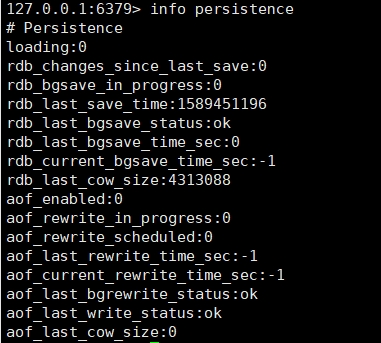
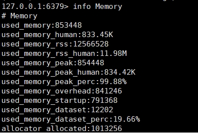
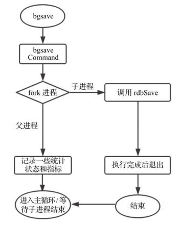
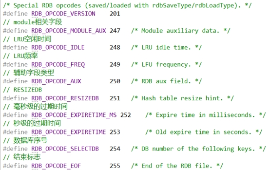
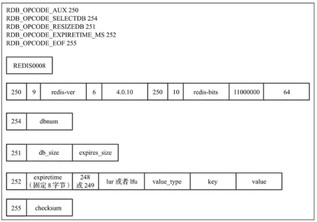
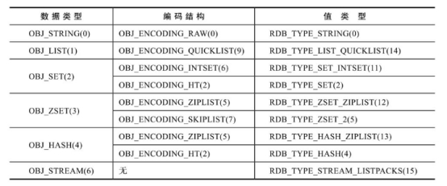
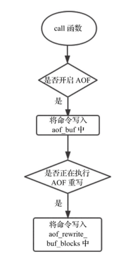
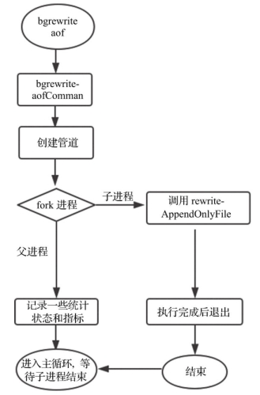
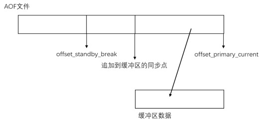

# Redis持久化-RDB 和 AOF 分析

参考：

> [redis持久化的几种方式](https://www.cnblogs.com/chenliangcl/p/7240350.html)

 

## 配置信息

### 查看持久化设置

127.0.0.1:6379> info persistence

 

### 查看内存分配信息

127.0.0.1:6379> info memory

 

 

## RDB

> 保存某一时间点之前的数据

### 触发方式

#### 1、 配置参数

> 在配置文件，如redis.conf中

```
save 900 1 #在900秒(15分钟)之后，如果至少有1个key发生变化，则dump内存快照。

save 300 10 #在300秒(5分钟)之后，如果至少有10个key发生变化，则dump内存快照。

save 60 10000 #在60秒(1分钟)之后，如果至少有10000个key发生变化，则dump内存快照
```

 

#### 2、 在客户端使用bgsave命令

##### 执行流程



 

在客户端输入bgsave命令后，Redis调用bgsaveCommand函数，该函数fork一个子进程执行rdbSave函数进行实际的快照存储工作，而父进程可以继续处理客户端请求。当子进程退出后，父进程调用相关回调函数进行后续处理。

 

### 文件结构

| 名称 | “REDIS”  | RDB_VERSION | AUX_FIELD_KEY_VALUE_PAIRS | DB_NUM     | DB_DICT_SIZE           | EXPIRE_DICT_SIZE         | KEY_VALUE_PARIS | EOF      | CHECK_NUM |
| ---- | -------- | ----------- | ------------------------- | ---------- | ---------------------- | ------------------------ | --------------- | -------- | --------- |
| 说明 | 固定字节 | RDB版本号   | 辅助字段                  | 数据库序号 | 指明数据库键值对的长度 | 指明数据库过期时间的长度 | 键值对的实际值  | 结束标志 | 校验码    |

区分加载的是辅助字段还是数据库序号或者是其他类型，在RDB每一部分之前都有一个类型字节，在Redis中称为opcodes



 

#### 带opcodes的结构



 

#### 键值对结构

| 名称 | EXPIRE_TIME     | LRU或LFU           | VALUE_TYPE | KEY        | VALUE |
| ---- | --------------- | ------------------ | ---------- | ---------- | ----- |
| 说明 | 8字节固长，可选 | 内存淘汰策略，可选 | 值类型     | 健，字符串 | 值    |

数据类型/底层编码结构和值类型对应关系有



 

对于每个健，其保存形式如下

| 名称 | LENGTH | STRING     |
| ---- | ------ | ---------- |
| 说明 | 长度   | 字符串内容 |

 

### RDB方式的优势

1). 一旦采用该方式，那么你的整个Redis数据库将只包含一个文件，这对于文件备份而言是非常完美的。比如，你可能打算每个小时归档一次最近24小时的数据，同时还要每天归档一次最近30天的数据。通过这样的备份策略，一旦系统出现灾难性故障，我们可以非常容易的进行恢复。

2). 对于灾难恢复而言，RDB是非常不错的选择。因为我们可以非常轻松的将一个单独的文件压缩后再转移到其它存储介质上。

3). 性能最大化。对于Redis的服务进程而言，在开始持久化时，它唯一需要做的只是fork出子进程，之后再由子进程完成这些持久化的工作，这样就可以极大的避免服务进程执行IO操作了。

4). 相比于AOF机制，如果数据集很大，RDB的启动效率会更高。

### RDB方式的劣势

1). 如果你想保证数据的高可用性，即最大限度的避免数据丢失，那么RDB将不是一个很好的选择。因为系统一旦在定时持久化之前出现宕机现象，此前没有来得及写入磁盘的数据都将丢失。

2). 由于RDB是通过fork子进程来协助完成数据持久化工作的，因此，如果当数据集较大时，可能会导致整个服务器停止服务几百毫秒，甚至是1秒钟。

 

## AOF

> 保存的是Redis服务端执行的而每一条命令

### 配置

```
appendfsync always   #每次有数据修改发生时都会写入AOF文件。

appendfsync everysec  #每秒钟同步一次，该策略为AOF的缺省策略。

appendfsync no    #从不同步。高效但是数据不会被持久化。
```

 

### AOF命令同步的一般过程



如果开启了AOF，则每条命令执行完毕后都会同步写入aof_buf中，aof_buf是个全局的SDS类型的缓冲区。Redis通过catAppendOnlyGenericCommand函数将命令转换为保存在缓冲区中的数据结构。

### 保存格式

如命令：set key 3

其保存在缓冲区中的格式为 `*3\r\n$3\r\nset\r\n$3\r\nkey\r\n$3\r\naof\r\n`

首先以`*3`开始，表示命令共有3个参数。`$3`表示接下来的第1个参数长度为3，顺序读取第3个字符set，第1个参数就解析完毕。以此类推，第2个`$3`表示第2个参数的长度，读取为key，第3个`$3`表示第3个参数的长度aof。至此，该条命令解析完毕。读取到下一个*时即表明开启了其他命令的解析。

 

### AOF文件写入

写文件通过操作系统提供的write函数执行。write之后数据只是保存在kernel的缓冲区中，真正写入磁盘还需要调用fsync函数。fsync是一个阻塞并且缓慢的操作，所以Redis通过appendfsync配置控制执行fsync的频次。具体有如下3种模式：

- no：不执行fsync，由操作系统负责数据的刷盘。数据安全性最低但Redis性能最高
- always：每执行一次写入就会执行一次fsync。数据安全性最高但会导致Redis性能降低
- everysec：每1秒执行一次fsync操作。属于折中方案，在数据安全性和性能之间达到一个平衡

生产环境一般配置为appendfsync everysec，即每秒执行一次fsync操作。

 

### AOF重写

AOF重写通过fork出一个子进程来执行，重写不会对原有文件进行任何修改和读取，子进程对所有数据库中所有的键各自生成一条相应的执行命令，最后将重写开始后父进程继续执行的命令进行回放，生成一个新的AOF文件。

 

#### AOF重写的触发方式

##### 1、 配置自动触发

如：当AOF文件大于64MB时，并且AOF文件当前大小比基准大小增长了100%时会触发一次AOF重写。

```
auto-aof-rewrite-percentage 100

auto-aof-rewrite-min-size 64mb
```

起始的基准大小为Redis重启并加载完AOF文件之后，aof_buf的大小。当执行完一次AOF重写之后，基准大小相应更新为重写之后AOF文件的大小。

##### 2、 执行bgrewriteaof命令显式触发

客户端输入bgrewriteaof命令的执行流程



 

该命令调用bgrewriteaofCommand，然后创建管道, fork进程，子进程调用rewriteAppendOnlyFile执行AOF重写操作，父进程记录一些统计指标后继续进入主循环处理客户端请求。当子进程执行完毕后，父进程调用回调函数做一些后续的处理操作。

### AOF方式的优势

1). 该机制可以带来更高的数据安全性，即数据持久性。Redis中提供了3中同步策略，即每秒同步、每修改同步和不同步。事实上，每秒同步也是异步完成的，其效率也是非常高的，所差的是一旦系统出现宕机现象，那么这一秒钟之内修改的数据将会丢失。而每修改同步，我们可以将其视为同步持久化，即每次发生的数据变化都会被立即记录到磁盘中。可以预见，这种方式在效率上是最低的。至于无同步，无需多言，我想大家都能正确的理解它。

2). 由于该机制对日志文件的写入操作采用的是append模式，因此在写入过程中即使出现宕机现象，也不会破坏日志文件中已经存在的内容。然而如果我们本次操作只是写入了一半数据就出现了系统崩溃问题，不用担心，在Redis下一次启动之前，我们可以通过redis-check-aof工具来帮助我们解决数据一致性的问题。

3). 如果日志过大，Redis可以自动启用rewrite机制。即Redis以append模式不断的将修改数据写入到老的磁盘文件中，同时Redis还会创建一个新的文件用于记录此期间有哪些修改命令被执行。因此在进行rewrite切换时可以更好的保证数据安全性。

4). AOF包含一个格式清晰、易于理解的日志文件用于记录所有的修改操作。事实上，我们也可以通过该文件完成数据的重建。

### AOF方式的劣势

1). 对于相同数量的数据集而言，AOF文件通常要大于RDB文件。RDB 在恢复大数据集时的速度比 AOF 的恢复速度要快。

2). 根据同步策略的不同，AOF在运行效率上往往会慢于RDB。总之，每秒同步策略的效率是比较高的，同步禁用策略的效率和RDB一样高效。

 

## 混合持久化

混合持久化指进行AOF重写时子进程将当前时间点的数据快照保存为RDB文件格式，而后将父进程累积命令保存为AOF格式。

加载时，首先会识别AOF文件是否以REDIS字符串开头，如果是，就按RDB格式加载，加载完RDB后继续按AOF格式加载剩余部分。子进程执行rewriteAppendOnlyFile函数时会判断该配置是否开启，如果开启，则首先按RDB的保存方式保存当前数据快照。保存完毕后回放累积命令到文件末尾即可

 

### 问题

使用原生的主从缓冲区同步主要解决两个问题

1、备机连上来后，同步位置不在缓冲区中，需要重做RDB，这时若备机的数据落后很久，能否利用现有的rdb文件+aof文件，追加到 缓冲区后使用缓冲区的数据接着同步

2、若落后时间短，能否先从aof文件传，追到缓冲区后，使用缓冲区接着同步

 

### 优化思路

#### 1、 借助辅助字段offset

Aof文件中每条写命令都添加一个辅助字段信息offset用以标记，记作offset_aof_aux 

在主从断开时，主机继续保持运行，一直到reconnect时有一个最新的offset（记作offset_primary_curret）；备机reconnect到主机时，会向主机发送repl_id和break时的offset（记作offset_standby_break）

| eg: set msg hello                             |                                                              |
| --------------------------------------------- | ------------------------------------------------------------ |
| ***\*原生\*******\*AOF\****                   | ***\*添加辅助字段\****                                       |
| `*2$6\r\nSELECT\r\n$1\r\n0\r\n`               | `*2$6\r\nSELECT\r\n$1\r\n0\r\n`                              |
| `*3$3\r\nSET\r\n$3\r\nmsg\r\n$5\r\nhello\r\n` | `*4$3\r\nSET\r\n$3\r\nmsg\r\n$5\r\nhello\r\n$10\r\noffset_aux\r\n123456\r\n` |

 



 

当备机reconnect时，主机判断offset_standby_break不在缓冲区中，此时从aof文件中查找offset_aof_aux==offset_standby_break的位置点，应从此处开始弥补断线期间缺失的数据。另外需要计算主机中当前缓冲区最早的offset_backlog_aux_early，即上图所示的追加到的缓冲区同步点。（1）先从aof中拿offset_standby_break(等同于符合要求的offset_aof_aux)到offset_backlog_aux_early区间的写命令，同步到备机.（2）然后，在缓冲区从offset_backlog_aux_early开始同步缓冲区数据到备机。

 

 

#### 2、 主从初次采用全量同步，之后采用基于aof-position的增量同步方式

`Aof-position`

采用RDB+AOF方式，AOF文件按文件大小滚动，每生成RDB文件时记录当前aof的position。如：

- 正常情况下当AOF文件position重新归位时，即“aof文件满“
- 手动执行bgsave命令生成rdb文件时
- 设置定时RDB文件备份时

从端