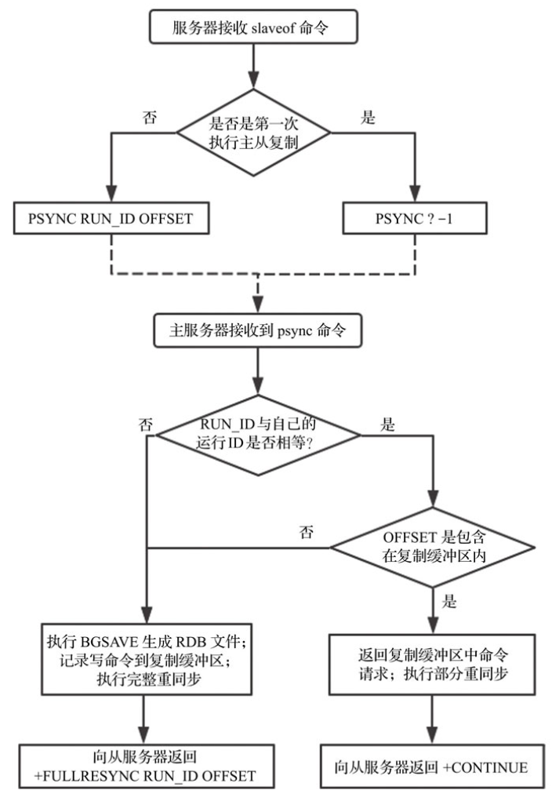

# replication （复制）

# 主从复制

## 特点：

-   **异步复制**，从 Redis 2.8 开始， 从服务器会以每秒一次的频率向主服务器报告复制流（replication stream）的处理进度
-   **支持一主多从**
-   **支持主-从-从**，从之间支持构成图状结构
-   **复制功能不会阻塞主服务器**： 即使有一个或多个从服务器正在进行初次同步， 主服务器也可以继续处理命令请求
-   **复制功能也不会阻塞从服务器**： 只要在 `redis.conf` 文件中进行了相应的设置， 即使从服务器正在进行初次同步， 服务器也可以使用旧版本的数据集来处理命令查询

不过， 在从服务器删除旧版本数据集并载入新版本数据集的那段时间内， 连接请求会被阻塞。

你还可以配置从服务器， 让它在与主服务器之间的连接断开时， 向客户端发送一个错误。

-   **支持让从服务器处理只读操作**。复制功能可以单纯地用于数据冗余（data redundancy）， 也可以通过让多个从服务器处理只读命令请求来提升扩展性（scalability）： 比如说， 繁重的 [SORT key [BY pattern\] [LIMIT offset count] [GET pattern [GET pattern …]] [ASC | DESC] [ALPHA] [STORE destination]](http://redisdoc.com/database/sort.html#sort) 命令可以交给附属节点去运行
-   可以通过复制功能来**让主服务器免于执行持久化操作**： 只要关闭主服务器的持久化功能， 然后由从服务器去执行持久化操作即可

在关闭主服务器持久化时，为保证复制功能的数据安全应该同时禁止自动拉起。

为了帮助理解主服务器关闭持久化时自动拉起的危险性，参考一下以下会导致主从服务器数据全部丢失的例子：

1.  假设节点A为主服务器，并且关闭了持久化。 并且节点B和节点C从节点A复制数据

2.  节点A崩溃，然后由自动拉起服务重启了节点A. 由于节点A的持久化被关闭了，所以重启之后没有任何数据
3.  节点B和节点C将从节点A复制数据，但是A的数据是空的， 于是就把自身保存的数据副本删除。

在关闭主服务器上的持久化，并同时开启自动拉起进程的情况下，即便使用Sentinel来实现Redis的高可用性，也是非常危险的。 因为主服务器可能拉起得非常快，以至于Sentinel在配置的心跳时间间隔内没有检测到主服务器已被重启，然后还是会执行上面的数据丢失的流程。

## 运作原理

无论是初次连接还是重新连接， 当建立一个从服务器时， 从服务器都将向主服务器发送一个 [SYNC](http://redisdoc.com/internal/sync.html#sync) 命令。

接到 [SYNC](http://redisdoc.com/internal/sync.html#sync) 命令的主服务器将开始执行 [BGSAVE](http://redisdoc.com/persistence/bgsave.html#bgsave) ， 并在保存操作执行期间， 将所有新执行的写入命令都保存到一个缓冲区里面。

当 [BGSAVE](http://redisdoc.com/persistence/bgsave.html#bgsave) （后台异步保存）执行完毕后， 主服务器将执行保存操作所得的 `.rdb` 文件发送给从服务器， 从服务器接收这个 `.rdb` 文件， 并将文件中的数据载入到内存中。

之后主服务器会以 Redis 命令协议的格式， 将写命令缓冲区中积累的所有内容都发送给从服务器。

你可以通过 telnet 命令来亲自验证这个同步过程： 首先连上一个正在处理命令请求的 Redis 服务器， 然后向它发送 [SYNC](http://redisdoc.com/internal/sync.html#sync) 命令， 过一阵子， 你将看到 telnet 会话（session）接收到服务器发来的大段数据（`.rdb` 文件）， 之后还会看到， 所有在服务器执行过的写命令， 都会重新发送到 telnet 会话来。

即使有多个从服务器同时向主服务器发送 [SYNC](http://redisdoc.com/internal/sync.html#sync) ， 主服务器也只需执行一次 [BGSAVE](http://redisdoc.com/persistence/bgsave.html#bgsave) 命令， 就可以处理所有这些从服务器的同步请求。

从服务器可以在主从服务器之间的连接断开时进行自动重连， 在 Redis 2.8 版本之前， 断线之后重连的从服务器总要执行一次完整重同步（full resynchronization）操作， 但是从 Redis 2.8 版本开始， 从服务器可以根据主服务器的情况来选择执行完整重同步还是部分重同步（partial resynchronization）。

Redis 2.8提出了新的主从复制解决方案。从服务器会记录已经从主服务器接收到的数据量（复制偏移量）；而主服务器会维护一个复制缓冲区，记录自己已执行且待发送给从服务器的命令请求，同时还需要记录复制缓冲区第一个字节的复制偏移量。从服务器请求同步主服务器的命令也改为了`psync`。**当从服务器连接到主服务器时，会向主服务器发送psync命令请求同步数据，同时告诉主服务器自己已经接收到的复制偏移量，主服务器判断该复制偏移量是否还包含在复制缓冲区；如果包含，则不需要执行持久化操作，直接向从服务器发送复制缓冲区中命令请求即可，这称为部分重同步；如果不包含，则需要执行持久化操作，同时将所有新执行的写命令缓存在复制缓冲区中，并重置复制缓冲区第一个字节的复制偏移量，这称为完整重同步**。

另外需要注意的是，每台Redis服务器都有一个运行ID，从服务器每次发送psync请求同步数据时，会携带自己需要同步主服务器的运行ID。主服务器接收到psync命令时，需要判断命令参数运行ID与自己的运行ID是否相等，只有相等才有可能执行部分重同步。而当从服务器首次请求主服务器同步数据时，从服务器显然是不知道主服务器的运行ID，此时运行ID以“?”填充，同时复制偏移量初始化为-1。

从上面的分析我们可以得到psync命令格式为`psync<MASTER_RUN_ID> <OFFSET>`，主从复制初始化流程如下图所示。



图1 主从复制初始化流程图

从图1可以看到，当主服务器判断可以执行部分重同步时向从服务器返回“+CONTINUE”；需要执行完整重同步时向从服务器返回“+FULLRESYNC RUN_ID OFFSET”，其中RUN_ID为主服务器自己的运行ID, OFFSET为复制偏移量。可以看到执行部分重同步的要求还是比较严格的：

1）RUN_ID必须相等；
2）复制偏移量必须包含在复制缓冲区中。

然而在生产环境中，经常会出现以下两种情况：

-   从服务器重启（复制信息丢失）；
-    主服务器故障导致主从切换（从多个从服务器重新选举出一台机器作为主服务器，主服务器运行ID发生改变）。

这时候显然是无法执行部分重同步的，而这两种情况又很常见，因此Redis 4.0针对主从复制又提出了两点优化，提出了psync2协议。

**方案1：持久化主从复制信息。**

Redis服务器关闭时，将主从复制信息（复制的主服务器RUN_ID与复制偏移量）作为辅助字段存储在RDB文件中；Redis服务器启动加载RDB文件时，恢复主从复制信息，重新同步主服务器时携带。持久化主从复制信息代码如下：

```c
// rdb.c
if (rdbSaveAuxFieldStrStr(rdb,"repl-id",server.replid)
            == -1) return -1;
        if (rdbSaveAuxFieldStrInt(rdb,"repl-offset",server.master_repl_offset)
            == -1) return -1;
```

方案2：存储上一个主服务器复制信息。代码如下：

```c
// server.h
char replid2[CONFIG_RUN_ID_SIZE+1]; /* replid inherited from master*/
long long second_replid_offset; /* Accept offsets up to this for replid2. */
```

初始化replid2为空字符串，second_replid_offset为-1；当主服务器发生故障，自己成为新的主服务器时，便使用replid2和second_replid_offset存储之前主服务器的运行ID与复制偏移量：

```c
// replication.c
/* Use the current replication ID / offset as secondary replication
 * ID, and change the current one in order to start a new history.
 * This should be used when an instance is switched from slave to master
 * so that it can serve PSYNC requests performed using the master
 * replication ID. */
void shiftReplicationId(void) {
    memcpy(server.replid2,server.replid,sizeof(server.replid));
    /* We set the second replid offset to the master offset + 1, since
     * the slave will ask for the first byte it has not yet received, so
     * we need to add one to the offset: for example if, as a slave, we are
     * sure we have the same history as the master for 50 bytes, after we
     * are turned into a master, we can accept a PSYNC request with offset
     * 51, since the slave asking has the same history up to the 50th
     * byte, and is asking for the new bytes starting at offset 51. */
    server.second_replid_offset = server.master_repl_offset+1;
    changeReplicationId();
    serverLog(LL_WARNING,"Setting secondary replication ID to %s, valid up to offset: %lld. New replication ID is %s", server.replid2, server.second_replid_offset, server.replid);
}
```

另外判断是否能执行部分重同步的条件也改变为：

```c
// replication.c/masterTryPartialResyncchronization(client *c)
...
/* Is the replication ID of this master the same advertised by the wannabe
     * slave via PSYNC? If the replication ID changed this master has a
     * different replication history, and there is no way to continue.
     *
     * Note that there are two potentially valid replication IDs: the ID1
     * and the ID2. The ID2 however is only valid up to a specific offset. */
    if (strcasecmp(master_replid, server.replid) &&
        (strcasecmp(master_replid, server.replid2) ||
         psync_offset > server.second_replid_offset))
    {
        /* Run id "?" is used by slaves that want to force a full resync. */
        if (master_replid[0] != '?') {
            if (strcasecmp(master_replid, server.replid) &&
                strcasecmp(master_replid, server.replid2))
            {
                serverLog(LL_NOTICE,"Partial resynchronization not accepted: "
                    "Replication ID mismatch (Replica asked for '%s', my "
                    "replication IDs are '%s' and '%s')",
                    master_replid, server.replid, server.replid2);
            } else {
                serverLog(LL_NOTICE,"Partial resynchronization not accepted: "
                    "Requested offset for second ID was %lld, but I can reply "
                    "up to %lld", psync_offset, server.second_replid_offset);
            }
        } else {
            serverLog(LL_NOTICE,"Full resync requested by replica %s",
                replicationGetSlaveName(c));
        }
        goto need_full_resync;
    }
...
```

假设m为主服务器（运行ID为M_ID）, A、B和C为三个从服务器；某一时刻主服务器m发生故障，从服务器A升级为主服务器（同时会记录replid2=M_ID），从服务器B和C重新向主服务器A发送“psync M_IDpsync_offset”请求；显然根据上面条件，只要psync_offset满足条件，就可以执行部分重同步。