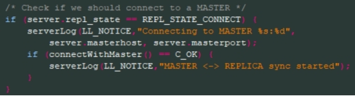
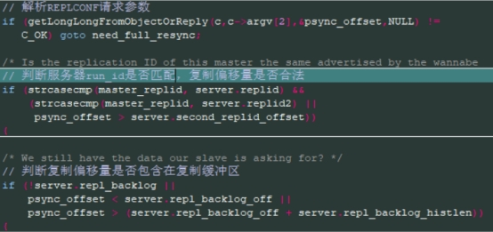

# Redis主从复制

## 全量复制

主机向从机一次发送完整的数据文件

- 流程
  - slave 向 master 传递命令 psync? -1 （因为第一次通信不知道master的runid和偏移量，所以传-1）
  - master 向 slave 返回runid 和偏移量
  - slave 保存 master 的信息
  - master 执行 bgsave 生产RDB快照（这个过程会耗费主服务器大量的CPU、内存和磁盘I/O资源）
  - master 做send RDB 操作 向 slave 同步快照信息（耗费主服务器大量的网络资源包括带宽和流量，并对主服务器响应命令请求的时间产生影响）
  - master 做 send buffer 操作 ， 向 slave 同步 生成快照过程中的 缓存命令（这个缓存区应该是replication buffer）
  - slave 加载 RDB文件及数据（从在加载的过程中会因为阻塞而没办法处理命令请求）
- 开销
  - bgsave时间
  - RDB文件网络传输时间
  - 从节点清空数据时间
  - 从节点加载RDB的时间
  - 可能的AOF重写时间


## 部分复制

在已进行过全量同步的基础上，主机向从机发送某一偏移量的缓存命令，从机上执行这些命令，并更新自己命令缓存区的偏移量，以保持与主机同步的偏移

- redis 2.8后的功能，当网络发生抖动断开后，会用到部分复制的功能
- 当网络发生抖动，slave会与master断开
- master 写命令时，会写一份复制缓冲区的命令
- 当slave在此连接master时 ，传递命令 psync {offset} {runid} ,告诉 master 自己当前的偏移量是多少
- master 向 slave 返回CONTINUE 把 缺失的内容 传递过去。


## 两种方式出现的场景

1、 从机在第一次与主机连接时，向主机发送 psync ? -1 命令请求数据同步，此时进行完整复制

2、 在经过初次复制并能保持后续的正常连接中，采用部分复制的方式保持主从数据同步

3、 从机重启、从机与主机之间断线重连，此时发生重同步，发送 psync 命令，会涉及两种模式：部分重同步、完整重同步

# PSYNC1

## PSYNC重同步

- 目的：解决sync在断线重复制时的低效问题，redis2.8版本后支持

- 过程：重连时，slave会向master发送psync命令请求同步数据，同时告诉master自己已经接收到的复制偏移量，master判断该复制偏移量是否还包含在复制缓冲区；如果包含，则不需要执行持久化操作，直接向slave发送复制缓冲区中命令请求即可，此时叫部分重同步；如果不包含，则需要执行持久化操作，同时将所有新执行的写命令缓存在复制缓冲区中，并重置复制缓冲区第一个字节的复制偏移量，此时叫完整重同步

## PSYNC 的实现包含三个部分

- run_id，服务器的ID

- offset，服务器的复制偏移量

- repl_backlog，master上的复制积压缓冲区

### PSYNC 命令格式

`PSYNC <run_id> <offset>`

### run_id：主机ID

每个redis服务器都有一个自己独有的标识ID，在服务器启动时自动生成，由40个随机十六进制字符组成。在slave对master进行初次复制时，master会将自己的run_id发给slave，slave将保存这个run_id。当slave重连到一个master上时，slave将向当前连接的master发送之前保存的run_id：

- 如果slave保存的run_id与当前连接的master的run_id相同时，表明该连接是重连，将尝试进行部分重同步操作

- 如果run_id不同，表明当前连接是新连接，将执行完整重同步操作

### offset：复制偏移量

主从机上会各自维持一个offset：

- master成功向slave发送N个字节的命令后会将master的offset加上N

- slave在接收到master的N个字节命令后同样会将slave的offset增加N。

Master和Slave如果状态是一致的那么它的的offset也应该是一致的。

### repl_backlog 复制积压缓冲区

由Master维护的一个固定长度的FIFO队列，默认大小为1MB。当master进行命令传播时，它不仅会将写命令发送给所有slave，还会将写命令入队到复制积压缓冲区里面，并且复制积压缓冲区会为队列中的每个字节记录相应的复制偏移量。

当slave重连到一个master上时，slave通过PSYNC命令发送自己的offset给master，在master上会进行以下判断（假设run_id是一致的）：

- 如果offset偏移量之后的数据（也即是偏移量offset+1开始的数据）仍然存在于复制积压缓冲区里面，那么master会向slave发送+CONTINUE回复，将对slave执行部分重同步操作。

- 如果offset偏移量之后的数据已经不存在于复制积压缓冲区，那么master将对slave执行完整重同步操作

复制积压缓冲区的大小需要合适的设置，如果主服务器需要执行大量写命令，又或者主从服务器断线后重连接所需的时间比较长，那么PSYNC命令的复制重同步模式就不能正常发挥作用。一个可参考的估算方式（参考书籍《Redis涉及与实现》 黄建宏著）：

```
2 * second * write_size_per_second  
```

> second为从服务器断线后重新连接上主服务器所需的平均时间（以秒计算） write_size_per_second是主服务器平均每秒产生的写命令数据量（协议格式的写命令的长度总和）

### 总结PSYNC的实现流程


### PSYNC命令的调用

- 如果从服务器以前没有复制过任何主服务器，或者之前执行过`SLAVEOF no one`命令，那么从服务器在开始一次新的复制时将向主服务器发送`PSYNC ? -1`命令，主动请求主服务器进行完整重同步

- 如果从服务器已经复制过某个主服务器，那么从服务器在开始一次新的复制时将向主服务器发送`PSYNC ＜runid＞ ＜offset＞`命令，接收到这个命令的主服务器会通过这两个参数来判断应该对从服务器执行哪种同步操作

### PSYNC回复

根据实际情况，接收到PSYNC命令的主服务器会向从服务器返回以下三种回复的其中一种：

- 如果主服务器返回`+FULLRESYNC ＜runid＞ ＜offset＞`回复，那么表示主服务器将与从服务器执行完整重同步操作：其中runid是这个主服务器的运行ID，从服务器会将这个ID保存起来，在下一次发送PSYNC命令时使用；而offset则是主服务器当前的复制偏移量，从服务器会将这个值作为自己的初始化偏移量

- 如果主服务器返回`+CONTINUE`回复，那么表示主服务器将与从服务器执行部分重同步操作，从服务器只要等着主服务器将自己缺少的那部分数据发送过来就可以

- 如果主服务器返回`-ERR`回复，那么表示主服务器的版本低于Redis 2.8，它识别不了PSYNC命令，从服务器将向主服务器发送SYNC命令，并与主服务器执行完整同步操作

# PSYNC2

在实际生产情况中，经常会出现以下情况：

- 从服务器重启，复制信息丢失，run_id改变

- 主服务器故障导致主从切换，从多个从服务器重新选举出一台机器作为主服务器，主服务器运行ID发生改变

这两种情况下不能进行部分重同步，但进行全量复制时又会让主服务器执行快照保存慢以及数据传输低效的问题。

 

在redis4.0版本中，从两点优化了psync（即psync2）。psync2在psync1基础上新增两个复制id和offest（用`info replication`可查看），定义在`redisServer`结构体中：


- replid: 复制id，一个长度为41个字节(40个随机串+’0’)的字符串，每个redis实例都有。当实例变为从实例后，自己的replid会被主实例的replid覆盖。当作为主实例时，replid表示其run_id

- replid2：复制id2,默认初始化为全0，当从实例变成主实例时，replid2用于存储之前主实例的replid，保存时调用方法：`replication.c/shiftReplicationId()`


同理对offset有相同的操作。

## psync2实现过程

对于从服务器redis重启时，发生的部分同步过程：

### 1、持久化主从复制信息

Redis服务器关闭时，通过`shutdown save`，调用`rdbSaveAuxFieldStrStr`方法将主从复制信息（当前实例的repl-id和repl-offset）作为辅助字段（Aux fileds）存储在RDB文件中。持久化主从复制信息的代码：

在  `rdb.c/rdbSaveInfoAuxFileds()` 中

 

### 2、重启后加载RDB文件中的复制信息

Redis服务器启动加载RDB文件时，会专门处理文件中辅助字段(AUX fields）信息，把其中`repl_id`和`repl_offset`加载到实例中，分别赋给`master_replid`和`master_repl_offset`两个变量值，特别注意当从库开启了AOF持久化，redis加载顺序发生变化优先加载AOF文件，但是由于aof文件中没有复制信息，所以导致重启后从实例依旧使用全量复制！。

### 3、向主库上报复制信息，判断是否进行部分同步

从实例向主库上报`master_replid`和`master_repl_offset+1`；从实例同时满足以下两条件，就可以部分重新同步，否则执行全量同步.

判断是否能够进行部分重同步：

`replication.c/masterTryPartialResynchronization()`


- 从实例上报`master_replid`串，与主实例的`master_replid1`或`replid2`有一个相等，用于判断主从未发生改变；

- 从实例上报的`master_repl_offset+1`字节，还存在于主实例的复制积压缓冲区中，用于判断从库丢失部分是否在复制缓冲区中；

对于主从切换后，发生的部分同步过程：

redis从库默认开启复制积压缓冲区功能，以便从库故障切换变化master后，其他落后该从库可以从缓冲区中获取缺少的命令。此时psync过程的实现通过两组replid、offset替换原来的master runid和offset变量实现。

- 第一组：`master_replid`和`master_repl_offset`：如果redis是主实例，则表示为自己的replid和复制偏移量； 如果redis是从实例，则表示为自己主实例的replid1和同步主实例的复制偏移量。

- 第二组：`master_replid2`和`second_repl_offset`：无论主从，都表示自己上次主实例repid1和复制偏移量；用于兄弟实例或级联复制，主库故障切换。

判断是否使用部分复制条件：如果从库提供的`master_replid`与master的`replid`不同，且与master的`replid2`不同，或同步速度快于master； 就必须进行全量复制，否则执行部分复制。

常见的主从切换使用部分同步的场景：

- 一主一从发生切换，A->B 切换变成 B->A ;

- 一主多从发生切换，兄弟节点变成父子节点时；

- 级联复制发生切换， A->B->C 切换变成 B->C->A；

 

# PSYNC建立过程，源码分析

## 全局变量


部分复制的复制积压缓冲区定义在 redisServer 结构体中，列举有几个重要的参数：


## 创建 backlog


## 向复制缓冲区写入数据

- 写入的数据：unsigned char类型，经过`feedReplicationBacklogWithObject()`转换

- Backlog相关的几个参数的更新，比如offset、idx、back_off


## Offset的计算

主服务器中通过`feedReplicationBacklogWithObject`写入命令请求时更新；在从服务器上报时，`psync_offset = reploff + 1`，然后主服务器端通过`addReplyReplicationBacklog(client *c, int offset)`从backlog中取[offset,end)的内容提供给`client *c`。

## 命令请求传输时的数据格式

举例：主实例客户端接收一条命令，`set a 1`

在主从复制中，主实例发送给从实例的命令形式为:

`*3\r\n$3\r\nset$1\r\na$1\r\n1`

`*3`表示命令有3个参数

`\r\n`表示换行符，用以区分不同的参数

`$3`、`$1`、`$1`表示参数的长度

在`replication.c/replicationFeedSlaves()`中实现上述过程


（a） 首先判断本次操作的数据库与上次的是否相同，如果不同则需要先同步select命令


（b） 若与上次操作的数据库相同，则（b.1）将命令记录到backlog


并(b.2)发送给所有slaves


## Slave

### replicaofCommand函数

> Slaveof 命令请求的处理入口

用户通过执行`slaveof`命令，主动连接到master以请求数据同步。

Slaveof命令处理函数为 `replication.c/replicaofCommand`：

```c
void replicaofCommand(client *c) {
    …
    /* slaveof no one命令取消主从复制，该实例将变为一个普通的redis实例. */
    if (!strcasecmp(c->argv[1]->ptr,"no") &&
        !strcasecmp(c->argv[2]->ptr,"one")) {
        if (server.masterhost) { // 有连接过的master
            …
        }
    } else { // 若 slaveof 指定了ip和port
        long port;
        
        if (c->flags & CLIENT_SLAVE)  
        {// 已经是一个replica时回复错误信息，直接返回
            …
        }
        // 不能解析port值时，直接返回
        if ((getLongFromObjectOrReply(c, c->argv[2], &port, NULL) != C_OK))
            return;

        /* 已经是指定ip port 的replica，无需其他操作，直接返回 */
        if (server.masterhost && !strcasecmp(server.masterhost,c->argv[1]->ptr)
            && server.masterport == port) {
            …
        }
        /* 指定的ip port为新master，进行相关设置*/
        replicationSetMaster(c->argv[1]->ptr, port);
        …
    }
    addReply(c,shared.ok);
}
```


### replicationSetMaster函数

> 配置指定的ip、port等信息

在`replication.c/ replicationSetMaster()`中，更新了指定的ip、por以及repl_state


函数replicaofCommand中没有向主服务器发送连接请求，该过程是在时间事件中完成，通过replicationCron发起请求连接。

### replicationCron函数

> 调用定时任务处理函

首先serverCron中配置了主从复制的定时任务：`server.c/serverCron()`


每1000毫秒执行一次`replication.c/replicationCron()`函数：

repl_state: REPL_STATE_CONNECT -> REPL_STATE_CONNECTING



### conncectWithMaster函数

> 建立socket连接

在`replication.c/connectWithMaster()`中建立连接、创建文件事件（若socket可写或可读时，调用`replication.c/syncWithMaster()`处理函数）、更新repl_state状态：


### repl_state状态

主从复制流程中定义的状态，repl_state表示的是从服务器状态：


### syncWithMaster函数

> 实现从服务器状态转换

在syncWithMaster处理函数中，实现从服务器状态的转换：(假设状态转换中没有异常出现)

REPL_STATE_CONNECTING -> REPL_STATE_PONG


REPL_STATE_PONG -> (a) 或者 (b)

(a) REPL_STATE_AUTH(需要验证时) -> REPL_STATE_RECEIVE_AUTH -> PREL_STATE_SEND_PORT

(b) REPL_STATE_AUTH(不需要验证时) -> REPL_STATE_SEND_PORT

…

中间其他状态转换过程详细参见`syncWithMaster`函数

…

REPL_STATE_PSYNC -> REPL_STATE_RECEIVE_PSYNC


其中调用`replication.c/slaveTryPartialResynchronization(fd, read_only)`函数发送psync命令(read_only=0)：


注意的一点：上报给主服务器的从机复制偏移量`psync_offset = reploff+1`，或者读取psync的回复(read_only=1)


在`slaveTryPartialResynchronization()`中获取该事件的回复


如果回复是 `+CONTINUE` 则表示进行部分复制，通过`replicationResurrectCachedMaster()`建立部分复制，其中将repl_state状态更新为`REPL_STATE_CONNECTED`：


如果回复是 `+FULLRESYNC`，表明需要进行完整同步，从服务器需要准备接收主服务器发送的RDB文件，在`syncWithMaster()`中创建了相应的文件事件，并修改repl_state状态为`REPL_STATE_TRANSFER`：


该文件事件会调用`readSyncBulkPayload`处理函数，实现RDB文件的接收与加载，加载完成后会修改状态为`REPL_STATE_CONNECTED`

 

当从服务器状态成为`REPL_STATE_CONNECTED`时，表明从服务器已经成功与主服务器建立连接，从服务器只需要接收并执行主服务器同步过来的命令请求，此过程与普通客户端命令请求相似。

## Master

### replconfCommand函数

> REPLCONF命令处理的入口函数

`replication.c/replconfCommand()`


主要是解析REPLCONF命令请求参数，将参数保存至client对象中，如ip、port、客户端能力标识CAPA、从机的复制偏移量、交互事件等

### syncCommand函数

> 处理sync 或 psync

`replication.c/syncCommand()`

主机接收到从机的psync命令请求后，psync命令的处理入口函数为`syncCommand`。


### masterTrypartialResynchronization函数

> 主机端进行部分同步操作

`replication.c/masterTrypartialResynchronization()`



判断replid是否可以执行部分重同步，如果可以则向客户端返回`+CONTINUE`并返回复制缓冲区中的命令请求，同时更新有效从服务器数目。


### addReplyReplicationBacklog函数

> 向slave 'c' 提供复制积压缓冲区指定的offset到end的内容

`replication.c/addReplyReplicationBacklog()`


 