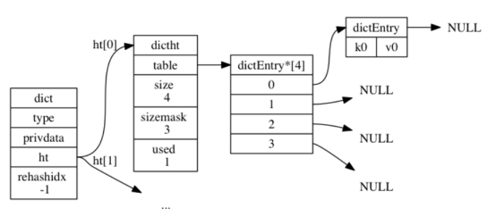
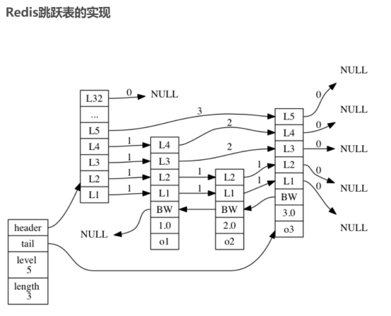
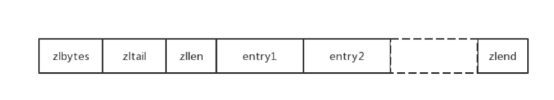
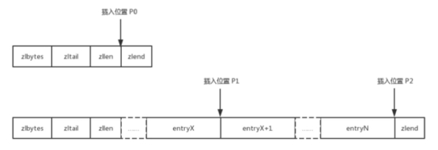
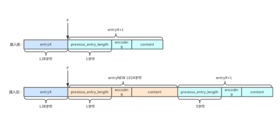
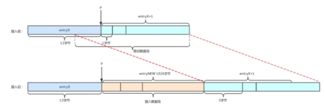
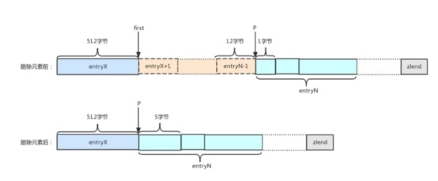
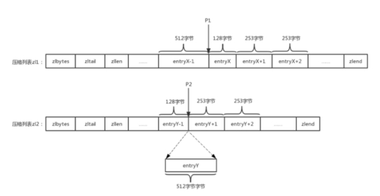
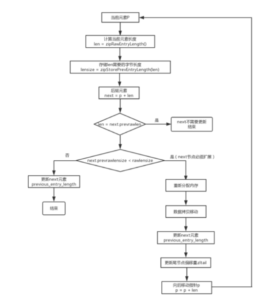

# 1 redis基础数据结构

本文来自

> 《redis设计与实现》——黄建宏


## 1.1 SDS

### 1.1.1 SDS数据结构

Redis 没有直接使用 C 语言传统的字符串表示（以空字符结尾的字符数组，以下简称 C 字符串）， 而是自己构建了一种名为简单动态字符串（simple dynamic string，SDS）的抽象类型， 并将 SDS 用作 Redis 的默认字符串表示。

```c
//<sds.h>  
  
typedef char *sds;  
  
/* Note: sdshdr5 is never used, we just access the flags byte directly. 
 * However is here to document the layout of type 5 SDS strings. */  
struct __attribute__ ((__packed__)) sdshdr5 {  
    unsigned char flags; /* 3 lsb of type, and 5 msb of string length */  
    char buf[];  
};  
struct __attribute__ ((__packed__)) sdshdr8 {  
    uint8_t len; /* used */  
    uint8_t alloc; /* excluding the header and null terminator */  
    unsigned char flags; /* 3 lsb of type, 5 unused bits */  
    char buf[];  
};  
struct __attribute__ ((__packed__)) sdshdr16 {  
    uint16_t len; /* used */  
    uint16_t alloc; /* excluding the header and null terminator */  
    unsigned char flags; /* 3 lsb of type, 5 unused bits */  
    char buf[];  
};  
struct __attribute__ ((__packed__)) sdshdr32 {  
    uint32_t len; /* used */  
    uint32_t alloc; /* excluding the header and null terminator */  
    unsigned char flags; /* 3 lsb of type, 5 unused bits */  
    char buf[];  
};  
struct __attribute__ ((__packed__)) sdshdr64 {  
    uint64_t len; /* used */  
    uint64_t alloc; /* excluding the header and null terminator */  
    unsigned char flags; /* 3 lsb of type, 5 unused bits */  
    char buf[];  
};  
  
  
//flag低3位保存sds类型，sdshdr5的flag高5位保存buf长度  
#define SDS_TYPE_5  0  
#define SDS_TYPE_8  1  
#define SDS_TYPE_16 2  
#define SDS_TYPE_32 3  
#define SDS_TYPE_64 4  
#define SDS_TYPE_MASK 7  
#define SDS_TYPE_BITS 3  
  
//获取指向sdshdr结构体的指针，并赋给sh  
#define SDS_HDR_VAR(T,s) struct sdshdr##T *sh = (void*)((s)-(sizeof(struct sdshdr##T)));  
//获取指向sdshdr结构体的指针  
#define SDS_HDR(T,s) ((struct sdshdr##T *)((s)-(sizeof(struct sdshdr##T))))  
//获取sdshdr5的字符串长度，即flag字段中高5位存储的值  
#define SDS_TYPE_5_LEN(f) ((f)>>SDS_TYPE_BITS) 
```

 

SDS_HDR --> | len | alloc | flag | buf(sds) |

unsigned char flags = sds[-1]

- len ：sds的长度，不包括末尾结束符
- alloc ：分配的sds长度，不包括结束符
- flag ：sds类型
- buf ：sds实际存放位置

 

SDS 遵循 C 字符串以空字符结尾的惯例， 保存空字符的 1 字节空间不计算在 SDS 的 len 属性里面， 并且为空字符分配额外的 1 字节空间，遵循空字符结尾这一惯例的好处是， SDS 可以直接重用一部分 C 字符串函数库里面的函数，末尾空字符的分配在sdsnewlen函数里（`sh = s_malloc(hdrlen+initlen+1);`），下面有完整函数代码

 

### 1.1.2 SDS新老结构的对比

在redis3.2.x之前，SDS的存储结构如下：

```c
struct sdshdr {  
    int len; //存长度  
    int free; //存字符串内容的柔性数组的剩余空间  
    char buf[]; //柔性数组，真正存放字符串值   
}; 
```

可以看出在旧SDS结构中，使用4字节整形存储长度和剩余空间。而对于众多的短字符串来说，4字节的整形占据了很大的空间，导致内存的浪费。新版本的redis结构中，存储字符串长度的len字段和存储已分配字节数的alloc字段的类型，分别占用了1、2、4、8字节，合理分配了内存占用。此外新版本的结构体中都带有__attribute__ ((__packed__))关键字，它告诉编译器不进行结构体的内存对齐，从而避免浪费内存。

### 1.1.7 SDS与C字符串的区别

- 常数复杂度O(1)获取字符串长度

获取一个 C 字符串的长度， 程序必须遍历整个字符串， 对遇到的每个字符进行计数， 直到遇到代表字符串结尾的空字符为止， 这个操作的复杂度为 O(N)

SDS 在 len 属性中记录了 SDS 本身的长度， 所以获取一个 SDS 长度的复杂度仅为 O(1)

- 杜绝缓冲区溢出

SDS 的空间分配策略完全杜绝了发生缓冲区溢出的可能性： 当 SDS API 需要对 SDS 进行修改时， API 会先检查 SDS 的空间是否满足修改所需的要求， 如果不满足的话， API 会自动将 SDS 的空间扩展至执行修改所需的大小， 然后才执行实际的修改操作， 所以使用 SDS 既不需要手动修改 SDS 的空间大小， 也不会出现缓冲区溢出问题

- 减少修改字符串时带来的内存重分配次数

C 字符串并不记录自身的长度， 所以对于一个包含了 N 个字符的 C 字符串来说， 这个 C 字符串的底层实现总是一个 N+1 个字符长的数组（额外的一个字符空间用于保存空字符），每次增长或者缩短一个 C 字符串， 程序都总要对保存这个 C 字符串的数组进行一次内存重分配操作，通过未使用空间（alloc - len）， SDS 实现了空间预分配和惰性空间释放两种优化策略

- 空间预分配

如果对 SDS 进行修改之后， SDS 的长度（也即是 len 属性的值）将小于 1 MB ， 那么程序分配和 len 属性同样大小的未使用空间， 这时 SDS alloc 属性的值将是和len 属性的2倍。 举个例子， 如果进行修改之后， SDS 的 len 将变成 13 字节， 那么程序也会分配 13 字节的未使用空间， SDS 的 buf 数组的实际长度将变成 13 + 13 + 1 = 27 字节（额外的一字节用于保存空字符）。

 如果对 SDS 进行修改之后， SDS 的长度将大于等于 1 MB ， 那么程序会分配 1 MB 的未使用空间。 举个例子， 如果进行修改之后， SDS 的 len 将变成 30 MB ， 那么程序会分配 1 MB 的未使用空间， SDS 的 buf 数组的实际长度将为 30 MB + 1 MB + 1 byte 。

 通过这种预分配策略， SDS 将连续增长 N 次字符串所需的内存重分配次数从必定 N 次降低为最多 N 次。

- 惰性空间释放

惰性空间释放用于优化 SDS 的字符串缩短操作： 当 SDS 的 API 需要缩短 SDS 保存的字符串时， 程序并不立即使用内存重分配来回收缩短后多出来的字节， 而是使用 free 属性将这些字节的数量记录起来， 并等待将来使用

 通过惰性空间释放策略， SDS 避免了缩短字符串时所需的内存重分配操作， 并为将来可能有的增长操作提供了优化

- 二进制安全

C 字符串中的字符必须符合某种编码（比如 ASCII）， 并且除了字符串的末尾之外， 字符串里面不能包含空字符， 否则最先被程序读入的空字符将被误认为是字符串结尾 —— 这些限制使得 C 字符串只能保存文本数据， 而不能保存像图片、音频、视频、压缩文件这样的二进制数据

 使用 SDS 来保存之前提到的特殊数据格式就没有任何问题， 因为 SDS 使用 len 属性的值而不是空字符来判断字符串是否结束，通过使用二进制安全的 SDS ， 而不是 C 字符串， 使得 Redis 不仅可以保存文本数据， 还可以保存任意格式的二进制数据

- 兼容部分 C 字符串函数

SDS 的 API 都是二进制安全的， 但它们一样遵循 C 字符串以空字符结尾的惯例： 这些 API 总会将 SDS 保存的数据的末尾设置为空字符， 并且总会在为 buf 数组分配空间时多分配一个字节来容纳这个空字符， 这是为了让那些保存文本数据的 SDS 可以重用一部分

### 1.1.6 SDS API

#### 获取sds已用长度和可用长度

```c
//<sds.h>  
//获取sds长度  
static inline size_t sdslen(const sds s) {  
    unsigned char flags = s[-1];  
    switch(flags&SDS_TYPE_MASK) {  
        case SDS_TYPE_5:  
            return SDS_TYPE_5_LEN(flags);  
        case SDS_TYPE_8:  
            return SDS_HDR(8,s)->len;  
        case SDS_TYPE_16:  
            return SDS_HDR(16,s)->len;  
        case SDS_TYPE_32:  
            return SDS_HDR(32,s)->len;  
        case SDS_TYPE_64:  
            return SDS_HDR(64,s)->len;  
    }  
    return 0;  
}  
  
//获取sds可用的字节数     
/* sdsalloc() = sdsavail() + sdslen() */  
static inline size_t sdsavail(const sds s) {  
    unsigned char flags = s[-1];  
    switch(flags&SDS_TYPE_MASK) {  
        case SDS_TYPE_5: {  
            return 0;  
        }  
        case SDS_TYPE_8: {  
            SDS_HDR_VAR(8,s);  
            return sh->alloc - sh->len;  
        }  
        case SDS_TYPE_16: {  
            SDS_HDR_VAR(16,s);  
            return sh->alloc - sh->len;  
        }  
        case SDS_TYPE_32: {  
            SDS_HDR_VAR(32,s);  
            return sh->alloc - sh->len;  
        }  
        case SDS_TYPE_64: {  
            SDS_HDR_VAR(64,s);  
            return sh->alloc - sh->len;  
        }  
    }  
    return 0;  
}  
```

通过这两个例子可以看出SDS的结构体数据查看方法，通过字符串指针sds向前移动一个字节可以得到flags标记，再通过flags结构体类型，从而通过宏SDS_HDR得到结构体数据。这就要求SDS必须不进行结构体的内存对齐。否则可能无法获取flags数据。

#### 创建一个sds字符串

```c
/* Create a new sds string with the content specified by the 'init' pointer 
 * and 'initlen'. 
 * If NULL is used for 'init' the string is initialized with zero bytes. 
 * If SDS_NOINIT is used, the buffer is left uninitialized; 
 * 
 * The string is always null-termined (all the sds strings are, always) so 
 * even if you create an sds string with: 
 * 
 * mystring = sdsnewlen("abc",3); 
 * 
 * You can print the string with printf() as there is an implicit \0 at the 
 * end of the string. However the string is binary safe and can contain 
 * \0 characters in the middle, as the length is stored in the sds header. */  
sds sdsnewlen(const void *init, size_t initlen) {  
    void *sh;  
    sds s;  
    char type = sdsReqType(initlen);  
    /* Empty strings are usually created in order to append. Use type 8 
     * since type 5 is not good at this. */  
    if (type == SDS_TYPE_5 && initlen == 0) type = SDS_TYPE_8;  
    int hdrlen = sdsHdrSize(type);  
    unsigned char *fp; /* flags pointer. */  
  
    sh = s_malloc(hdrlen+initlen+1);  
    if (init==SDS_NOINIT)  
        init = NULL;  
    else if (!init)  
        memset(sh, 0, hdrlen+initlen+1);  
    if (sh == NULL) return NULL;  
    s = (char*)sh+hdrlen;  
    fp = ((unsigned char*)s)-1;  
    switch(type) {  
        case SDS_TYPE_5: {  
            *fp = type | (initlen << SDS_TYPE_BITS);  
            break;  
        }  
        case SDS_TYPE_8: {  
            SDS_HDR_VAR(8,s);  
            sh->len = initlen;  
            sh->alloc = initlen;  
            *fp = type;  
            break;  
        }  
        case SDS_TYPE_16: {  
            SDS_HDR_VAR(16,s);  
            sh->len = initlen;  
            sh->alloc = initlen;  
            *fp = type;  
            break;  
        }  
        case SDS_TYPE_32: {  
            SDS_HDR_VAR(32,s);  
            sh->len = initlen;  
            sh->alloc = initlen;  
            *fp = type;  
            break;  
        }  
        case SDS_TYPE_64: {  
            SDS_HDR_VAR(64,s);  
            sh->len = initlen;  
            sh->alloc = initlen;  
            *fp = type;  
            break;  
        }  
    }  
    if (initlen && init)  
        memcpy(s, init, initlen);  
    s[initlen] = '\0';  
    return s;  
}  
```

总体工作为为结构体分配内存，设置结构体的值，返回字符串指针。注意到空字符串使用的是SDS_TYPE_8而不是SDS_TYPE_5。

```c
/* Enlarge the free space at the end of the sds string so that the caller 
 * is sure that after calling this function can overwrite up to addlen 
 * bytes after the end of the string, plus one more byte for nul term. 
 * 
 * Note: this does not change the *length* of the sds string as returned 
 * by sdslen(), but only the free buffer space we have. */  
sds sdsMakeRoomFor(sds s, size_t addlen) {  
    void *sh, *newsh;  
    size_t avail = sdsavail(s);  
    size_t len, newlen;  
    char type, oldtype = s[-1] & SDS_TYPE_MASK;  
    int hdrlen;  
  
    /* Return ASAP if there is enough space left. */  
    if (avail >= addlen) return s;  
  
    len = sdslen(s);  
    sh = (char*)s-sdsHdrSize(oldtype);  
    newlen = (len+addlen);  
    if (newlen < SDS_MAX_PREALLOC)  
        newlen *= 2;  
    else  
        newlen += SDS_MAX_PREALLOC;  
  
    type = sdsReqType(newlen);  
  
    /* Don't use type 5: the user is appending to the string and type 5 is 
     * not able to remember empty space, so sdsMakeRoomFor() must be called 
     * at every appending operation. */  
    if (type == SDS_TYPE_5) type = SDS_TYPE_8;  
  
    hdrlen = sdsHdrSize(type);  
    if (oldtype==type) {  
        newsh = s_realloc(sh, hdrlen+newlen+1);  
        if (newsh == NULL) return NULL;  
        s = (char*)newsh+hdrlen;  
    } else {  
        /* Since the header size changes, need to move the string forward, 
         * and can't use realloc */  
        newsh = s_malloc(hdrlen+newlen+1);  
        if (newsh == NULL) return NULL;  
        memcpy((char*)newsh+hdrlen, s, len+1);  
        s_free(sh);  
        s = (char*)newsh+hdrlen;  
        s[-1] = type;  
        sdssetlen(s, len);  
    }  
    sdssetalloc(s, newlen);  
    return s;  
}  
```

#### 扩展字符串

先判断可用空间是否足够，足够则不扩展，再查看扩展后是否改变类型，并分别做不同的处理。

##### 扩展格式化字符串，带有可变参数

```c
/* This function is similar to sdscatprintf, but much faster as it does 
 * not rely on sprintf() family functions implemented by the libc that 
 * are often very slow. Moreover directly handling the sds string as 
 * new data is concatenated provides a performance improvement. 
 * 
 * However this function only handles an incompatible subset of printf-alike 
 * format specifiers: 
 * 
 * %s - C String 
 * %S - SDS string 
 * %i - signed int 
 * %I - 64 bit signed integer (long long, int64_t) 
 * %u - unsigned int 
 * %U - 64 bit unsigned integer (unsigned long long, uint64_t) 
 * %% - Verbatim "%" character. 
 */  
sds sdscatfmt(sds s, char const *fmt, ...) {  
    size_t initlen = sdslen(s);  
    const char *f = fmt;  
    long i;  
    va_list ap;  
  
    va_start(ap,fmt);  
    f = fmt;    /* Next format specifier byte to process. */  
    i = initlen; /* Position of the next byte to write to dest str. */  
    while(*f) {  
        char next, *str;  
        size_t l;  
        long long num;  
        unsigned long long unum;  
  
        /* Make sure there is always space for at least 1 char. */  
        if (sdsavail(s)==0) {  
            s = sdsMakeRoomFor(s,1);  
        }  
  
        switch(*f) {  
        case '%':  
            next = *(f+1);  
            f++;  
            switch(next) {  
            case 's':  
            case 'S':  
                str = va_arg(ap,char*);  
                l = (next == 's') ? strlen(str) : sdslen(str);  
                if (sdsavail(s) < l) {  
                    s = sdsMakeRoomFor(s,l);  
                }  
                memcpy(s+i,str,l);  
                sdsinclen(s,l);  
                i += l;  
                break;  
            case 'i':  
            case 'I':  
                if (next == 'i')  
                    num = va_arg(ap,int);  
                else  
                    num = va_arg(ap,long long);  
                {  
                    char buf[SDS_LLSTR_SIZE];  
                    l = sdsll2str(buf,num);  
                    if (sdsavail(s) < l) {  
                        s = sdsMakeRoomFor(s,l);  
                    }  
                    memcpy(s+i,buf,l);  
                    sdsinclen(s,l);  
                    i += l;  
                }  
                break;  
            case 'u':  
            case 'U':  
                if (next == 'u')  
                    unum = va_arg(ap,unsigned int);  
                else  
                    unum = va_arg(ap,unsigned long long);  
                {  
                    char buf[SDS_LLSTR_SIZE];  
                    l = sdsull2str(buf,unum);  
                    if (sdsavail(s) < l) {  
                        s = sdsMakeRoomFor(s,l);  
                    }  
                    memcpy(s+i,buf,l);  
                    sdsinclen(s,l);  
                    i += l;  
                }  
                break;  
            default: /* Handle %% and generally %<unknown>. */  
                s[i++] = next;  
                sdsinclen(s,1);  
                break;  
            }  
            break;  
        default:  
            s[i++] = *f;  
            sdsinclen(s,1);  
            break;  
        }  
        f++;  
    }  
    va_end(ap);  
  
    /* Add null-term */  
    s[i] = '\0';  
    return s;  
}  
```

可以看到函数对格式化字符串中的每个字符和参数逐个添加到SDS中，最终返回字符串指针。对于非参数的连续字符，如果一起复制到SDS可能会更好。

#### SDS截取字符串

```c
/* Turn the string into a smaller (or equal) string containing only the 
 * substring specified by the 'start' and 'end' indexes. 
 * 
 * start and end can be negative, where -1 means the last character of the 
 * string, -2 the penultimate character, and so forth. 
 * 
 * The interval is inclusive, so the start and end characters will be part 
 * of the resulting string. 
 * 
 * The string is modified in-place. 
 * 
 * Example: 
 * 
 * s = sdsnew("Hello World"); 
 * sdsrange(s,1,-1); => "ello World" 
 */  
void sdsrange(sds s, ssize_t start, ssize_t end) {  
    size_t newlen, len = sdslen(s);  
  
    if (len == 0) return;  
    if (start < 0) {  
        start = len+start;  
        if (start < 0) start = 0;  
    }  
    if (end < 0) {  
        end = len+end;  
        if (end < 0) end = 0;  
    }  
    newlen = (start > end) ? 0 : (end-start)+1;  
    if (newlen != 0) {  
        if (start >= (ssize_t)len) {  
            newlen = 0;  
        } else if (end >= (ssize_t)len) {  
            end = len-1;  
            newlen = (start > end) ? 0 : (end-start)+1;  
        }  
    } else {  
        start = 0;  
    }  
    if (start && newlen) memmove(s, s+start, newlen);  
    s[newlen] = 0;  
    sdssetlen(s,newlen);  
}  
```

截取字符串，索引可以为负值，左右索引位置的值都被选取。

##  1.2 链表

### 1.2.1 链表及其节点、迭代器结构

```c
/* Node, List, and Iterator are the only data structures used currently. */  
  
typedef struct listNode {  
    struct listNode *prev;  
    struct listNode *next;  
    void *value;  
} listNode;  
  
typedef struct listIter {  
    listNode *next;  
    int direction;  
} listIter;  
  
typedef struct list {  
    listNode *head;  
    listNode *tail;  
    void *(*dup)(void *ptr);  
    void (*free)(void *ptr);  
    int (*match)(void *ptr, void *key);  
    unsigned long len;  
} list;  
```


- list为双端列表，保存有头尾节点的指针，并且链表为双向链表，每个节点都有一个指向下一个节点和上一个节点的指针。迭代器可指定一个方向，正向或逆向迭代链表。
- dup 函数用于复制链表节点所保存的值；
- free 函数用于释放链表节点所保存的值；
- match 函数则用于对比链表节点所保存的值和另一个输入值是否相等。

 Redis 的链表实现的特性可以总结如下：

- 双端： 链表节点带有 prev 和 next 指针， 获取某个节点的前置节点和后置节点的复杂度都是 O(1) 。
- 无环： 表头节点的 prev 指针和表尾节点的 next 指针都指向 NULL ， 对链表的访问以 NULL 为终点。
- 带表头指针和表尾指针： 通过 list 结构的 head 指针和 tail 指针， 程序获取链表的表头节点和表尾节点的复杂度为 O(1) 。
- 带链表长度计数器： 程序使用 list 结构的 len 属性来对 list 持有的链表节点进行计数， 程序获取链表中节点数量的复杂度为 O(1) 。
- 多态： 链表节点使用 void* 指针来保存节点值， 并且可以通过 list 结构的 dup 、 free 、 match 三个属性为节点值设置类型特定函数， 所以链表可以用于保存各种不同类型的值。

 

##### 便捷的宏定义

```c
/* Functions implemented as macros */  
#define listLength(l) ((l)->len)  
#define listFirst(l) ((l)->head)  
#define listLast(l) ((l)->tail)  
#define listPrevNode(n) ((n)->prev)  
#define listNextNode(n) ((n)->next)  
#define listNodeValue(n) ((n)->value)  
  
#define listSetDupMethod(l,m) ((l)->dup = (m))  
#define listSetFreeMethod(l,m) ((l)->free = (m))  
#define listSetMatchMethod(l,m) ((l)->match = (m))  
  
#define listGetDupMethod(l) ((l)->dup)  
#define listGetFree(l) ((l)->free)  
#define listGetMatchMethod(l) ((l)->match)  
```

 

### 1.2.2 链表接口

#### 创建新链表

注意到dup、free和match无默认值

```c
/* Create a new list. The created list can be freed with 
 * AlFreeList(), but private value of every node need to be freed 
 * by the user before to call AlFreeList(). 
 * 
 * On error, NULL is returned. Otherwise the pointer to the new list. */  
list *listCreate(void)  
{  
    struct list *list;  
  
    if ((list = zmalloc(sizeof(*list))) == NULL)  
        return NULL;  
    list->head = list->tail = NULL;  
    list->len = 0;  
    list->dup = NULL;  
    list->free = NULL;  
    list->match = NULL;  
    return list;  
}
```

#### 清空链表

可以看到清空列表后清除了节点，但dup、free和match函数指针并未清除，有别于新建的链表

```c
/* Remove all the elements from the list without destroying the list itself. */  
void listEmpty(list *list)  
{  
    unsigned long len;  
    listNode *current, *next;  
  
    current = list->head;  
    len = list->len;  
    while(len--) {  
        next = current->next;  
        if (list->free) list->free(current->value);  
        zfree(current);  
        current = next;  
    }  
    list->head = list->tail = NULL;  
    list->len = 0;  
}
```

#### 添加节点到链表头

步骤为分配节点空间、设置节点值，将节点添加到原head节点前面。第三步需要注意添加过程。

```c
/* Add a new node to the list, to head, containing the specified 'value' 
 * pointer as value. 
 * 
 * On error, NULL is returned and no operation is performed (i.e. the 
 * list remains unaltered). 
 * On success the 'list' pointer you pass to the function is returned. */  
list *listAddNodeHead(list *list, void *value)  
{  
    listNode *node;  
  
    if ((node = zmalloc(sizeof(*node))) == NULL)  
        return NULL;  
    node->value = value;  
    if (list->len == 0) {  
        list->head = list->tail = node;  
        node->prev = node->next = NULL;  
    } else {  
        node->prev = NULL;  
        node->next = list->head;  
        list->head->prev = node;  
        list->head = node;  
    }  
    list->len++;  
    return list;  
}
```

#### 在列表尾部及在任意位置添加节点

同样需要注意新加节点与前后节点的关系

```c
/* Add a new node to the list, to tail, containing the specified 'value' 
 * pointer as value. 
 * 
 * On error, NULL is returned and no operation is performed (i.e. the 
 * list remains unaltered). 
 * On success the 'list' pointer you pass to the function is returned. */  
list *listAddNodeTail(list *list, void *value)  
{  
    listNode *node;  
  
    if ((node = zmalloc(sizeof(*node))) == NULL)  
        return NULL;  
    node->value = value;  
    if (list->len == 0) {  
        list->head = list->tail = node;  
        node->prev = node->next = NULL;  
    } else {  
        node->prev = list->tail;  
        node->next = NULL;  
        list->tail->next = node;  
        list->tail = node;  
    }  
    list->len++;  
    return list;  
}  
  
list *listInsertNode(list *list, listNode *old_node, void *value, int after) {  
    listNode *node;  
  
    if ((node = zmalloc(sizeof(*node))) == NULL)  
        return NULL;  
    node->value = value;  
    if (after) {  
        node->prev = old_node;  
        node->next = old_node->next;  
        if (list->tail == old_node) {  
            list->tail = node;  
        }  
    } else {  
        node->next = old_node;  
        node->prev = old_node->prev;  
        if (list->head == old_node) {  
            list->head = node;  
        }  
    }  
    if (node->prev != NULL) {  
        node->prev->next = node;  
    }  
    if (node->next != NULL) {  
        node->next->prev = node;  
    }  
    list->len++;  
    return list;  
}
```

#### 删除节点

```c
/* Remove the specified node from the specified list. 
 * It's up to the caller to free the private value of the node. 
 * 
 * This function can't fail. */  
void listDelNode(list *list, listNode *node)  
{  
    if (node->prev)  
        node->prev->next = node->next;  
    else  
        list->head = node->next;  
    if (node->next)  
        node->next->prev = node->prev;  
    else  
        list->tail = node->prev;  
    if (list->free) list->free(node->value);  
    zfree(node);  
    list->len--;  
}  
```

#### 获取迭代器

```c
/* Returns a list iterator 'iter'. After the initialization every 
 * call to listNext() will return the next element of the list. 
 * 
 * This function can't fail. */  
listIter *listGetIterator(list *list, int direction)  
{  
    listIter *iter;  
  
    if ((iter = zmalloc(sizeof(*iter))) == NULL) return NULL;  
    if (direction == AL_START_HEAD)  
        iter->next = list->head;  
    else  
        iter->next = list->tail;  
    iter->direction = direction;  
    return iter;  
}
```

#### 使用迭代器

```c
/* Return the next element of an iterator. 
 * It's valid to remove the currently returned element using 
 * listDelNode(), but not to remove other elements. 
 * 
 * The function returns a pointer to the next element of the list, 
 * or NULL if there are no more elements, so the classical usage patter 
 * is: 
 * 
 * iter = listGetIterator(list,<direction>); 
 * while ((node = listNext(iter)) != NULL) { 
 *     doSomethingWith(listNodeValue(node)); 
 * } 
 * 
 * */  
listNode *listNext(listIter *iter)  
{  
    listNode *current = iter->next;  
  
    if (current != NULL) {  
        if (iter->direction == AL_START_HEAD)  
            iter->next = current->next;  
        else  
            iter->next = current->prev;  
    }  
    return current;  
}
```

#### 复制链表

如果dup函数指针不为空，使用它复制链表节点的value，否则只复制value的指针，即为浅复制。

```c
/* Duplicate the whole list. On out of memory NULL is returned. 
 * On success a copy of the original list is returned. 
 * 
 * The 'Dup' method set with listSetDupMethod() function is used 
 * to copy the node value. Otherwise the same pointer value of 
 * the original node is used as value of the copied node. 
 * 
 * The original list both on success or error is never modified. */  
list *listDup(list *orig)  
{  
    list *copy;  
    listIter iter;  
    listNode *node;  
  
    if ((copy = listCreate()) == NULL)  
        return NULL;  
    copy->dup = orig->dup;  
    copy->free = orig->free;  
    copy->match = orig->match;  
    listRewind(orig, &iter);  
    while((node = listNext(&iter)) != NULL) {  
        void *value;  
  
        if (copy->dup) {  
            value = copy->dup(node->value);  
            if (value == NULL) {  
                listRelease(copy);  
                return NULL;  
            }  
        } else  
            value = node->value;  
        if (listAddNodeTail(copy, value) == NULL) {  
            listRelease(copy);  
            return NULL;  
        }  
    }  
    return copy;  
}
```

 

## 1.3 字典

Redis 的字典使用哈希表作为底层实现， 一个哈希表里面可以有多个哈希表节点， 而每个哈希表节点就保存了字典中的一个键值对

###  1.3.1 哈希表

Redis 字典所使用的哈希表由 dict.h/dictht 结构定义

```c
/* This is our hash table structure. Every dictionary has two of this as we 
 * implement incremental rehashing, for the old to the new table. */  
typedef struct dictht {  
    // 哈希表数组  
    dictEntry **table;  
    // 哈希表大小  
    unsigned long size;  
    // 哈希表大小掩码，用于计算索引值  
    // 总是等于 size - 1  
    unsigned long sizemask;  
    // 该哈希表已有节点的数量  
    unsigned long used;  
} dictht;
```

- table 属性是一个数组， 数组中的每个元素都是一个指向 dict.h/dictEntry 结构的指针， 每个 dictEntry 结构保存着一个键值对
- size 属性记录了哈希表的大小， 也即是 table 数组的大小
- sizemask 属性的值总是等于 size - 1 ， 这个属性和哈希值一起决定一个键应该被放到 table 数组的哪个索引上面。
- used 属性则记录了哈希表目前已有节点（键值对）的数量

 

### 1.3.2 哈希表节

哈希表节点使用 dictEntry 结构表示， 每个 dictEntry 结构都保存着一个键值对：

```c
typedef struct dictEntry {  
    void *key;  
    union {  
        void *val;  
        uint64_t u64;  
        int64_t s64;  
        double d;  
    } v;  
    struct dictEntry *next;  
} dictEntry;
```


- key 属性保存着键值对中的键
- v 属性则保存着键值对中的值， 其中键值对的值可以是一个指针， 或者是一个 uint64_t 整数， 又或者是一个 int64_t 整数，或者是double类型的浮点数
- next 属性是指向另一个哈希表节点的指针， 这个指针可以将多个哈希值相同的键值对连接在一次， 以此来解决键冲突（collision）的问题

 

### 1.3.3 字典

Redis 中的字典由 dict.h/dict 结构

```c
typedef struct dict {  
    dictType *type;  
    void *privdata;  
    dictht ht[2];  
    long rehashidx; /* rehashing not in progress if rehashidx == -1 */  
    unsigned long iterators; /* number of iterators currently running */  
} dict;
```

type 属性和 privdata 属性是针对不同类型的键值对， 为创建多态字典而设置的：

- type 属性是一个指向 dictType 结构的指针， 每个 dictType 结构保存了一簇用于操作特定类型键值对的函数， Redis 会为用途不同的字典设置不同的类型特定函数。

```c
typedef struct dictType {  
    uint64_t (*hashFunction)(const void *key);  
    void *(*keyDup)(void *privdata, const void *key);  
    void *(*valDup)(void *privdata, const void *obj);  
    int (*keyCompare)(void *privdata, const void *key1, const void *key2);  
    void (*keyDestructor)(void *privdata, void *key);  
    void (*valDestructor)(void *privdata, void *obj);  
} dictType;
```

- privdata 属性则保存了需要传给那些类型特定函数的可选参数
- ht 属性是一个包含两个项的数组， 数组中的每个项都是一个 dictht 哈希表， 一般情况下， 字典只使用 ht[0] 哈希表， ht[1] 哈希表只会在对 ht[0] 哈希表进行 rehash 时使用
- rehashidx ： 它记录了 rehash 目前的进度， 如果目前没有在进行 rehash ， 那么它的值为 -1
- iterators：字典迭代器的数量，只有是安全迭代器时（dictIterator->safe = 1）才会增加此字段

### 1.3.4 迭代器

字典的迭代器由 dict.h/dictIterator 结构

 

```c
/* If safe is set to 1 this is a safe iterator, that means, you can call 
 * dictAdd, dictFind, and other functions against the dictionary even while 
 * iterating. Otherwise it is a non safe iterator, and only dictNext() 
 * should be called while iterating. */  
typedef struct dictIterator {  
    dict *d;  
    long index;  
    int table, safe;  
    dictEntry *entry, *nextEntry;  
    /* unsafe iterator fingerprint for misuse detection. */  
    long long fingerprint;  
} dictIterator;
```

safe字段用于标识该迭代器是否为一个安全的迭代器。如果是，则可以在迭代过程中使用dictDelete、dictFind等方法；如果不是，则只能使用dictNext遍历方法

 迭代器提供了遍历字典中所有元素的方法，通过`dicGetIterator()`获得迭代器后，使用`dictNext(dictIterator *)`获得下一个元素。遍历的过程，先从ht[0]开始，依次从第一个桶table[0]开始遍历桶中的元素，然后遍历table[1],...... ,table[size],若正在扩容，则会继续遍历ht[1]中的桶。遍历桶中元素时，依次访问链表中的每一个元素。

###  1.3.5 便捷的宏定义

```c
#define dictFreeVal(d, entry) \  
    if ((d)->type->valDestructor) \  
        (d)->type->valDestructor((d)->privdata, (entry)->v.val)  
  
#define dictSetVal(d, entry, _val_) do { \  
    if ((d)->type->valDup) \  
        (entry)->v.val = (d)->type->valDup((d)->privdata, _val_); \  
    else \  
        (entry)->v.val = (_val_); \  
} while(0)  
  
#define dictSetSignedIntegerVal(entry, _val_) \  
    do { (entry)->v.s64 = _val_; } while(0)  
  
#define dictSetUnsignedIntegerVal(entry, _val_) \  
    do { (entry)->v.u64 = _val_; } while(0)  
  
#define dictSetDoubleVal(entry, _val_) \  
    do { (entry)->v.d = _val_; } while(0)  
  
#define dictFreeKey(d, entry) \  
    if ((d)->type->keyDestructor) \  
        (d)->type->keyDestructor((d)->privdata, (entry)->key)  
  
#define dictSetKey(d, entry, _key_) do { \  
    if ((d)->type->keyDup) \  
        (entry)->key = (d)->type->keyDup((d)->privdata, _key_); \  
    else \  
        (entry)->key = (_key_); \  
} while(0)  
  
#define dictCompareKeys(d, key1, key2) \  
    (((d)->type->keyCompare) ? \  
        (d)->type->keyCompare((d)->privdata, key1, key2) : \  
        (key1) == (key2))  
  
#define dictHashKey(d, key) (d)->type->hashFunction(key)  
#define dictGetKey(he) ((he)->key)  
#define dictGetVal(he) ((he)->v.val)  
#define dictGetSignedIntegerVal(he) ((he)->v.s64)  
#define dictGetUnsignedIntegerVal(he) ((he)->v.u64)  
#define dictGetDoubleVal(he) ((he)->v.d)  
#define dictSlots(d) ((d)->ht[0].size+(d)->ht[1].size)  
#define dictSize(d) ((d)->ht[0].used+(d)->ht[1].used)  
#define dictIsRehashing(d) ((d)->rehashidx != -1)
```

### 1.3.6 哈希算法

当要将一个新的键值对添加到字典里面时， 程序需要先根据键值对的键计算出哈希值和索引值， 然后再根据索引值， 将包含新键值对的哈希表节点放到哈希表数组的指定索引上面

Redis 计算哈希值和索引值的方法如下：

```c
// 使用字典设置的哈希函数，计算键 key 的哈希值  
hash = dict->type->hashFunction(key);  
  
// 使用哈希表的 sizemask 属性和哈希值，计算出索引值  
// 根据情况不同， ht[x] 可以是 ht[0] 或者 ht[1]  
index = hash & dict->ht[x].sizemask;
```

下图为在哈希值为0处添加了一个键值对后的字典示意图



当字典被用作数据库的底层实现， 或者哈希键的底层实现时， Redis5默认使用 SipHash算法来计算键的哈希值

```c
/* -------------------------- hash functions -------------------------------- */  
  
static uint8_t dict_hash_function_seed[16];  
  
void dictSetHashFunctionSeed(uint8_t *seed) {  
    memcpy(dict_hash_function_seed,seed,sizeof(dict_hash_function_seed));  
}  
  
uint8_t *dictGetHashFunctionSeed(void) {  
    return dict_hash_function_seed;  
}  
  
/* The default hashing function uses SipHash implementation 
 * in siphash.c. */  
  
uint64_t siphash(const uint8_t *in, const size_t inlen, const uint8_t *k);  
uint64_t siphash_nocase(const uint8_t *in, const size_t inlen, const uint8_t *k);  
  
uint64_t dictGenHashFunction(const void *key, int len) {  
    return siphash(key,len,dict_hash_function_seed);  
}  
  
uint64_t dictGenCaseHashFunction(const unsigned char *buf, int len) {  
    return siphash_nocase(buf,len,dict_hash_function_seed);  
}
```

### 1.3.7 解决键冲突

当有两个或以上数量的键被分配到了哈希表数组的同一个索引上面时， 我们称这些键发生了冲突（collision）。

Redis 的哈希表使用链地址法（separate chaining）来解决键冲突： 每个哈希表节点都有一个 next 指针， 多个哈希表节点可以用 next 指针构成一个单向链表， 被分配到同一个索引上的多个节点可以用这个单向链表连接起来， 这就解决了键冲突的问题

因为dictEntry节点组成的链表没有指向链表表尾的指针， 所以为了速度考虑， 程序总是将新节点添加到链表的表头位置（复杂度为 O(1)）， 排在其他已有节点的前面

### 1.3.8 Rehash

随着操作的不断执行， 哈希表保存的键值对会逐渐地增多或者减少， 为了让哈希表的负载因子（load factor）维持在一个合理的范围之内， 当哈希表保存的键值对数量太多或者太少时， 程序需要对哈希表的大小进行相应的扩展或者收缩。

扩展和收缩哈希表的工作可以通过执行 rehash （重新散列）操作来完成， Redis 对字典的哈希表执行 rehash 的步骤如下：

1）为字典的 ht[1] 哈希表分配空间， 这个哈希表的空间大小取决于要执行的操作， 以及 ht[0] 当前包含的键值对数量 （也即是 ht[0].used 属性的值）：

如果执行的是扩展操作， 那么 ht[1] 的大小为第一个大于等于 ht[0].used * 2 的 2^n （2 的 n 次方幂）；

如果执行的是收缩操作， 那么 ht[1] 的大小为第一个大于等于 ht[0].used 的 2^n 。

2）将保存在 ht[0] 中的所有键值对 rehash 到 ht[1] 上面： rehash 指的是重新计算键的哈希值和索引值， 然后将键值对放置到 ht[1] 哈希表的指定位置上。

3）当 ht[0] 包含的所有键值对都迁移到了 ht[1] 之后 （ht[0] 变为空表）， 释放 ht[0] ， 将 ht[1] 设置为 ht[0] ， 并在 ht[1] 新创建一个空白哈希表， 为下一次 rehash 做准备，下面会对照代码解读

### 1.3.9 哈希表的扩展与收缩

当以下条件中的任意一个被满足时， 程序会自动开始对哈希表执行扩展操作：

- 服务器目前没有在执行 BGSAVE 命令或者 BGREWRITEAOF 命令， 并且哈希表的负载因子大于等于 1 ；
- 服务器目前正在执行 BGSAVE 命令或者 BGREWRITEAOF 命令， 并且哈希表的负载因子大于等于 5 ；

其中哈希表的负载因子可以通过公式：

```c
# 负载因子 = 哈希表已保存节点数量 / 哈希表大小
load_factor = ht[0].used / ht[0].size
```

根据 BGSAVE 命令或 BGREWRITEAOF 命令是否正在执行， 服务器执行扩展操作所需的负载因子并不相同， 这是因为在执行 BGSAVE 命令或 BGREWRITEAOF 命令的过程中， Redis 需要创建当前服务器进程的子进程， 而大多数操作系统都采用写时复制（copy-on-write）技术来优化子进程的使用效率， 所以在子进程存在期间， 服务器会提高执行扩展操作所需的负载因子， 从而尽可能地避免在子进程存在期间进行哈希表扩展操作， 这可以避免不必要的内存写入操作， 最大限度地节约内存

 

另一方面， 当哈希表的负载因子小于 0.1 时， 程序自动开始对哈希表执行收缩操作

### 1.3.10 渐进式 Rehas

扩展或收缩哈希表需要将 ht[0] 里面的所有键值对 rehash 到 ht[1] 里面， 但是， 这个 rehash 动作并不是一次性、集中式地完成的， 而是分多次、渐进式地完成的

 如果 ht[0] 里只保存着四个键值对， 那么服务器可以在瞬间就将这些键值对全部 rehash 到 ht[1] ； 但是， 如果哈希表里保存的键值对数量不是四个， 而是四百万、四千万甚至四亿个键值对， 那么要一次性将这些键值对全部 rehash 到 ht[1] 的话， 庞大的计算量可能会导致服务器在一段时间内停止服务

 哈希表渐进式 rehash 的详细步骤：

 为 ht[1] 分配空间， 让字典同时持有 ht[0] 和 ht[1] 两个哈希表。

在字典中维持一个索引计数器变量 rehashidx ， 并将它的值设置为 0 ， 表示 rehash 工作正式开始。

在 rehash 进行期间， 每次对字典执行添加、删除、查找或者更新操作时， 程序除了执行指定的操作以外， 还会顺带将 ht[0] 哈希表在 rehashidx 索引上的所有键值对 rehash 到 ht[1] ， 当 rehash 工作完成之后， 程序将 rehashidx 属性的值增一。

随着字典操作的不断执行， 最终在某个时间点上， ht[0] 的所有键值对都会被 rehash 至 ht[1] ， 这时程序将 rehashidx 属性的值设为 -1 ， 表示 rehash 操作已完成。

### 1.3.11 源码解读字典API

```c
/* Reset a hash table already initialized with ht_init(). 
 * NOTE: This function should only be called by ht_destroy(). */  
static void _dictReset(dictht *ht)  
{  
    ht->table = NULL;  
    ht->size = 0;  
    ht->sizemask = 0;  
    ht->used = 0;  
}  
  
/* Create a new hash table */  
dict *dictCreate(dictType *type,  
        void *privDataPtr)  
{  
    dict *d = zmalloc(sizeof(*d));  
  
    _dictInit(d,type,privDataPtr);  
    return d;  
}  
  
/* Initialize the hash table */  
int _dictInit(dict *d, dictType *type,  
        void *privDataPtr)  
{  
    _dictReset(&d->ht[0]);  
    _dictReset(&d->ht[1]);  
    d->type = type;  
    d->privdata = privDataPtr;  
    d->rehashidx = -1;  
    d->iterators = 0;  
    return DICT_OK;  
}
```

#### 添加一个元素到哈希表

```c
/* Add an element to the target hash table */  
int dictAdd(dict *d, void *key, void *val)  
{  
    dictEntry *entry = dictAddRaw(d,key,NULL);  
  
    if (!entry) return DICT_ERR;  
    dictSetVal(d, entry, val);  
    return DICT_OK;  
}  
  
/* Low level add or find: 
 * This function adds the entry but instead of setting a value returns the 
 * dictEntry structure to the user, that will make sure to fill the value 
 * field as he wishes. 
 * 
 * This function is also directly exposed to the user API to be called 
 * mainly in order to store non-pointers inside the hash value, example: 
 * 
 * entry = dictAddRaw(dict,mykey,NULL); 
 * if (entry != NULL) dictSetSignedIntegerVal(entry,1000); 
 * 
 * Return values: 
 * 
 * If key already exists NULL is returned, and "*existing" is populated 
 * with the existing entry if existing is not NULL. 
 * 
 * If key was added, the hash entry is returned to be manipulated by the caller. 
 */  
dictEntry *dictAddRaw(dict *d, void *key, dictEntry **existing)  
{  
    long index;  
    dictEntry *entry;  
    dictht *ht;  
  
    if (dictIsRehashing(d)) _dictRehashStep(d);  
  
    /* Get the index of the new element, or -1 if 
     * the element already exists. */  
    if ((index = _dictKeyIndex(d, key, dictHashKey(d,key), existing)) == -1)  
        return NULL;  
  
    /* Allocate the memory and store the new entry. 
     * Insert the element in top, with the assumption that in a database 
     * system it is more likely that recently added entries are accessed 
     * more frequently. */  
    ht = dictIsRehashing(d) ? &d->ht[1] : &d->ht[0];  
    entry = zmalloc(sizeof(*entry));  
    entry->next = ht->table[index];  
    ht->table[index] = entry;  
    ht->used++;  
  
    /* Set the hash entry fields. */  
    dictSetKey(d, entry, key);  
    return entry;  
} 
```

#### 从hash表删除一个元素

```c
/* Search and remove an element. This is an helper function for 
 * dictDelete() and dictUnlink(), please check the top comment 
 * of those functions. */  
static dictEntry *dictGenericDelete(dict *d, const void *key, int nofree) {  
    uint64_t h, idx;  
    dictEntry *he, *prevHe;  
    int table;  
  
    if (d->ht[0].used == 0 && d->ht[1].used == 0) return NULL;  
  
    if (dictIsRehashing(d)) _dictRehashStep(d);  
    h = dictHashKey(d, key);  
  
    for (table = 0; table <= 1; table++) {  
        idx = h & d->ht[table].sizemask;  
        he = d->ht[table].table[idx];  
        prevHe = NULL;  
        while(he) {  
            if (key==he->key || dictCompareKeys(d, key, he->key)) {  
                /* Unlink the element from the list */  
                if (prevHe)  
                    prevHe->next = he->next;  
                else  
                    d->ht[table].table[idx] = he->next;  
                if (!nofree) {  
                    dictFreeKey(d, he);  
                    dictFreeVal(d, he);  
                    zfree(he);  
                }  
                d->ht[table].used--;  
                return he;  
            }  
            prevHe = he;  
            he = he->next;  
        }  
        if (!dictIsRehashing(d)) break;  
    }  
    return NULL; /* not found */  
}  
  
/* Remove an element, returning DICT_OK on success or DICT_ERR if the 
 * element was not found. */  
int dictDelete(dict *ht, const void *key) {  
    return dictGenericDelete(ht,key,0) ? DICT_OK : DICT_ERR;  
}  
  
/* Remove an element from the table, but without actually releasing 
 * the key, value and dictionary entry. The dictionary entry is returned 
 * if the element was found (and unlinked from the table), and the user 
 * should later call `dictFreeUnlinkedEntry()` with it in order to release it. 
 * Otherwise if the key is not found, NULL is returned. 
 * 
 * This function is useful when we want to remove something from the hash 
 * table but want to use its value before actually deleting the entry. 
 * Without this function the pattern would require two lookups: 
 * 
 *  entry = dictFind(...); 
 *  // Do something with entry 
 *  dictDelete(dictionary,entry); 
 * 
 * Thanks to this function it is possible to avoid this, and use 
 * instead: 
 * 
 * entry = dictUnlink(dictionary,entry); 
 * // Do something with entry 
 * dictFreeUnlinkedEntry(entry); // <- This does not need to lookup again. 
 */  
dictEntry *dictUnlink(dict *ht, const void *key) {  
    return dictGenericDelete(ht,key,1);  
}  
  
/* You need to call this function to really free the entry after a call 
 * to dictUnlink(). It's safe to call this function with 'he' = NULL. */  
void dictFreeUnlinkedEntry(dict *d, dictEntry *he) {  
    if (he == NULL) return;  
    dictFreeKey(d, he);  
    dictFreeVal(d, he);  
    zfree(he);  
}
```

#### Rehash的核心函数

如果累计empty_visits次哈希值无对应数据，便结束哈希。

```c
/* Performs N steps of incremental rehashing. Returns 1 if there are still 
 * keys to move from the old to the new hash table, otherwise 0 is returned. 
 * 
 * Note that a rehashing step consists in moving a bucket (that may have more 
 * than one key as we use chaining) from the old to the new hash table, however 
 * since part of the hash table may be composed of empty spaces, it is not 
 * guaranteed that this function will rehash even a single bucket, since it 
 * will visit at max N*10 empty buckets in total, otherwise the amount of 
 * work it does would be unbound and the function may block for a long time. */  
int dictRehash(dict *d, int n) {  
    int empty_visits = n*10; /* Max number of empty buckets to visit. */  
    if (!dictIsRehashing(d)) return 0;  
  
    while(n-- && d->ht[0].used != 0) {  
        dictEntry *de, *nextde;  
  
        /* Note that rehashidx can't overflow as we are sure there are more 
         * elements because ht[0].used != 0 */  
        assert(d->ht[0].size > (unsigned long)d->rehashidx);  
        while(d->ht[0].table[d->rehashidx] == NULL) {  
            d->rehashidx++;  
            if (--empty_visits == 0) return 1;  
        }  
        de = d->ht[0].table[d->rehashidx];  
        /* Move all the keys in this bucket from the old to the new hash HT */  
        while(de) {  
            uint64_t h;  
  
            nextde = de->next;  
            /* Get the index in the new hash table */  
            h = dictHashKey(d, de->key) & d->ht[1].sizemask;  
            de->next = d->ht[1].table[h];  
            d->ht[1].table[h] = de;  
            d->ht[0].used--;  
            d->ht[1].used++;  
            de = nextde;  
        }  
        d->ht[0].table[d->rehashidx] = NULL;  
        d->rehashidx++;  
    }  
  
    /* Check if we already rehashed the whole table... */  
    if (d->ht[0].used == 0) {  
        zfree(d->ht[0].table);  
        d->ht[0] = d->ht[1];  
        _dictReset(&d->ht[1]);  
        d->rehashidx = -1;  
        return 0;  
    }  
  
    /* More to rehash... */  
    return 1;  
}
```

渐进式rehash，每次进行一步长的rehash

```c
/* This function performs just a step of rehashing, and only if there are 
 * no safe iterators bound to our hash table. When we have iterators in the 
 * middle of a rehashing we can't mess with the two hash tables otherwise 
 * some element can be missed or duplicated. 
 * 
 * This function is called by common lookup or update operations in the 
 * dictionary so that the hash table automatically migrates from H1 to H2 
 * while it is actively used. */  
static void _dictRehashStep(dict *d) {  
    if (d->iterators == 0) dictRehash(d,1);  
}
```

#### 扩容算法

```c
/* Note that even when dict_can_resize is set to 0, not all resizes are 
 * prevented: a hash table is still allowed to grow if the ratio between 
 * the number of elements and the buckets > dict_force_resize_ratio. */  
static int dict_can_resize = 1;  
static unsigned int dict_force_resize_ratio = 5;  
  
#define DICT_OK 0  
#define DICT_ERR 1  
  
/* Expand the hash table if needed */  
//判断是否需要扩容  
static int _dictExpandIfNeeded(dict *d)  
{  
    /* Incremental rehashing already in progress. Return. */  
    if (dictIsRehashing(d)) return DICT_OK;  
  
    /* If the hash table is empty expand it to the initial size. */  
    if (d->ht[0].size == 0) return dictExpand(d, DICT_HT_INITIAL_SIZE);  
  
    /* If we reached the 1:1 ratio, and we are allowed to resize the hash 
     * table (global setting) or we should avoid it but the ratio between 
     * elements/buckets is over the "safe" threshold, we resize doubling 
     * the number of buckets. */  
  
    //负载因子>1  && （可以扩容 或者 负载因子>5）  
    if (d->ht[0].used >= d->ht[0].size &&  
        (dict_can_resize ||  
         d->ht[0].used/d->ht[0].size > dict_force_resize_ratio))  
    {  
        //这里的ht[0].used*2 并非是将dict扩容为used*2，真正扩容后dict的大小在_dictNextPower里决定  
        return dictExpand(d, d->ht[0].used*2);  
    }  
    return DICT_OK;  
}  
  
/* Expand or create the hash table */  
//为dict的ht[1]开辟空间，准备开始扩容  
int dictExpand(dict *d, unsigned long size)  
{  
    /* the size is invalid if it is smaller than the number of 
     * elements already inside the hash table */  
    if (dictIsRehashing(d) || d->ht[0].used > size)  
        return DICT_ERR;  
  
    dictht n; /* the new hash table */  
    unsigned long realsize = _dictNextPower(size);  
  
    /* Rehashing to the same table size is not useful. */  
    if (realsize == d->ht[0].size) return DICT_ERR;  
  
    /* Allocate the new hash table and initialize all pointers to NULL */  
    n.size = realsize;  
    n.sizemask = realsize-1;  
    n.table = zcalloc(realsize*sizeof(dictEntry*));  
    n.used = 0;  
  
    /* Is this the first initialization? If so it's not really a rehashing 
     * we just set the first hash table so that it can accept keys. */  
    if (d->ht[0].table == NULL) {  
        d->ht[0] = n;  
        return DICT_OK;  
    }  
      
    /* Prepare a second hash table for incremental rehashing */  
    d->ht[1] = n;  
    d->rehashidx = 0;  
    return DICT_OK;  
}  
  
/* This is the initial size of every hash table */  
#define DICT_HT_INITIAL_SIZE     4  
  
/* Our hash table capability is a power of two */  
static unsigned long _dictNextPower(unsigned long size)  
{  
    unsigned long i = DICT_HT_INITIAL_SIZE;  
  
    if (size >= LONG_MAX) return LONG_MAX + 1LU;  
    while(1) {  
        if (i >= size)  
            return i;  
        i *= 2;  
    }  
}  
//即 将hash表的size扩容为第一个大于等于 `ht[0].used * 2` 的 2^n 幂
```

#### 获取dict的迭代器

```c
dictIterator *dictGetIterator(dict *d)  
{  
    dictIterator *iter = zmalloc(sizeof(*iter));  
  
    iter->d = d;  
    iter->table = 0;  
    iter->index = -1;  
    iter->safe = 0;  
    iter->entry = NULL;  
    iter->nextEntry = NULL;  
    return iter;  
}
```

#### 通过迭代器遍历dict

```c
dictEntry *dictNext(dictIterator *iter)  
{  
    while (1) {  
        if (iter->entry == NULL) {  
            dictht *ht = &iter->d->ht[iter->table];  
  
            //如果是初次迭代，则要查看是否是安全迭代器，  
            //如果是安全迭代器则让其对应的字典对象的iterators自增；  
            //如果不是则记录当前字典的指纹  
            if (iter->index == -1 && iter->table == 0) {  
                if (iter->safe)  
                    iter->d->iterators++;  
                else  
                    iter->fingerprint = dictFingerprint(iter->d); //fingerprint是字典的指纹  
            }  
            iter->index++;  
              
            //字典已经处于rehash的中间状态，所以还要遍历ht[1]中的元素  
            if (iter->index >= (long) ht->size) {  
                if (dictIsRehashing(iter->d) && iter->table == 0) {  
                    iter->table++;  
                    iter->index = 0;  
                    ht = &iter->d->ht[1];  
                } else {  
                    break;  
                }  
            }  
            iter->entry = ht->table[iter->index];  
        } else {  
            iter->entry = iter->nextEntry;  
        }  
        if (iter->entry) {  
            /* We need to save the 'next' here, the iterator user 
             * may delete the entry we are returning. */  
            iter->nextEntry = iter->entry->next;  
            return iter->entry;  
        }  
    }  
    return NULL;  
}
```

如果是初次迭代，则要查看是否是安全迭代器，如果是安全迭代器则让其对应的字典对象的iterators自增；如果不是则记录当前字典的指纹

如果dictht的table、size和used任意一个有变化，则指纹将被改变。这也就意味着，扩容、缩容、rehash、新增元素和删除元素都会改变指纹（除了修改元素内容）

遍历完成后，要调用下面方法释放迭代器。需要注意的是，如果是安全迭代器，就需要让其指向的字典的iterators自减以还原；如果不是，则需要检测前后字典的指纹是否一致

```c
void dictReleaseIterator(dictIterator *iter)  
{  
    if (!(iter->index == -1 && iter->table == 0)) {  
        if (iter->safe)  
            iter->d->iterators--;  
        else  
            assert(iter->fingerprint == dictFingerprint(iter->d));  
    }  
    zfree(iter);  
}
```

我们探讨下什么是安全迭代器。如果是安全迭代器，则可以在迭代过程中使用dictAdd、dictDelete、dictFind等方法；如果不是，则只能使用dictNext遍历方法。源码中我们看到如果safe为1，则让字典iterators自增，这样dict字典库中的操作就不会触发渐进rehash（if (d->iterators == 0) dictRehash(d,1);），从而在一定程度上（消除rehash影响，但是无法阻止用户删除元素）保证了字典结构的稳定。如果不是安全迭代器，则只能使用dictNext方法遍历元素，而像添加元素的dictAdd方法都不能调用。因为dictAdd底层会调用_dictRehashStep让字典结构发生改变。

如果在不安全的迭代器中进行dictAdd、dictDelete、dictFind等方法，这些方法会判断当前dict是否在`rehash（if (dictIsRehashing(d)) _dictRehashStep(d);）`来调用一次`_dictRehashStep`，在不安全的迭代器中dict的iterators属性不会自增，因此为0，if (d->iterators == 0)判断成功，调用 dictRehash(d,1);，然后进行了rehash操作，会导致不可预期的问题，比如遍历重复元素或漏掉元素。也就是说在不安全的迭代器中调用dictAdd、dictDelete、dictFind这些方法会导致rehash，使遍历的元素不可预期。

 函数dictScan可以在rehash的过程中遍历字典

```c
unsigned long dictScan(dict *d,  
                       unsigned long v,  
                       dictScanFunction *fn,  
                       dictScanBucketFunction* bucketfn,  
                       void *privdata)  
{  
    dictht *t0, *t1;  
    const dictEntry *de, *next;  
    unsigned long m0, m1;  
  
    if (dictSize(d) == 0) return 0;  
  
    //没有rehash时直接遍历  
    if (!dictIsRehashing(d)) {  
        t0 = &(d->ht[0]);  
        m0 = t0->sizemask;  
  
        /* Emit entries at cursor */  
        if (bucketfn) bucketfn(privdata, &t0->table[v & m0]);  
          
        //将hash表中cursor索引（table[cursor]）指向的链表（dictEntry）都遍历一遍  
        de = t0->table[v & m0];  
        while (de) {  
            next = de->next;  
              
            //调用用户提供的fn函数，需要对键值对进行的操作  
            fn(privdata, de);  
            de = next;  
        }  
  
        /* Set unmasked bits so incrementing the reversed cursor 
         * operates on the masked bits */  
        v |= ~m0;  
  
        /* Increment the reverse cursor */  
        v = rev(v);  
        v++;  
        v = rev(v);  
        //将cursor索引赋值为hash表中下一个要遍历的bucket索引,即table[cursor]指向的下一个要遍历的链表  
    } else {  
        //正在进行rehash  
         
        t0 = &d->ht[0];  
        t1 = &d->ht[1];  
  
        /* Make sure t0 is the smaller and t1 is the bigger table */  
        if (t0->size > t1->size) {  
            t0 = &d->ht[1];  
            t1 = &d->ht[0];  
        }  
        //t0小表， t1大表  
          
        m0 = t0->sizemask;  
        m1 = t1->sizemask;  
  
        /* Emit entries at cursor */  
        if (bucketfn) bucketfn(privdata, &t0->table[v & m0]);  
  
        //将小表中cursor索引（table[cursor]）指向的链表都遍历一遍  
        de = t0->table[v & m0];  
        while (de) {  
            next = de->next;  
            fn(privdata, de);  
            de = next;  
        }  
  
        /* Iterate over indices in larger table that are the expansion 
         * of the index pointed to by the cursor in the smaller table */  
  
        //再遍历大表t1中相应的索引指向的链表，这里相应的索引见最后的【注】  
        do {  
            /* Emit entries at cursor */  
            if (bucketfn) bucketfn(privdata, &t1->table[v & m1]);  
            de = t1->table[v & m1];  
            while (de) {  
                next = de->next;  
                fn(privdata, de);  
                de = next;  
            }  
  
            /* Increment the reverse cursor not covered by the smaller mask.*/  
            v |= ~m1;  
            v = rev(v);  
            v++;  
            v = rev(v);  
  
            /* Continue while bits covered by mask difference is non-zero */  
        } while (v & (m0 ^ m1));  
    }  
  
    return v;  
}
```

该算法使用了游标cursor（v）来遍历字典，它表示本次要访问的bucket（table[cursor]）的索引。bucket中保存了一个链表，因此每次迭代都会把该bucket的链表中的所有元素都遍历一遍

 第一次迭代时，cursor置为0，dictScan函数的返回值作为下一个cursor再次调用dictScan，最终，dictScan函数返回0表示迭代结束

 这里cursor的演变是采用了reverse binary iteration方法，也就是每次是向v的最高位加1，并向低位方向进位。比如1101的下一个数是0011，因为1101的前三个数为110，最高位加1，并且向低位进位就是001，所以最终得到0011

```c
//向v的最高位加1，并向低位方向进位  
v |= ~m1;  
v = rev(v);  
v++;  
v = rev(v);
```

计算一个哈希表节点索引的方法是hashkey & mask，其中，mask的值永远是哈希表大小减1。哈希表长度为8，则mask为111，因此，节点的索引值就取决于hashkey的低三位，假设是abc。如果哈希表长度为16，则mask为1111，同样的节点计算得到的哈希值不变，而索引值是?abc，其中?既可能是0，也可能是1，也就是说，该节点在长度为16的哈希表中，索引是0abc或者1abc。以此类推，如果哈希表长度为32，则该节点的索引是00abc，01abc，10abc或者11abc中的一个

 哈希表长度分别为8和16时，cursor变化过程：

```c
000 --> 100 --> 010 --> 110 --> 001 --> 101 --> 011 --> 111 --> 000   
0000 --> 1000 --> 0100 --> 1100 --> 0010 --> 1010 --> 0110 --> 1110 --> 0001 --> 1001 --> 0101 --> 1101 --> 0011 --> 1011 --> 0111 --> 1111 --> 0000 
```

哈希表长度为8时，第i个cursor（0 <= i <=7），扩展到长度为16的哈希表中，对应的cursor是2i和2i+1，它们是相邻的，这点很重要

 首先是字典扩展的情况，假设当前字典哈希表长度为8，在迭代完索引为010的bucket之后，下一个cursor为110。假设在下一次迭代前，字典哈希表长度扩展成了16，110这个cursor，在长度为16的情况下，就成了0110，因此开始迭代索引为0110的bucket中的节点

 在长度为8时，已经迭代过的cursor分别是：000，100，010。哈希表长度扩展到16后，在这些索引的bucket中的节点，分布到新的bucket中，新bucket的索引将会是：0000，1000，0100，1100，0010，1010。而这些，正好是将要迭代的0110之前的索引，从0110开始，按照长度为16的哈希表cursor变化过程迭代下去，这样既不会漏掉节点，也不会迭代重复的节点

 再看一下字典哈希表缩小的情况，也就是由16缩小为8。在长度为16时，迭代完0100的cursor之后，下一个cursor为1100，假设此时哈希表长度缩小为8。1100这个cursor，在长度为8的情况下，就成了100。因此开始迭代索引为100的bucket中的节点

 在长度为16时，已经迭代过的cursor是：0000，1000，0100，哈希表长度缩小后，这些索引的bucket中的节点，分布到新的bucket中，新bucket的索引将会是：000和100。现在要从索引为100的bucket开始迭代，这样不会漏掉节点，但是之前长度为16时，索引为0100中的节点会被重复迭代，然而，也就仅0100这一个bucket中的节点会重复而已

## 1.4 跳跃表

跳跃表（skiplist）是一种有序数据结构， 它通过在每个节点中维持多个指向其他节点的指针， 从而达到快速访问节点的目的

 跳跃表支持平均 O(log N) 最坏 O(N) 复杂度的节点查找， 还可以通过顺序性操作来批量处理节点。

 在大部分情况下， 跳跃表的效率可以和平衡树相媲美， 并且因为跳跃表的实现比平衡树要来得更为简单， 所以有不少程序都使用跳跃表来代替平衡树。

 Redis 使用跳跃表作为有序集合键的底层实现之一： 如果一个有序集合包含的元素数量比较多， 又或者有序集合中元素的成员（member）是比较长的字符串时， Redis 就会使用跳跃表来作为有序集合键的底层实现



最左边的是 zskiplist 结构

- header ：指向跳跃表的表头节点。
- tail ：指向跳跃表的表尾节点。
- level ：记录目前跳跃表内，层数最大的那个节点的层数（表头节点的层数不计算在内）。
- length ：记录跳跃表的长度，也即是，跳跃表目前包含节点的数量（表头节点不计算在内）。

位于 zskiplist 结构右方的是四个 zskiplistNode 结构 

- level：节点中用 L1 、 L2 、 L3 等字样标记节点的各个层， L1 代表第一层， L2 代表第二层，以此类推。每个层都带有两个属性：前进指针和跨度。前进指针用于访问位于表尾方向的其他节点，而跨度则记录了前进指针所指向节点和当前节点的距离。在上面的图片中，连线上带有数字的箭头就代表前进指针，而那个数字就是跨度。当程序从表头向表尾进行遍历时，访问会沿着层的前进指针进行。
- backward：节点中用 BW 字样标记节点的后退指针，它指向位于当前节点的前一个节点。后退指针在程序从表尾向表头遍历时使用。
- score：各个节点中的 1.0 、 2.0 和 3.0 是节点所保存的分值。在跳跃表中，节点按各自所保存的分值从小到大排列。
- sds：各个节点中的 o1 、 o2 和 o3 是节点所保存的sds对象。

 

### 1.4.1 跳跃表节点

```c
//server.h  
  
/* ZSETs use a specialized version of Skiplists */  
typedef struct zskiplistNode {  
    //保存的sds  
    sds ele;  
  
    //分值  
    double score;  
  
    // 后退指针  
    struct zskiplistNode *backward;  
  
    // 层  
    struct zskiplistLevel {  
        // 前进指针  
        struct zskiplistNode *forward;  
  
        /** 
         * 跨度实际上是用来计算元素排名(rank)的， 
         * 在查找某个节点的过程中，将沿途访过的所有层的跨度累积起来， 
         * 得到的结果就是目标节点在跳跃表中的排位 
         */  
        unsigned long span;  
    } level[];  
} zskiplistNode;
```

#### 层

跳跃表节点的 level 数组可以包含多个元素， 每个元素都包含一个指向其他节点的指针， 程序可以通过这些层来加快访问其他节点的速度， 一般来说， 层的数量越多， 访问其他节点的速度就越快。

每次创建一个新跳跃表节点的时候， 程序都根据幂次定律 （power law，越大的数出现的概率越小） 随机生成一个介于 1 和 32 之间的值作为 level 数组的大小， 这个大小就是层的“高度”。

#### 前进指针

每个层都有一个指向表尾方向的前进指针（level[i].forward 属性）， 用于从表头向表尾方向访问节点。

#### 跨度

层的跨度（level[i].span 属性）用于记录两个节点之间的距离

跨度是用来计算排位（rank）的： 在查找某个节点的过程中， 将沿途访问过的所有层的跨度累计起来， 得到的结果就是目标节点在跳跃表中的排位

#### 后退指针

节点的后退指针（backward 属性）用于从表尾向表头方向访问节点： 跟可以一次跳过多个节点的前进指针不同， 因为每个节点只有一个后退指针， 所以每次只能后退至前一个节点

#### 分值和成员

节点的分值（score 属性）是一个 double 类型的浮点数， 跳跃表中的所有节点都按分值从小到大来排序。

节点的成员（sds属性）是一个字符串sds

###  1.4.2 跳跃表

```c
//server.h  
  
typedef struct zskiplist {  
    // 表头节点和表尾节点  
    struct zskiplistNode *header, *tail;  
  
    // 表中节点的数量  
    unsigned long length;  
  
    // 表中层数最大的节点的层数  
    int level;  
} zskiplist;
```

- header 和 tail 指针分别指向跳跃表的表头和表尾节点， 通过这两个指针， 程序定位表头节点和表尾节点的复杂度为 O(1)
- length 属性来记录节点的数量， 程序可以在 O(1) 复杂度内返回跳跃表的长度
- level 属性则用于在 O(1) 复杂度内获取跳跃表中层高最大的那个节点的层数量， 注意表头节点的层高并不计算在内

 

### 1.4.3 跳跃表API实现

#### 创建一个跳跃表节点

```c
//t_zset.c  
  
/* Create a skiplist node with the specified number of levels. 
 * The SDS string 'ele' is referenced by the node after the call. */  
zskiplistNode *zslCreateNode(int level, double score, sds ele) {  
  
    //给Node以及level数组分配内存  
    zskiplistNode *zn =  
        zmalloc(sizeof(*zn)+level*sizeof(struct zskiplistLevel));  
    zn->score = score;  
    zn->ele = ele;  
    return zn;  
}
```

#### 创建一个跳跃表

```c
/* Create a new skiplist. */  
zskiplist *zslCreate(void) {  
    int j;  
    zskiplist *zsl;  
  
    zsl = zmalloc(sizeof(*zsl));  
    zsl->level = 1;  
    zsl->length = 0;  
    zsl->header = zslCreateNode(ZSKIPLIST_MAXLEVEL,0,NULL);  
    for (j = 0; j < ZSKIPLIST_MAXLEVEL; j++) {  
        zsl->header->level[j].forward = NULL;  
        zsl->header->level[j].span = 0;  
    }  
    zsl->header->backward = NULL;  
    zsl->tail = NULL;  
    return zsl;  
}
```

#### 跳跃表中插入一个节点

```c
/* Insert a new node in the skiplist. Assumes the element does not already 
 * exist (up to the caller to enforce that). The skiplist takes ownership 
 * of the passed SDS string 'ele'. */  
zskiplistNode *zslInsert(zskiplist *zsl, double score, sds ele) {  
    zskiplistNode *update[ZSKIPLIST_MAXLEVEL], *x;  
    unsigned int rank[ZSKIPLIST_MAXLEVEL];  
    int i, level;  
  
    serverAssert(!isnan(score));  
    x = zsl->header;  
    for (i = zsl->level-1; i >= 0; i--) {  
        /* store rank that is crossed to reach the insert position */  
        rank[i] = i == (zsl->level-1) ? 0 : rank[i+1];  
        while (x->level[i].forward &&  
                (x->level[i].forward->score < score ||  
                    (x->level[i].forward->score == score &&  
                    sdscmp(x->level[i].forward->ele,ele) < 0)))  
        {  
            rank[i] += x->level[i].span;  
            x = x->level[i].forward;  
        }  
        update[i] = x;  
    }  
    /* we assume the element is not already inside, since we allow duplicated 
     * scores, reinserting the same element should never happen since the 
     * caller of zslInsert() should test in the hash table if the element is 
     * already inside or not. */  
    level = zslRandomLevel();  
    if (level > zsl->level) {  
        for (i = zsl->level; i < level; i++) {  
            rank[i] = 0;  
            update[i] = zsl->header;  
            update[i]->level[i].span = zsl->length;  
        }  
        zsl->level = level;  
    }  
    x = zslCreateNode(level,score,ele);  
    for (i = 0; i < level; i++) {  
        x->level[i].forward = update[i]->level[i].forward;  
        update[i]->level[i].forward = x;  
  
        /* update span covered by update[i] as x is inserted here */  
        x->level[i].span = update[i]->level[i].span - (rank[0] - rank[i]);  
        update[i]->level[i].span = (rank[0] - rank[i]) + 1;  
    }  
  
    /* increment span for untouched levels */  
    for (i = level; i < zsl->level; i++) {  
        update[i]->level[i].span++;  
    }  
  
    x->backward = (update[0] == zsl->header) ? NULL : update[0];  
    if (x->level[0].forward)  
        x->level[0].forward->backward = x;  
    else  
        zsl->tail = x;  
    zsl->length++;  
    return x;  
} 
```

在跳跃表中删除一个节点的核心函数。包括了连接被删除节点前后节点，重新计算前一个节点的span。处理删除尾节点的特殊情况，以及清除空的level。删除只需要常数时间

```c
/* Internal function used by zslDelete, zslDeleteByScore and zslDeleteByRank */  
void zslDeleteNode(zskiplist *zsl, zskiplistNode *x, zskiplistNode **update) {  
    int i;  
    for (i = 0; i < zsl->level; i++) {  
        if (update[i]->level[i].forward == x) {  
            update[i]->level[i].span += x->level[i].span - 1;  
            update[i]->level[i].forward = x->level[i].forward;  
        } else {  
            update[i]->level[i].span -= 1;  
        }  
    }  
    if (x->level[0].forward) {  
        x->level[0].forward->backward = x->backward;  
    } else {  
        zsl->tail = x->backward;  
    }  
    while(zsl->level > 1 && zsl->header->level[zsl->level-1].forward == NULL)  
        zsl->level--;  
    zsl->length--;  
}
```

跳跃表在根据score和ele删除节点函数。先通过score和ele找到节点，再调用zslDeleteNode删除节点。

```c
/* Delete an element with matching score/element from the skiplist. 
 * The function returns 1 if the node was found and deleted, otherwise 
 * 0 is returned. 
 * 
 * If 'node' is NULL the deleted node is freed by zslFreeNode(), otherwise 
 * it is not freed (but just unlinked) and *node is set to the node pointer, 
 * so that it is possible for the caller to reuse the node (including the 
 * referenced SDS string at node->ele). */  
int zslDelete(zskiplist *zsl, double score, sds ele, zskiplistNode **node) {  
    zskiplistNode *update[ZSKIPLIST_MAXLEVEL], *x;  
    int i;  
  
    x = zsl->header;  
    for (i = zsl->level-1; i >= 0; i--) {  
        while (x->level[i].forward &&  
                (x->level[i].forward->score < score ||  
                    (x->level[i].forward->score == score &&  
                     sdscmp(x->level[i].forward->ele,ele) < 0)))  
        {  
            x = x->level[i].forward;  
        }  
        update[i] = x;  
    }  
    /* We may have multiple elements with the same score, what we need 
     * is to find the element with both the right score and object. */  
    x = x->level[0].forward;  
    if (x && score == x->score && sdscmp(x->ele,ele) == 0) {  
        zslDeleteNode(zsl, x, update);  
        if (!node)  
            zslFreeNode(x);  
        else  
            *node = x;  
        return 1;  
    }  
    return 0; /* not found */  
}
```

跳跃表根据score范围删除节点。注意到update数组适用于于每一次删除节点，因而节省了时间。

```c
/* Delete all the elements with score between min and max from the skiplist. 
 * Min and max are inclusive, so a score >= min || score <= max is deleted. 
 * Note that this function takes the reference to the hash table view of the 
 * sorted set, in order to remove the elements from the hash table too. */  
unsigned long zslDeleteRangeByScore(zskiplist *zsl, zrangespec *range, dict *dict) {  
    zskiplistNode *update[ZSKIPLIST_MAXLEVEL], *x;  
    unsigned long removed = 0;  
    int i;  
  
    x = zsl->header;  
    for (i = zsl->level-1; i >= 0; i--) {  
        while (x->level[i].forward && (range->minex ?  
            x->level[i].forward->score <= range->min :  
            x->level[i].forward->score < range->min))  
                x = x->level[i].forward;  
        update[i] = x;  
    }  
  
    /* Current node is the last with score < or <= min. */  
    x = x->level[0].forward;  
  
    /* Delete nodes while in range. */  
    while (x &&  
           (range->maxex ? x->score < range->max : x->score <= range->max))  
    {  
        zskiplistNode *next = x->level[0].forward;  
        zslDeleteNode(zsl,x,update);  
        dictDelete(dict,x->ele);  
        zslFreeNode(x); /* Here is where x->ele is actually released. */  
        removed++;  
        x = next;  
    }  
    return removed;  
}
```

##  1.5 整数集合

整数集合（intset）是集合键的底层实现之一： 当一个集合只包含整数值元素， 并且这个集合的元素数量不多时， Redis 就会使用整数集合作为集合键的底层实现

### 1.5.1 整数集合的实现

整数集合（intset）是 Redis 用于保存整数值的集合抽象数据结构， 它可以保存类型为 int16_t 、 int32_t 或者 int64_t 的整数值， 并且保证集合中不会出现重复元素

```c
// intset.h  
  
typedef struct intset {  
  
    //决定contents数组中保存的类型  
    uint32_t encoding;  
      
    // 集合包含的元素数量  
    uint32_t length;  
      
    // 保存元素的数组  
    int8_t contents[];  
} intset;
```

虽然 intset 结构将 contents 属性声明为 int8_t 类型的数组， 但实际上 contents 数组并不保存任何 int8_t 类型的值 —— contents 数组的真正类型取决于 encoding 属性的值：

### 1.5.2 升级

每当我们要将一个新元素添加到整数集合里面， 并且新元素的类型比整数集合现有所有元素的类型都要长时， 整数集合需要先进行升级（upgrade）， 然后才能将新元素添加到整数集合里面

因为引发升级的新元素的长度总是比整数集合现有所有元素的长度都大， 所以这个新元素的值要么就大于所有现有元素， 要么就小于所有现有元素：

- 在新元素小于所有现有元素的情况下， 新元素会被放置在底层数组的最开头（索引 0 ）；
- 在新元素大于所有现有元素的情况下， 新元素会被放置在底层数组的最末尾（索引 length-1 ）

### 1.5.3 升级的好处

#### 提升灵活性

我们一般只使用 int16_t 类型的数组来保存 int16_t 类型的值， 只使用 int32_t 类型的数组来保存 int32_t 类型的值， 诸如此类。

但是， 因为整数集合可以通过自动升级底层数组来适应新元素， 所以我们可以随意地将 int16_t 、 int32_t 或者 int64_t 类型的整数添加到集合中， 而不必担心出现类型错误

#### 节约内存

整数集合现在的做法既可以让集合能同时保存三种不同类型的值， 又可以确保升级操作只会在有需要的时候进行， 这可以尽量节省内存。

比如说， 如果我们一直只向整数集合添加 int16_t 类型的值， 那么整数集合的底层实现就会一直是 int16_t 类型的数组， 只有在我们要将 int32_t 类型或者 int64_t 类型的值添加到集合时， 程序才会对数组进行升级

注意：整数集合不支持降级操作， 一旦对数组进行了升级， 编码就会一直保持升级后的状态

### 1.5.4 intset的API实现

#### 创建一个空的整数集合

```c
/* Create an empty intset. */  
intset *intsetNew(void) {  
    intset *is = zmalloc(sizeof(intset));  
    is->encoding = intrev32ifbe(INTSET_ENC_INT16);  
    is->length = 0;  
    return is;  
}
```

 

#### 向整数集合中添加元素

```c
/* Insert an integer in the intset */  
intset *intsetAdd(intset *is, int64_t value, uint8_t *success) {  
    uint8_t valenc = _intsetValueEncoding(value);  
    uint32_t pos;  
    if (success) *success = 1;  
  
    /* Upgrade encoding if necessary. If we need to upgrade, we know that 
     * this value should be either appended (if > 0) or prepended (if < 0), 
     * because it lies outside the range of existing values. */  
    if (valenc > intrev32ifbe(is->encoding)) {  
        /* This always succeeds, so we don't need to curry *success. */  
        return intsetUpgradeAndAdd(is,value);  
    } else {  
        /* Abort if the value is already present in the set. 
         * This call will populate "pos" with the right position to insert 
         * the value when it cannot be found. */  
        if (intsetSearch(is,value,&pos)) {  
            if (success) *success = 0;  
            return is;  
        }  
  
        is = intsetResize(is,intrev32ifbe(is->length)+1);  
        if (pos < intrev32ifbe(is->length)) intsetMoveTail(is,pos,pos+1);  
    }  
  
    _intsetSet(is,pos,value);  
    is->length = intrev32ifbe(intrev32ifbe(is->length)+1);  
    return is;  
} 
```

#### 移动集合一部分的接口

```c
static void intsetMoveTail(intset *is, uint32_t from, uint32_t to) {  
    void *src, *dst;  
    uint32_t bytes = intrev32ifbe(is->length)-from;  
    uint32_t encoding = intrev32ifbe(is->encoding);  
  
    if (encoding == INTSET_ENC_INT64) {  
        src = (int64_t*)is->contents+from;  
        dst = (int64_t*)is->contents+to;  
        bytes *= sizeof(int64_t);  
    } else if (encoding == INTSET_ENC_INT32) {  
        src = (int32_t*)is->contents+from;  
        dst = (int32_t*)is->contents+to;  
        bytes *= sizeof(int32_t);  
    } else {  
        src = (int16_t*)is->contents+from;  
        dst = (int16_t*)is->contents+to;  
        bytes *= sizeof(int16_t);  
    }  
    memmove(dst,src,bytes);  
}
```

 

#### 添加元素时需要升级的接口

```c
/* Upgrades the intset to a larger encoding and inserts the given integer. */  
static intset *intsetUpgradeAndAdd(intset *is, int64_t value) {  
    uint8_t curenc = intrev32ifbe(is->encoding);  
    uint8_t newenc = _intsetValueEncoding(value);  
    int length = intrev32ifbe(is->length);  
    int prepend = value < 0 ? 1 : 0;  
  
    /* First set new encoding and resize */  
    is->encoding = intrev32ifbe(newenc);  
    is = intsetResize(is,intrev32ifbe(is->length)+1);  
  
    /* Upgrade back-to-front so we don't overwrite values. 
     * Note that the "prepend" variable is used to make sure we have an empty 
     * space at either the beginning or the end of the intset. */  
    while(length--)  
        _intsetSet(is,length+prepend,_intsetGetEncoded(is,length,curenc));  
  
    /* Set the value at the beginning or the end. */  
    if (prepend)  
        _intsetSet(is,0,value);  
    else  
        _intsetSet(is,intrev32ifbe(is->length),value);  
    is->length = intrev32ifbe(intrev32ifbe(is->length)+1);  
    return is;  
}
```

#### 内部获取值的函数接口

```c
/* Return the value at pos, given an encoding. */  
static int64_t _intsetGetEncoded(intset *is, int pos, uint8_t enc) {  
    int64_t v64;  
    int32_t v32;  
    int16_t v16;  
  
    if (enc == INTSET_ENC_INT64) {  
        memcpy(&v64,((int64_t*)is->contents)+pos,sizeof(v64));  
        memrev64ifbe(&v64);  
        return v64;  
    } else if (enc == INTSET_ENC_INT32) {  
        memcpy(&v32,((int32_t*)is->contents)+pos,sizeof(v32));  
        memrev32ifbe(&v32);  
        return v32;  
    } else {  
        memcpy(&v16,((int16_t*)is->contents)+pos,sizeof(v16));  
        memrev16ifbe(&v16);  
        return v16;  
    }  
} 
```

#### 从整数集合删除一个元素

```c
/* Delete integer from intset */  
intset *intsetRemove(intset *is, int64_t value, int *success) {  
    uint8_t valenc = _intsetValueEncoding(value);  
    uint32_t pos;  
    if (success) *success = 0;  
  
    if (valenc <= intrev32ifbe(is->encoding) && intsetSearch(is,value,&pos)) {  
        uint32_t len = intrev32ifbe(is->length);  
  
        /* We know we can delete */  
        if (success) *success = 1;  
  
        /* Overwrite value with tail and update length */  
        if (pos < (len-1)) intsetMoveTail(is,pos+1,pos);  
        is = intsetResize(is,len-1);  
        is->length = intrev32ifbe(len-1);  
    }  
    return is;  
}
```

 

## 1.6 压缩列表

压缩列表（ziplist）是列表键和哈希键的底层实现之一。

当一个列表键只包含少量列表项， 并且每个列表项要么就是小整数值， 要么就是长度比较短的字符串， 那么 Redis 就会使用压缩列表来做列表键的底层实现。

另外， 当一个哈希键只包含少量键值对， 并且每个键值对的键和值要么就是小整数值， 要么就是长度比较短的字符串， 那么 Redis 就会使用压缩列表来做哈希键的底层实现。

### 1.6.1 构成

  Redis使用字节数组表示一个压缩列表，字节数组逻辑划分为多个字段，如图所示：



各字段含义如下：

1、zlbytes：压缩列表的字节长度，占4个字节，因此压缩列表最长(2^32)-1字节；

2、zltail：压缩列表尾元素相对于压缩列表起始地址的偏移量，占4个字节；

3、zllen：压缩列表的元素数目，占两个字节；那么当压缩列表的元素数目超过(2^16)-1怎么处理呢？此时通过zllen字段无法获得压缩列表的元素数目，必须遍历整个压缩列表才能获取到元素数目；

4、entryX：压缩列表存储的若干个元素，可以为字节数组或者整数；entry的编码结构后面详述；

5、zlend：压缩列表的结尾，占一个字节，恒为0xFF。

 

假设char * zl指向压缩列表首地址，Redis通过以下宏定义实现了压缩列表各个字段的操作存取：

```c
/* Return total bytes a ziplist is composed of. */  
#define ZIPLIST_BYTES(zl)       (*((uint32_t*)(zl)))  
  
/* Return the offset of the last item inside the ziplist. */  
#define ZIPLIST_TAIL_OFFSET(zl) (*((uint32_t*)((zl)+sizeof(uint32_t))))  
  
/* Return the length of a ziplist, or UINT16_MAX if the length cannot be 
 * determined without scanning the whole ziplist. */  
#define ZIPLIST_LENGTH(zl)      (*((uint16_t*)((zl)+sizeof(uint32_t)*2)))  
  
/* The size of a ziplist header: two 32 bit integers for the total 
 * bytes count and last item offset. One 16 bit integer for the number 
 * of items field. */  
#define ZIPLIST_HEADER_SIZE     (sizeof(uint32_t)*2+sizeof(uint16_t))  
  
/* Size of the "end of ziplist" entry. Just one byte. */  
#define ZIPLIST_END_SIZE        (sizeof(uint8_t))  
  
/* Return the pointer to the first entry of a ziplist. */  
#define ZIPLIST_ENTRY_HEAD(zl)  ((zl)+ZIPLIST_HEADER_SIZE)  
  
/* Return the pointer to the last entry of a ziplist, using the 
 * last entry offset inside the ziplist header. */  
#define ZIPLIST_ENTRY_TAIL(zl)  ((zl)+intrev32ifbe(ZIPLIST_TAIL_OFFSET(zl)))  
  
/* Return the pointer to the last byte of a ziplist, which is, the 
 * end of ziplist FF entry. */  
#define ZIPLIST_ENTRY_END(zl)   ((zl)+intrev32ifbe(ZIPLIST_BYTES(zl))-1)
```

压缩列表元素的编码结构，如图所示


- previous_entry_length字段表示前一个元素的字节长度，占1个或者5个字节；当前一个元素的长度小于254字节时，previous_entry_length字段用一个字节表示；当前一个元素的长度大于等于254字节时，previous_entry_length字段用5个字节来表示；而这时候previous_entry_length的第一个字节是固定的标志0xFE，后面4个字节才真正表示前一个元素的长度；假设已知当前元素的首地址为p，那么（p-previous_entry_length）就是前一个元素的首地址，从而实现压缩列表从尾到头的遍历；
- encoding字段表示当前元素的编码，即content字段存储的数据类型（整数或者字节数组），数据内容存储在content字段；为了节约内存，encoding字段同样是可变长度，编码如表

| encoding编码                                                 | encoding长度 | content类型                             |
| ------------------------------------------------------------ | ------------ | --------------------------------------- |
| 00 bbbbbb（6比特表示content长度）                            | 1字节        | 最大长度63的字节数组                    |
| 01 bbbbbb xxxxxxxx（14比特表示content长度）                  | 2字节        | 最大长度(2^14)-1字节最大长度的字节数组  |
| 10 **__** aaaaaaaa bbbbbbbb cccccccc dddddddd（32比特表示content长度） | 5字节        | 最大长度(2^32)-1的字节数组              |
| 11 00 0000                                                   | 1字节        | int16整数                               |
| 11 01 0000                                                   | 1字节        | int32整数                               |
| 11 10 0000                                                   | 1字节        | int64整数                               |
| 11 11 0000                                                   | 1字节        | 24比特整数                              |
| 11 11 1110                                                   | 1字节        | 8比特整数                               |
| 11 11 xxxx                                                   | 1字节        | 没有content字段；xxxx表示0~12之间的整数 |

 根据encoding字段第一个字节的前2个比特，可以判断content字段存储的是整数，或者字节数组（以及字节数组最大长度）；当content存储的是字节数组时，后续字节标识字节数组的实际长度；当content存储的是整数时，根据第3、4比特才能判断整数的具体类型；而当encoding字段标识当前元素存储的是0~12的立即数时，数据直接存储在encoding字段的最后4个比特，此时没有content字段。参照encoding字段的编码表格，Redis预定义了以下常量：

```c
/* Different encoding/length possibilities */  
#define ZIP_STR_MASK 0xc0  
#define ZIP_INT_MASK 0x30  
#define ZIP_STR_06B (0 << 6)  
#define ZIP_STR_14B (1 << 6)  
#define ZIP_STR_32B (2 << 6)  
#define ZIP_INT_16B (0xc0 | 0<<4)  
#define ZIP_INT_32B (0xc0 | 1<<4)  
#define ZIP_INT_64B (0xc0 | 2<<4)  
#define ZIP_INT_24B (0xc0 | 3<<4)  
#define ZIP_INT_8B 0xfe 
```


### 1.6.2 结构体entry

结构体zlentry

```c
/* We use this function to receive information about a ziplist entry. 
 * Note that this is not how the data is actually encoded, is just what we 
 * get filled by a function in order to operate more easily. */  
typedef struct zlentry {  
    unsigned int prevrawlensize; /* Bytes used to encode the previous entry len*/  
    unsigned int prevrawlen;     /* Previous entry len. */  
    unsigned int lensize;        /* Bytes used to encode this entry type/len. 
                                    For example strings have a 1, 2 or 5 bytes 
                                    header. Integers always use a single byte.*/  
    unsigned int len;            /* Bytes used to represent the actual entry. 
                                    For strings this is just the string length 
                                    while for integers it is 1, 2, 3, 4, 8 or 
                                    0 (for 4 bit immediate) depending on the 
                                    number range. */  
    unsigned int headersize;     /* prevrawlensize + lensize. */  
    unsigned char encoding;      /* Set to ZIP_STR_* or ZIP_INT_* depending on 
                                    the entry encoding. However for 4 bits 
                                    immediate integers this can assume a range 
                                    of values and must be range-checked. */  
    unsigned char *p;            /* Pointer to the very start of the entry, that 
                                    is, this points to prev-entry-len field. */  
} zlentry;
```

 我们看到结构体定义了7个字段，而2.1节显示每个元素只包含3个字段。回顾压缩列表元素的编码结构，可变因素实际上不止三个；previous_entry_length字段的长度（字段prevrawlensize表示）、previous_entry_length字段存储的内容（字段prevrawlen表示）、encoding字段的长度（字段lensize表示）、encoding字段的内容（字段len表示数据内容长度，字段encoding表示数据类型）、和当前元素首地址（字段p表示）。而headersize字段则表示当前元素的首部长度，即previous_entry_length字段长度与encoding字段长度之和。

函数zipEntry用来解码压缩列表的元素，存储于zlentry结构体：

```c
/* Return a struct with all information about an entry. */  
void zipEntry(unsigned char *p, zlentry *e) {  
  
    ZIP_DECODE_PREVLEN(p, e->prevrawlensize, e->prevrawlen);  
    ZIP_DECODE_LENGTH(p + e->prevrawlensize, e->encoding, e->lensize, e->len);  
    e->headersize = e->prevrawlensize + e->lensize;  
    e->p = p;  
}
```

解码过程主要可以分为以下两个步骤：

1) 解码previous_entry_length字段，此时入参ptr指向元素首地址；

```c
#define ZIP_BIG_PREVLEN 254  
  
#define ZIP_DECODE_PREVLEN(ptr, prevlensize, prevlen) do {     \  
    if ((ptr)[0] < ZIP_BIG_PREVLEN) {                          \  
        (prevlensize) = 1;                                     \  
        (prevlen) = (ptr)[0];                                  \  
    } else {                                                   \  
        (prevlensize) = 5;                                     \  
        memcpy(&(prevlen), ((char*)(ptr)) + 1, 4);             \  
        memrev32ifbe(&prevlen);                                \  
    }                                                          \  
} while(0);
```

2) 解码encoding字段逻辑，此时ptr指向元素首地址偏移previous_entry_length字段长度的位置：

```c
#define ZIP_STR_MASK 0xc0  
  
#define ZIP_DECODE_LENGTH(ptr, encoding, lensize, len) do {    \  
    (encoding) = (ptr[0]);                                     \  
    // ptr[0]小于11000000说明是字节数组，前两个比特为编码  
    if ((encoding) < ZIP_STR_MASK) (encoding) &= ZIP_STR_MASK; \  
    if ((encoding) < ZIP_STR_MASK) {                           \  
        if ((encoding) == ZIP_STR_06B) {                       \  
            (lensize) = 1;                                     \  
            (len) = (ptr)[0] & 0x3f;                           \  
        } else if ((encoding) == ZIP_STR_14B) {                \  
            (lensize) = 2;                                     \  
            (len) = (((ptr)[0] & 0x3f) << 8) | (ptr)[1];       \  
        } else if ((encoding) == ZIP_STR_32B) {                \  
            (lensize) = 5;                                     \  
            (len) = ((ptr)[1] << 24) |                         \  
                    ((ptr)[2] << 16) |                         \  
                    ((ptr)[3] <<  8) |                         \  
                    ((ptr)[4]);                                \  
        } else {                                               \  
            panic("Invalid string encoding 0x%02X", (encoding));\  
        }                                                      \  
    } else {                                                   \  
        (lensize) = 1;                                         \  
        (len) = zipIntSize(encoding);                          \  
    }                                                          \  
} while(0);
```

字节数组只根据ptr[0]的前2个比特即可判类型，而判断整数类型需要ptr[0]的前4个比特，代码如下：

```c
unsigned int zipIntSize(unsigned char encoding) {  
    switch(encoding) {  
    case ZIP_INT_8B:  return 1;  
    case ZIP_INT_16B: return 2;  
    case ZIP_INT_24B: return 3;  
    case ZIP_INT_32B: return 4;  
    case ZIP_INT_64B: return 8;  
    }  
      
    // 4比特立即数  
    if (encoding >= ZIP_INT_IMM_MIN && encoding <= ZIP_INT_IMM_MAX)       
        return 0;   
    panic("Invalid integer encoding 0x%02X", encoding);  
    return 0;  
}
```

### 1.6.3 新建压缩数组

```c
/* Create a new empty ziplist. */  
unsigned char *ziplistNew(void) {  
    unsigned int bytes = ZIPLIST_HEADER_SIZE+ZIPLIST_END_SIZE;  
    unsigned char *zl = zmalloc(bytes);  
    ZIPLIST_BYTES(zl) = intrev32ifbe(bytes);  
    ZIPLIST_TAIL_OFFSET(zl) = intrev32ifbe(ZIPLIST_HEADER_SIZE);  
    ZIPLIST_LENGTH(zl) = 0;  
    zl[bytes-1] = ZIP_END;  
    return zl;  
}
```

### 1.6.4 插入元素

压缩列表插入元素的API定义如下，函数输入参数zl表示压缩列表首地址，p指向新元素的插入位置，s表示数据内容，slen表示数据长度，返回参数为压缩列表首地址。

```c
/* Insert an entry at "p". */ 
unsigned char *ziplistInsert(unsigned char *zl, unsigned char *p, unsigned char *s, unsigned int slen) 
```

插入元素时，可以简要分为三个步骤：第一步需要将元素内容编码为压缩列表的元素，第二步重新分配空间，第三步拷贝数据。下面分别讨论每个步骤的实现逻辑。

1) 编码

编码即计算previous_entry_length字段、encoding字段和content字段的内容。如何获取前一个元素的长度呢？这时候就需要根据插入元素的位置分情况讨论了，如图所示：



- 当压缩列表为空插入位置为P0时，此时不存在前一个元素，即前一个元素的长度为0；
- 当插入位置为P1时，此时需要获取entryX元素的长度，而entryX+1元素的previous_entry_length字段存储的就是entryX元素的长度，比较容易获取；

- 当插入位置为P2时，此时需要获取entryN元素的长度，entryN是压缩列表的尾元素，计算其元素长度需要将其三个字段长度相加，函数实现如下：

```c
unsigned int zipRawEntryLength(unsigned char *p) {  
    unsigned int prevlensize, encoding, lensize, len;  
    ZIP_DECODE_PREVLENSIZE(p, prevlensize);  
    ZIP_DECODE_LENGTH(p + prevlensize, encoding, lensize, len);  
    return prevlensize + lensize + len;  
}
```

encoding字段标识的是当前元素存储的数据类型以及数据长度，编码时首先会尝试将数据内容解析为整数，如果解析成功则按照压缩列表整数类型编码存储，解析失败的话按照压缩列表字节数组类型编码存储。

```c
if (zipTryEncoding(s,slen,&value,&encoding)) { 
  reqlen = zipIntSize(encoding); 
} else { 
  reqlen = slen; 
} 
reqlen += zipStorePrevEntryLength(NULL,prevlen); 
reqlen += zipStoreEntryEncoding(NULL,encoding,slen); 
```

程序首先尝试按照整数解析新添加元素的数据内容，数值存储在变量value，编码存储在变量encoding。如果解析成功，还需要计算整数所占字节数。

变量reqlen最终存储的是当前元素所需空间大小，初始赋值为元素content字段所需空间大小，再累加previous_entry_length所需空间大小与encoding字段所需空间大小。

2) 重新分配空间



由于新插入元素，压缩列表所需空间增大，因此需要重新分配存储空间。那么空间大小是否是添加元素前的压缩列表长度与新添加元素元素长度之和呢？并不完全是，如图中所示的例子。

插入元素前，entryX元素长度为128字节，entryX+1元素的previous_entry_length字段占1个字节；添加元素entryNEW元素，元素长度为1024字节，此时entryX+1元素的previous_entry_length字段需要占5个字节；即压缩列表的长度不仅仅是增加了1024字节，还有entryX+1元素扩展的4字节。我们很容易知道，entryX+1元素长度可能增加4字节，也可能减小4字节，也可能不变。而由于重新分配空间，新元素插入的位置指针P会失效，因此需要预先计算好指针P相对于压缩列表首地址的偏移量，待分配空间之后再偏移即可。

```c
size_t curlen = intrev32ifbe(ZIPLIST_BYTES(zl));  
   
int forcelarge = 0;  
nextdiff = (p[0] != ZIP_END) ? zipPrevLenByteDiff(p,reqlen) : 0;  
if (nextdiff == -4 && reqlen < 4) {  
    nextdiff = 0;  
    forcelarge = 1;  
}  
   
//存储偏移量  
offset = p-zl;  
//调用realloc重新分配空间  
zl = ziplistResize(zl,curlen+reqlen+nextdiff);  
//重新偏移到插入位置P  
p = zl+offset;
```

那么nextdiff与forcelarge在这里有什么用呢？分析ziplistResize函数的3个输入参数，curlen表示插入元素前压缩列表的长度，reqlen表示插入元素元素的长度，而nextdiff表示的是entryX+1元素长度的变化，取值可能为0（长度不变）、4（长度增加4）和-4（长度减小4）。我们再思考下，当nextdiff等于-4，而reqlen小于4时会发生什么呢？没错，插入元素导致压缩列表所需空间减少了，即函数ziplistResize底层调用realloc重新分配的空间小于指针zl指向的空间。这可能会存在问题，我们都知道realloc重新分配空间时，返回的地址可能不变，当重新分配的空间大小反而减少时，realloc底层实现可能会将多余的空间回收，此时可能会导致数据的丢失。因此需要避免这种情况的发生，即重新赋值nextdiff等于0，同时使用forcelarge标记这种情况。

3) 数据拷贝

重新分配空间之后，需要将位置P后的元素移动到指定位置，将新元素插入到位置P。假设entryX+1元素的长度增加4（即nextdiff等于4），此时数据拷贝示意图如图所示：



从图中可以看到，位置P后的所有元素都需要移动，移动的偏移量是插入元素entryNew的长度，移动的数据块长度是位置P后所有元素长度之和再加上nextdiff的值，数据移动之后还需要更新entryX+1元素的previous_entry_length字段。

```c
memmove(p+reqlen,p-nextdiff,curlen-offset-1+nextdiff);   
//更新entryX+1元素的previous_entry_length字段字段  
if (forcelarge)  
    //entryX+1元素的previous_entry_length字段依然占5个字节;  
    //但是entryNEW元素长度小于4字节  
    zipStorePrevEntryLengthLarge(p+reqlen,reqlen);  
else  
    zipStorePrevEntryLength(p+reqlen,reqlen);  
   
//更新zltail字段  
ZIPLIST_TAIL_OFFSET(zl) =  
    intrev32ifbe(intrev32ifbe(ZIPLIST_TAIL_OFFSET(zl))+reqlen);  
   
zipEntry(p+reqlen, &tail);  
if (p[reqlen+tail.headersize+tail.len] != ZIP_END) {  
    ZIPLIST_TAIL_OFFSET(zl) =  
        intrev32ifbe(intrev32ifbe(ZIPLIST_TAIL_OFFSET(zl))+nextdiff);  
}  
   
//更新zllen字段  
ZIPLIST_INCR_LENGTH(zl,1);
```

当entryX+1元素就是尾元素时，只需要更新一次尾元素的偏移量；但是当entryX+1元素不知尾元素，且entryX+1元素长度发生了改变，此时尾元素偏移量还需要加上nextdiff的值。

### 1.6.5 删除元素

压缩列表删除元素的API定义如下，函数输入参数zl指向压缩列表首地址，*p指向待删除元素的首地址（参数p同时可以作为输出参数），返回参数为压缩列表首地址。ziplistDelete函数只是简单调用底层__ziplistDelete函数实现删除功能；__ziplistDelete函数可以同时删除多个元素，输入参数p指向的是首个删除元素的首地址，num表示待删除元素数目。

```c
unsigned char *ziplistDelete(unsigned char *zl, unsigned char **p) { 
  size_t offset = *p-zl; 
  zl = __ziplistDelete(zl,*p,1); 
  *p = zl+offset; 
  return zl; 
} 
```

删除元素同样可以简要分为三个步骤：第一步计算待删除元素总长度，第二步数据拷贝，第三步重新分配空间。下面分别讨论每个步骤的实现逻辑。

1) 计算待删除元素总长度

```c
unsigned int i, totlen, deleted = 0; 
size_t offset; 
int nextdiff = 0; 
zlentry first, tail; 
//解码第一个待删除元素 
zipEntry(p, &first); 
//遍历所有待删除元素，同时指针p向后偏移 
for (i = 0; p[0] != ZIP_END && i < num; i++) { 
  p += zipRawEntryLength(p); 
  deleted++; 
} 
//totlen即为待删除元素总长度 
totlen = p-first.p; 
```

2) 数据拷贝；

第一步骤计算完成之后，指针first与指针p之间的元素都是待删除的。很显然，当指针p恰好指向zlend字段，不再需要数据的拷贝了，只需要更新尾节点的偏移量即可。下面分析另外一种情况，即指针p指向的是某一个元素而不是zlend字段。



删除元素entryX+1到元素entryN-1之间的N-X-1个元素，元素entryN-1的长度为12字节，因此元素entryN的previous_entry_length字段占1个字节；删除这些元素之后，entryX称为了entryN的前一个元素，元素entryX的长度为512字节，因此元素entryN的previous_entry_length字段需要占5个字节。即删除元素之后的压缩列表的总长度，还与entryN元素长度的变化量有关。

```c
//计算元素entryN长度的变化量 
nextdiff = zipPrevLenByteDiff(p,first.prevrawlen); 
//更新元素entryN的previous_entry_length字段 
p -= nextdiff; 
zipStorePrevEntryLength(p,first.prevrawlen); 
//更新zltail 
ZIPLIST_TAIL_OFFSET(zl) = 
  intrev32ifbe(intrev32ifbe(ZIPLIST_TAIL_OFFSET(zl))-totlen); 
zipEntry(p, &tail); 
if (p[tail.headersize+tail.len] != ZIP_END) { 
  ZIPLIST_TAIL_OFFSET(zl) = 
    intrev32ifbe(intrev32ifbe(ZIPLIST_TAIL_OFFSET(zl))+nextdiff); 
} 
//数据拷贝 
memmove(first.p,p, 
  intrev32ifbe(ZIPLIST_BYTES(zl))-(p-zl)-1); 
```

与插入元素更新zltail字段相同，当entryX+1元素就是尾元素时，只需要更新一次尾元素的偏移量；但是当entryX+1元素不是尾元素时，且entryX+1元素长度发生了改变，此时尾元素偏移量还需要加上nextdiff的值。

3) 重新分配空间

```c
offset = first.p-zl; 
zl = ziplistResize(zl, intrev32ifbe(ZIPLIST_BYTES(zl))-totlen+nextdiff); 
p = zl+offset; 
ZIPLIST_INCR_LENGTH(zl,-deleted); 
```

删除元素时，我们是先拷贝数据，再重新分配空间，即调用ziplistResize函数时，多余的那部分空间存储的数据已经被拷贝了，此时回收这部分空间并不会造成数据的丢失。

### 1.6.6 遍历压缩列表

遍历就是从头到尾（前向遍历）或者从尾到头（后向遍历）访问压缩列表中的每一个元素。压缩列表的遍历API定义如下，函数输入参数zl指向压缩列表首地址，p指向当前访问元素的首地址；ziplistNext函数返回后一个元素的首地址，ziplistPrev返回前一个元素的首地址。

```c
//后向遍历 
unsigned char *ziplistNext(unsigned char *zl, unsigned char *p); 
//前向遍历 
unsigned char *ziplistPrev(unsigned char *zl, unsigned char *p); 
```

压缩列表每个元素的previous_entry_length字段存储的是前一个元素的长度，因此压缩列表的前向遍历相对简单，表达式(p-previous_entry_length)即可获取前一个元素的首地址，这里不做详述。后向遍历时，需要解码当前元素，计算当前元素长度，才能获取后一个元素首地址；ziplistNext函数实现如下：

```c
/* Return pointer to next entry in ziplist. 
 * 
 * zl is the pointer to the ziplist 
 * p is the pointer to the current element 
 * 
 * The element after 'p' is returned, otherwise NULL if we are at the end. */  
unsigned char *ziplistNext(unsigned char *zl, unsigned char *p) {  
    ((void) zl);  
  
    /* "p" could be equal to ZIP_END, caused by ziplistDelete, 
     * and we should return NULL. Otherwise, we should return NULL 
     * when the *next* element is ZIP_END (there is no next entry). */  
    if (p[0] == ZIP_END) {  
        return NULL;  
    }  
  
    p += zipRawEntryLength(p);  
    if (p[0] == ZIP_END) {  
        return NULL;  
    }  
  
    return p;  
}
```

ziplistPrev函数如下

```c
/* Return pointer to previous entry in ziplist. */  
unsigned char *ziplistPrev(unsigned char *zl, unsigned char *p) {  
    unsigned int prevlensize, prevlen = 0;  
  
    /* Iterating backwards from ZIP_END should return the tail. When "p" is 
     * equal to the first element of the list, we're already at the head, 
     * and should return NULL. */  
    if (p[0] == ZIP_END) {  
        p = ZIPLIST_ENTRY_TAIL(zl);  
        return (p[0] == ZIP_END) ? NULL : p;  
    } else if (p == ZIPLIST_ENTRY_HEAD(zl)) {  
        return NULL;  
    } else {  
        ZIP_DECODE_PREVLEN(p, prevlensize, prevlen);  
        assert(prevlen > 0);  
        return p-prevlen;  
    }  
}
```

### 1.6.7 连锁更新

如下图所示，删除压缩列表zl1位置P1的元素entryX，或者在压缩列表zl2位置P2插入元素entryY，此时会出现什么情况呢？



压缩列表zl1，元素entryX之后的所有元素entryX+1、entryX+2等长度都是253字节，显然这些元素的previous_entry_length字段的长度都是1字节。当删除元素entryX时，元素entryX+1的前驱节点改为元素entryX-1，长度为512字节，此时元素entryX+1的previous_entry_length字段需要5字节才能存储元素entryX-1的长度，则元素entryX+1的长度需要扩展至257字节；而由于元素entryX+1长度的增加，元素entryX+2的previous_entry_length字段同样需要改变。以此类推，由于删除了元素entryX，之后的所有元素entryX+1、entryX+2等长度都必须扩展，而每次元素的扩展都将导致重新分配内存，效率是很低下的。压缩列表zl2，插入元素entryY同样会产生上面的问题。

上面的情况称之为连锁更新。从上面分析可以看出，连锁更新会导致多次重新分配内存以及数据拷贝，效率是很低下的。但是出现这种情况的概率是很低的，因此对于删除元素与插入元素的操作，redis并没有为了避免连锁更新而采取措施。redis只是在删除元素与插入元素操作的末尾，检查是否需要更新后续元素的previous_entry_length字段，其实现函数_ziplistCascadeUpdate，主要逻辑如下图所示：



代码如下

```c
unsigned char *__ziplistCascadeUpdate(unsigned char *zl, unsigned char *p) {  
    size_t curlen = intrev32ifbe(ZIPLIST_BYTES(zl)), rawlen, rawlensize;  
    size_t offset, noffset, extra;  
    unsigned char *np;  
    zlentry cur, next;  
  
    while (p[0] != ZIP_END) {  
        zipEntry(p, &cur);  
        rawlen = cur.headersize + cur.len;  
        rawlensize = zipStorePrevEntryLength(NULL,rawlen);  
  
        /* Abort if there is no next entry. */  
        if (p[rawlen] == ZIP_END) break;  
        zipEntry(p+rawlen, &next);  
  
        /* Abort when "prevlen" has not changed. */  
        if (next.prevrawlen == rawlen) break;  
  
        if (next.prevrawlensize < rawlensize) {  
            /* The "prevlen" field of "next" needs more bytes to hold 
             * the raw length of "cur". */  
            offset = p-zl;  
            extra = rawlensize-next.prevrawlensize;  
            zl = ziplistResize(zl,curlen+extra);  
            p = zl+offset;  
  
            /* Current pointer and offset for next element. */  
            np = p+rawlen;  
            noffset = np-zl;  
  
            /* Update tail offset when next element is not the tail element. */  
            if ((zl+intrev32ifbe(ZIPLIST_TAIL_OFFSET(zl))) != np) {  
                ZIPLIST_TAIL_OFFSET(zl) =  
                    intrev32ifbe(intrev32ifbe(ZIPLIST_TAIL_OFFSET(zl))+extra);  
            }  
  
            /* Move the tail to the back. */  
            memmove(np+rawlensize,  
                np+next.prevrawlensize,  
                curlen-noffset-next.prevrawlensize-1);  
            zipStorePrevEntryLength(np,rawlen);  
  
            /* Advance the cursor */  
            p += rawlen;  
            curlen += extra;  
        } else {  
            if (next.prevrawlensize > rawlensize) {  
                /* This would result in shrinking, which we want to avoid. 
                 * So, set "rawlen" in the available bytes. */  
                zipStorePrevEntryLengthLarge(p+rawlen,rawlen);  
            } else {  
                zipStorePrevEntryLength(p+rawlen,rawlen);  
            }  
  
            /* Stop here, as the raw length of "next" has not changed. */  
            break;  
        }  
    }  
    return zl;  
}
```

## 1.7 快速列表

quicklist是一个3.2版本之后新增的基础数据结构，是 redis 自定义的一种复杂数据结构，将ziplist和adlist结合到了一个数据结构中。主要是作为list的基础数据结构。

在3.2之前，list是根据元素数量的多少采用ziplist或者adlist作为基础数据结构，3.2之后统一改用quicklist，从数据结构的角度来说quicklist结合了两种数据结构的优缺点，复杂但是实用：

链表在插入，删除节点的时间复杂度很低；但是内存利用率低，且由于内存不连续容易产生内存碎片

压缩表内存连续，存储效率高；但是插入和删除的成本太高，需要频繁的进行数据搬移、释放或申请内存

而quicklist通过将每个压缩表用双向链表的方式连接起来，来寻求一种收益最大化。

### 1.7.1 快速列表节点

quicklist的节点quicklistNode：

```c
/* quicklistNode is a 32 byte struct describing a ziplist for a quicklist. 
 * We use bit fields keep the quicklistNode at 32 bytes. 
 * count: 16 bits, max 65536 (max zl bytes is 65k, so max count actually < 32k). 
 * encoding: 2 bits, RAW=1, LZF=2. 
 * container: 2 bits, NONE=1, ZIPLIST=2. 
 * recompress: 1 bit, bool, true if node is temporarry decompressed for usage. 
 * attempted_compress: 1 bit, boolean, used for verifying during testing. 
 * extra: 10 bits, free for future use; pads out the remainder of 32 bits */  
typedef struct quicklistNode {  
    struct quicklistNode *prev;  
    struct quicklistNode *next;  
    unsigned char *zl;  
    unsigned int sz;             /* ziplist size in bytes */  
    unsigned int count : 16;     /* count of items in ziplist */  
    unsigned int encoding : 2;   /* RAW==1 or LZF==2 */  
    unsigned int container : 2;  /* NONE==1 or ZIPLIST==2 */  
    unsigned int recompress : 1; /* was this node previous compressed? */  
    unsigned int attempted_compress : 1; /* node can't compress; too small */  
    unsigned int extra : 10; /* more bits to steal for future usage */  
} quicklistNode;
```

quicklistNode实际上就是对ziplist的进一步封装，其中包括：

-  指向前后压缩表节点的两个指针

  - zl：ziplist指针

  - sz：ziplist的内存占用大小

- count：ziplist内部数据的个数
- encoding：ziplist编码方式，1为默认方式，2为LZF数据压缩方式
- recompress：是否压缩，1表示压缩

### 1.7.2 快速列表结构

通过quicklist将quicklistNode连接起来就是一个完整的数据结构了

```c
/* quicklist is a 40 byte struct (on 64-bit systems) describing a quicklist. 
 * 'count' is the number of total entries. 
 * 'len' is the number of quicklist nodes. 
 * 'compress' is: -1 if compression disabled, otherwise it's the number 
 *                of quicklistNodes to leave uncompressed at ends of quicklist. 
 * 'fill' is the user-requested (or default) fill factor. */  
typedef struct quicklist {  
    quicklistNode *head;  
    quicklistNode *tail;  
    unsigned long count;        /* total count of all entries in all ziplists */  
    unsigned long len;          /* number of quicklistNodes */  
    int fill : 16;              /* fill factor for individual nodes */  
    unsigned int compress : 16; /* depth of end nodes not to compress;0=off */  
} quicklist;
```

由于quicklist结构包含了压缩表和链表，那么每个quicklistNode的大小就是一个需要仔细考量的点。如果单个quicklistNode存储的数据太多，就会影响插入效率；但是如果单个quicklistNode太小，就会变得跟链表一样造成空间浪费。

quicklist通过fill对单个quicklistNode的大小进行限制：fill可以被赋值为正整数或负整数，当fill为负数时：

```
-1：单个节点最多存储4kb
-2：单个节点最多存储8kb
-3：单个节点最多存储16kb
-4：单个节点最多存储32kb
-5：单个节点最多存储64kb
```

为正数时，表示单个节点最大允许的元素个数，最大为32768个

```c
#define FILL_MAX (1 << 15)  // 32768  
void quicklistSetFill(quicklist *quicklist, int fill) { // set ziplist的单个节点最大存储数据量  
    if (fill > FILL_MAX) {  // 个数  
        fill = FILL_MAX;  
    } else if (fill < -5) { // 内存大小  
        fill = -5;  
    }  
    quicklist->fill = fill;  
}
```

在 redis 内部使用中，默认的最大单节点数据量设置是-2，也就是8kb

### 1.7.3 push

quicklist只能在头尾插入节点，以在头部插入节点为例：

```c
int quicklistPushHead(quicklist *quicklist, void *value, size_t sz) {   // 在头部插入数据  
    quicklistNode *orig_head = quicklist->head;  
  
    if (likely(_quicklistNodeAllowInsert(quicklist->head, quicklist->fill, sz))) {  // 判断是否能够被插入到头节点中  
        quicklist->head->zl = ziplistPush(quicklist->head->zl, value, sz, ZIPLIST_HEAD);  // 调用ziplist的api在头部插入数据  
        quicklistNodeUpdateSz(quicklist->head); // 更新节点的sz  
    } else {    // 需要新增节点  
        quicklistNode *node = quicklistCreateNode();    // 新建节点  
        node->zl = ziplistPush(ziplistNew(), value, sz, ZIPLIST_HEAD);  // 新建一个ziplist并插入一个节点  
  
        quicklistNodeUpdateSz(node);    // 更新节点的sz  
        _quicklistInsertNodeBefore(quicklist, quicklist->head, node);   // 将新节点插入到头节点之前  
    }  
    quicklist->count++; // count自增  
    quicklist->head->count++;  
    return (orig_head != quicklist->head);  // 返回0为用已有节点 返回1为新建节点  
}
```

quicklist的主要操作基本都是复用ziplist的api，其中likely是针对条件语句的优化，告知编译器这种情况很可能出现，让编译器针对这种条件进行优化；与之对应的还有unlikely。由于绝大部分时候都不需要新增节点，因此用likely做了优化

在_quicklistNodeAllowInsert函数中，针对单个节点的内存大小做了校验

```c
REDIS_STATIC int _quicklistNodeAllowInsert(const quicklistNode *node,  
                                           const int fill, const size_t sz) {  
    if (unlikely(!node))  
        return 0;  
  
    int ziplist_overhead;  
    /* size of previous offset */  
    if (sz < 254)  
        ziplist_overhead = 1;  
    else  
        ziplist_overhead = 5;  
  
    /* size of forward offset */  
    if (sz < 64)  
        ziplist_overhead += 1;  
    else if (likely(sz < 16384))  
        ziplist_overhead += 2;  
    else  
        ziplist_overhead += 5;  
  
    /* new_sz overestimates if 'sz' encodes to an integer type */  
    unsigned int new_sz = node->sz + sz + ziplist_overhead;  
    if (likely(_quicklistNodeSizeMeetsOptimizationRequirement(new_sz, fill)))  
        return 1;  
    else if (!sizeMeetsSafetyLimit(new_sz))  
        return 0;  
    else if ((int)node->count < fill)  
        return 1;  
    else  
        return 0;  
}
```

同样，因为默认的fill为-2，所以针对为负数并且不会超过单个节点存储限制的条件做了likely优化；除此之外在计算的时候还忽略了ziplist可能发生的连锁更新；以及fill为正数时单个节点不能超过8kb

### 1.7.4 节点压缩

由于list这个结构大部分时候只会用到头尾的数据，因此 redis 利用lzf算法对节点中间的元素进行压缩，以达到节省内存空间的效果。压缩节点的结构体和具体函数如下：

```c
typedef struct quicklistLZF {  // lzf结构体  
    unsigned int sz; /* LZF size in bytes*/  
    char compressed[];  
} quicklistLZF;  
  
REDIS_STATIC int __quicklistCompressNode(quicklistNode *node) { // 压缩节点  
#ifdef REDIS_TEST  
    node->attempted_compress = 1;  
#endif  
  
    /* Don't bother compressing small values */  
    if (node->sz < MIN_COMPRESS_BYTES)  // 小于48字节不进行压缩  
        return 0;  
  
    quicklistLZF *lzf = zmalloc(sizeof(*lzf) + node->sz);  
  
    /* Cancel if compression fails or doesn't compress small enough */  
    if (((lzf->sz = lzf_compress(node->zl, node->sz, lzf->compressed,  
                                 node->sz)) == 0) ||  
        lzf->sz + MIN_COMPRESS_IMPROVE >= node->sz) {   // 如果压缩失败或压缩后节省的空间不到8字节放弃压缩  
        /* lzf_compress aborts/rejects compression if value not compressable. */  
        zfree(lzf);  
        return 0;  
    }  
    lzf = zrealloc(lzf, sizeof(*lzf) + lzf->sz);    // 重新分配内存  
    zfree(node->zl);    // 释放原有节点  
    node->zl = (unsigned char *)lzf;    // 将压缩节点赋值给node  
    node->encoding = QUICKLIST_NODE_ENCODING_LZF;   // 记录编码  
    node->recompress = 0;  
    return 1;  
}
```

## 1.8 Redis对象

之前介绍了 Redis 用到的所有主要数据结构， 比如简单动态字符串（SDS）、双端链表、字典、跳跃表、整数集合， 等等，但Redis 并没有直接使用这些数据结构来实现键值对数据库， 而是基于这些数据结构创建了一个对象系统， 这个系统包含字符串对象、列表对象、哈希对象、集合对象和有序集合对象这五种类型的对象， 每种对象都用到了至少一种我们前面所介绍的数据结构对象的类型与编码

### 1.8.1 对象的类型与编码

Redis 使用对象来表示数据库中的键和值， 每次当我们在 Redis 的数据库中新创建一个键值对时， 我们至少会创建两个对象， 一个对象用作键值对的键（键对象）， 另一个对象用作键值对的值（值对象）

Redis 中的每个对象都由一个 redisObject 结构表示， 该结构中和保存数据有关的三个属性分别是 type 属性、 encoding 属性和 ptr 属性：

```c
//server.h  
  
typedef struct redisObject {  
    unsigned type:4;  
    unsigned encoding:4;  
    unsigned lru:LRU_BITS; /* LRU time (relative to global lru_clock) or 
                            * LFU data (least significant 8 bits frequency 
                            * and most significant 16 bits access time). */  
    int refcount;  
    // 指向底层实现数据结构的指针  
    void *ptr;  
} robj;
```

- type：保存对象使用的数据类型，命令type {key}返回值对象的数据类型
- encoding：保存对象使用的内部编码类型，命令object encoding {key}返回值对象的内部编码类型
- lru：记录对象最后一次被访问的时间（用于内存回收），命令object idletime {key}查看键的空闲时间，LRU/LFU
- refcount：记录对象的引用计数（用于回收），命令object refcount {key}查看键的引用数
- ptr：指向底层实现数据结构的指针

### 1.8.2 类型

对象的 type 属性记录了对象的类型

```c
//server.h  
  
/*----------------------------------------------------------------------------- 
 * Data types 
 *----------------------------------------------------------------------------*/  
  
/* A redis object, that is a type able to hold a string / list / set */  
  
/* The actual Redis Object */  
#define OBJ_STRING 0    /* String object. */  
#define OBJ_LIST 1      /* List object. */  
#define OBJ_SET 2       /* Set object. */  
#define OBJ_ZSET 3      /* Sorted set object. */  
#define OBJ_HASH 4      /* Hash object. */  
  
/* The "module" object type is a special one that signals that the object 
 * is one directly managed by a Redis module. In this case the value points 
 * to a moduleValue struct, which contains the object value (which is only 
 * handled by the module itself) and the RedisModuleType struct which lists 
 * function pointers in order to serialize, deserialize, AOF-rewrite and 
 * free the object. 
 * 
 * Inside the RDB file, module types are encoded as OBJ_MODULE followed 
 * by a 64 bit module type ID, which has a 54 bits module-specific signature 
 * in order to dispatch the loading to the right module, plus a 10 bits 
 * encoding version. */  
#define OBJ_MODULE 5    /* Module object. */  
#define OBJ_STREAM 6    /* Stream object. */
```

 对于 Redis 数据库保存的键值对来说， 键总是一个字符串对象， 而值则可以是字符串对象、列表对象、哈希对象、集合对象或者有序集合对象的其中一种

### 1.8.3 编码

对象的 ptr 指针指向对象的底层实现数据结构， 而这些数据结构由对象的 encoding 属性决定，encoding 属性记录了对象所使用的编码， 也即是说这个对象使用了什么数据结构作为对象的底层实现

```c
//server.h  
  
/* Objects encoding. Some kind of objects like Strings and Hashes can be 
 * internally represented in multiple ways. The 'encoding' field of the object 
 * is set to one of this fields for this object. */  
#define OBJ_ENCODING_RAW 0     /* Raw representation */  
#define OBJ_ENCODING_INT 1     /* Encoded as integer */  
#define OBJ_ENCODING_HT 2      /* Encoded as hash table */  
#define OBJ_ENCODING_ZIPMAP 3  /* Encoded as zipmap */  
#define OBJ_ENCODING_LINKEDLIST 4 /* No longer used: old list encoding. */  
#define OBJ_ENCODING_ZIPLIST 5 /* Encoded as ziplist */  
#define OBJ_ENCODING_INTSET 6  /* Encoded as intset */  
#define OBJ_ENCODING_SKIPLIST 7  /* Encoded as skiplist */  
#define OBJ_ENCODING_EMBSTR 8  /* Embedded sds string encoding */  
#define OBJ_ENCODING_QUICKLIST 9 /* Encoded as linked list of ziplists */  
#define OBJ_ENCODING_STREAM 10 /* Encoded as a radix tree of listpacks */
```

通过 encoding 属性来设定对象所使用的编码， 而不是为特定类型的对象关联一种固定的编码， 极大地提升了 Redis 的灵活性和效率， 因为 Redis 可以根据不同的使用场景来为一个对象设置不同的编码， 从而优化对象在某一场景下的效率

## 1.9 字符串对象

字符串对象的编码可以是 int 、 raw 或者 embstr

如果一个字符串对象保存的是整数值， 并且这个整数值可以用 long 类型来表示， 那么字符串对象会将整数值保存在字符串对象结构的 ptr 属性里面（将 void* 转换成 long ）， 并将字符串对象的编码设置为 int

如果字符串对象保存的是一个字符串值， 并且这个字符串值的长度大于 44 字节（#define OBJ_ENCODING_EMBSTR_SIZE_LIMIT 44）， 那么字符串对象将使用一个简单动态字符串（SDS）来保存这个字符串值， 并将对象的编码设置为 raw

如果字符串对象保存的是一个字符串值， 并且这个字符串值的长度小于等于 44 字节， 那么字符串对象将使用 embstr 编码的方式来保存这个字符串值

embstr 编码是专门用于保存短字符串的一种优化编码方式， 这种编码和 raw 编码一样， 都使用 redisObject 结构和 sdshdr 结构来表示字符串对象， 但 raw 编码会调用两次内存分配函数来分别创建 redisObject 结构和 sdshdr 结构， 而 embstr 编码则通过调用一次内存分配函数来分配一块连续的空间， 空间中依次包含 redisObject 和 sdshdr 两个结构

 