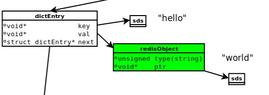
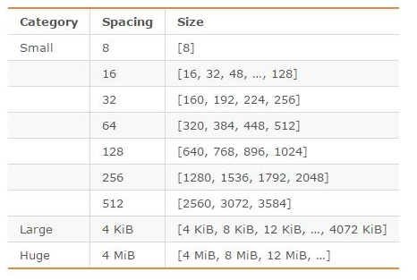
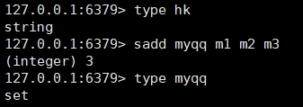
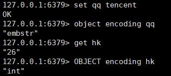
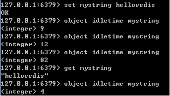
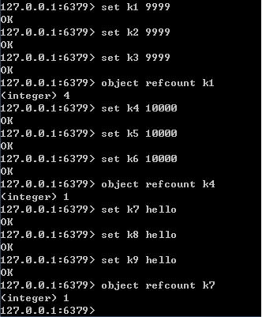
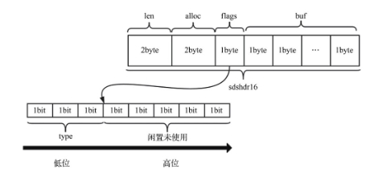

# Redis数据存储

参考

> 原文：https://www.cnblogs.com/kismetv/p/8654978.html

## 1、概述

关于Redis数据存储的细节，涉及到内存分配器（如jemalloc）、简单动态字符串（SDS）、5种对象类型及内部编码、redisObject。在讲述具体内容之前，先说明一下这几个概念之间的关系。

下图是执行set hello world时，所涉及到的数据模型。



图片来源：https://searchdatabase.techtarget.com.cn/7-20218/

（1）dictEntry：Redis是Key-Value数据库，因此对每个键值对都会有一个dictEntry，里面存储了指向Key和Value的指针；next指向下一个dictEntry，与本Key-Value无关。

（2）Key：图中右上角可见，Key（”hello”）并不是直接以字符串存储，而是存储在SDS结构中。

（3）redisObject：Value(“world”)既不是直接以字符串存储，也不是像Key一样直接存储在SDS中，而是存储在redisObject中。实际上，不论Value是5种类型的哪一种，都是通过redisObject来存储的；而redisObject中的type字段指明了Value对象的类型，ptr字段则指向对象所在的地址。不过可以看出，字符串对象虽然经过了redisObject的包装，但仍然需要通过SDS存储。

实际上，redisObject除了type和ptr字段以外，还有其他字段图中没有给出，如用于指定对象内部编码的字段；后面会详细介绍。

（4）jemalloc：无论是DictEntry对象，还是redisObject、SDS对象，都需要内存分配器（如jemalloc）分配内存进行存储。以DictEntry对象为例，有3个指针组成，在64位机器下占24个字节，jemalloc会为它分配32字节大小的内存单元。

下面来分别介绍jemalloc、redisObject、SDS、对象类型及内部编码。

## 2、jemalloc

Redis在编译时便会指定内存分配器；内存分配器可以是 libc 、jemalloc或者tcmalloc，默认是jemalloc。

jemalloc作为Redis的默认内存分配器，在减小内存碎片方面做的相对比较好。jemalloc在64位系统中，将内存空间划分为小、大、巨大三个范围；每个范围内又划分了许多小的内存块单位；当Redis存储数据时，会选择大小最合适的内存块进行存储。

jemalloc划分的内存单元如下图所示：



图片来源：http://blog.csdn.net/zhengpeitao/article/details/76573053

例如，如果需要存储大小为130字节的对象，jemalloc会将其放入160字节的内存单元中。

## 3、redisObject

前面说到，Redis对象有5种类型；无论是哪种类型，Redis都不会直接存储，而是通过redisObject对象进行存储。

redisObject对象非常重要，Redis对象的类型、内部编码、内存回收、共享对象等功能，都需要redisObject支持，下面将通过redisObject的结构来说明它是如何起作用的。

redisObject的定义如下（不同版本的Redis可能稍稍有所不同）：

```c
typedef struct redisObject {
    unsigned type:4;
    unsigned encoding:4;
    unsigned lru:LRU_BITS; /* LRU time (relative to globallru_clock) or
                            * LFU data (least significant 8 bits frequency
                            * and most significant 16 bits access time). */
    int refcount;
    void *ptr;
} robj;
```

redisObject的每个字段的含义和作用如下：

### type

type字段表示对象的类型，占4个比特；目前包括REDIS_STRING(字符串)、REDIS_LIST (列表)、REDIS_HASH(哈希)、REDIS_SET(集合)、REDIS_ZSET(有序集合)。

当我们执行type命令时，便是通过读取RedisObject的type字段获得对象的类型；如下图所示：



### encoding

encoding表示对象的内部编码，占4个比特。

对于Redis支持的每种类型，都有至少两种内部编码，例如对于字符串，有int、embstr、raw三种编码。通过encoding属性，Redis可以根据不同的使用场景来为对象设置不同的编码，大大提高了Redis的灵活性和效率。以列表对象为例，有压缩列表和双端链表两种编码方式；如果列表中的元素较少，Redis倾向于使用压缩列表进行存储，因为压缩列表占用内存更少，而且比双端链表可以更快载入；当列表对象元素较多时，压缩列表就会转化为更适合存储大量元素的双端链表。

通过object encoding命令，可以查看对象采用的编码方式，如下图所示：



5种对象类型对应的编码方式以及使用条件，将在后面介绍。

### lru

lru记录的是对象最后一次被命令程序访问的时间，占据的比特数不同的版本有所不同（如4.0版本占24比特，2.6版本占22比特）。

通过对比lru时间与当前时间，可以计算某个对象的空转时间；object idletime命令可以显示该空转时间（单位是秒）。object idletime命令的一个特殊之处在于它不改变对象的lru值。



lru值除了通过object idletime命令打印之外，还与Redis的内存回收有关系：如果Redis打开了maxmemory选项，且内存回收算法选择的是volatile-lru或allkeys—lru，那么当Redis内存占用超过maxmemory指定的值时，Redis会优先选择空转时间最长的对象进行释放。

### refcount

#### refcount与共享对象

refcount记录的是该对象被引用的次数，类型为整型。refcount的作用，主要在于对象的引用计数和内存回收。当创建新对象时，refcount初始化为1；当有新程序使用该对象时，refcount加1；当对象不再被一个新程序使用时，refcount减1；当refcount变为0时，对象占用的内存会被释放。

Redis中被多次使用的对象(refcount>1)，称为共享对象。Redis为了节省内存，当有一些对象重复出现时，新的程序不会创建新的对象，而是仍然使用原来的对象。这个被重复使用的对象，就是共享对象。目前共享对象仅支持整数值的字符串对象。

#### 共享对象的具体实现

Redis的共享对象目前只支持整数值的字符串对象。之所以如此，实际上是对内存和CPU（时间）的平衡：共享对象虽然会降低内存消耗，但是判断两个对象是否相等却需要消耗额外的时间。对于整数值，判断操作复杂度为O(1)；对于普通字符串，判断复杂度为O(n)；而对于哈希、列表、集合和有序集合，判断的复杂度为O(n^2)。

虽然共享对象只能是整数值的字符串对象，但是5种类型都可能使用共享对象（如哈希、列表等的元素可以使用）。

就目前的实现来说，Redis服务器在初始化时，会创建10000个字符串对象，值分别是0~9999的整数值；当Redis需要使用值为0~9999的字符串对象时，可以直接使用这些共享对象。10000这个数字可以通过调整参数REDIS_SHARED_INTEGERS（4.0中是OBJ_SHARED_INTEGERS）的值进行改变。

共享对象的引用次数可以通过object refcount命令查看，如下图所示。命令执行的结果页佐证了只有0~9999之间的整数会作为共享对象。



### ptr

ptr指针指向具体的数据，如前面的例子中，set hello world，ptr指向包含字符串world的SDS。

### 总结

综上所述，redisObject的结构与对象类型、编码、内存回收、共享对象都有关系；一个redisObject对象的大小为16字节：

4bit+4bit+24bit+4Byte+8Byte=16Byte。

## 4、SDS

Redis没有直接使用C字符串(即以空字符’\0’结尾的字符数组)作为默认的字符串表示，而是使用了SDS。SDS是简单动态字符串(Simple Dynamic String)的缩写。

### （1）SDS结构

sds的结构如下：

```c
struct __attribute__ ((__packed__)) sdshdr16 {
    uint16_t len; //字符串长度
    uint16_t alloc;  //已分配的总空间
    unsigned char flags; //标识是当前结构体的类型
    char buf[]; //存储字符串内容的柔性数组
};
```

其中，buf表示字节数组，用来存储字符串；len表示buf已使用的长度，alloc表示申请的总空间大小，flags表示当前结构体的类型，低3位用作标识位，高5位预留。下面是两个例子。



图片来源：《Redis5设计与源码实现》

###  （2）SDS与C字符串的比较

SDS在C字符串的基础上加入了alloc和len字段，带来了很多好处：

- 获取字符串长度：SDS是O(1)，C字符串是O(n)

- 缓冲区溢出：使用C字符串的API时，如果字符串长度增加（如strcat操作）而忘记重新分配内存，很容易造成缓冲区的溢出；而SDS由于记录了长度，相应的API在可能造成缓冲区溢出时会自动重新分配内存，杜绝了缓冲区溢出。

- 修改字符串时内存的重分配：对于C字符串，如果要修改字符串，必须要重新分配内存（先释放再申请），因为如果没有重新分配，字符串长度增大时会造成内存缓冲区溢出，字符串长度减小时会造成内存泄露。而对于SDS，由于可以记录len和alloc，因此解除了字符串长度和空间数组长度之间的关联，可以在此基础上进行优化：空间预分配策略（即分配内存时比实际需要的多）使得字符串长度增大时重新分配内存的概率大大减小；惰性空间释放策略使得字符串长度减小时重新分配内存的概率大大减小。

- 存取二进制数据：SDS可以，C字符串不可以。因为C字符串以空字符作为字符串结束的标识，而对于一些二进制文件（如图片等），内容可能包括空字符串，因此C字符串无法正确存取；而SDS以字符串长度len来作为字符串结束标识，因此没有这个问题。

此外，由于SDS中的buf仍然使用了C字符串（即以’\0’结尾），因此SDS可以使用C字符串库中的部分函数；但是需要注意的是，只有当SDS用来存储文本数据时才可以这样使用，在存储二进制数据时则不行（’\0’不一定是结尾）。

### （3）SDS与C字符串的应用

Redis在存储对象时，一律使用SDS代替C字符串。例如`set hello world`命令，hello和world都是以SDS的形式存储的。而`sadd myset member1 member2 member3`命令，不论是键（”myset”），还是集合中的元素（”member1”、 ”member2”和”member3”），都是以SDS的形式存储。除了存储对象，SDS还用于存储各种缓冲区。

只有在字符串不会改变的情况下，如打印日志时，才会使用C字符串。

##  Redis的对象类型与内部编码

Redis支持5种对象类型，而每种结构都有至少两种编码；这样做的好处在于：一方面接口与实现分离，当需要增加或改变内部编码时，用户使用不受影响，另一方面可以根据不同的应用场景切换内部编码，提高效率。

关于Redis内部编码的转换，都符合以下规律：编码转换在Redis写入数据时完成，且转换过程不可逆，只能从小内存编码向大内存编码转换。

### 1、字符串

#### （1）概况

字符串是最基础的类型，因为所有的键都是字符串类型，且字符串之外的其他几种复杂类型的元素也是字符串。

字符串长度不能超过512MB。

#### （2）内部编码

字符串类型的内部编码有3种，它们的应用场景如下：

- int：8个字节的长整型。字符串值是整型时，这个值使用long整型表示。

- embstr：`<=44`字节的字符串。embstr与raw都使用redisObject和sds保存数据，区别在于，embstr的使用只分配一次内存空间（因此redisObject和sds是连续的），而raw需要分配两次内存空间（分别为redisObject和sds分配空间）。因此与raw相比，embstr的好处在于创建时少分配一次空间，删除时少释放一次空间，以及对象的所有数据连在一起，寻找方便。而embstr的坏处也很明显，如果字符串的长度增加需要重新分配内存时，整个redisObject和sds都需要重新分配空间，因此redis中的embstr实现为只读。

- raw：大于44个字节的字符串

`embstr`和`raw`进行区分的长度，是44；是因为redisObject的长度是16字节，`sdshdr8`的长度最少是`len(1)+alloc(1)+flags(1)+buf(1)=4`字节长度；因此当字符串长度是44时，embstr的长度正好是16+4+44=64，jemalloc正好可以分配64字节的内存单元。

#### （3）编码转换

当int数据不再是整数，或大小超过了long的范围时，自动转化为raw。

Embstr与raw的转换则要看flags对应的存储类型是否发生变化，如果flags发生变化，通常发生转换，embstr->raw，若flags没有变化，则按上述的情况进行判断。

 

列表等之后整理

https://www.cnblogs.com/kismetv/p/8654978.html