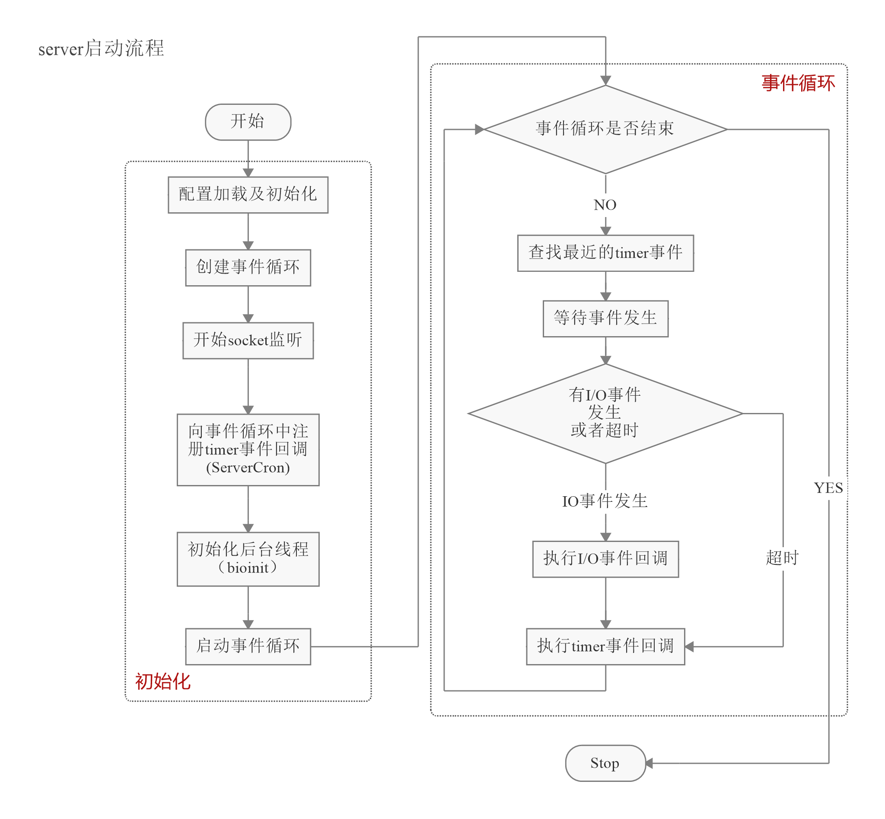

# redis服务器启动过程

> 源码 5.0.7

主要有7个步骤：

① 初始化配置，包括用户可配置的参数，以及命令表的初始化；
② 加载并解析配置文件；
③ 初始化服务端内部变量，其中就包括数据库；
④ 创建事件循环eventLoop;
⑤创建socket并启动监听；
⑥ 创建文件事件与时间事件；
⑦开启事件循环。

# server.c的main()

服务器启动从`server.c`的`main()`开始

定义

```c
int main(int argc, char **argv)
{
		...
}
```

主体流程



## 配置加载及初始化

Linux or Mac OS 下设置进程名

```c
/* We need to initialize our libraries, and the server configuration. */
// 定义在 config.h
// 实现在 sepprcotitle.c
#ifdef INIT_SETPROCTITLE_REPLACEMENT
    spt_init(argc, argv);
#endif
```

具体的解释参阅：[redis里的小秘密:设置进程名](https://www.jianshu.com/p/36c301ac87df)


字符编码相关的设置

```c
// 字符编码相关的设置
setlocale(LC_COLLATE,"");
```


设置全局时间环境变量

```c
/** 得到当前时间
// sys/time.h
int gettimeofday(struct  timeval*tv,struct  timezone *tz );
// 把目前的时间用tv 结构体返回，当地时区的信息则放到tz所指的结构中
*/
gettimeofday(&tv,NULL);
```

tzset()函数使用环境变量TZ的当前设置把值赋给三个全局变量:daylight,timezone和tzname。这些变量由ftime和localtime函数使用校正格林威治(UTC)时间为本地时间,通过time函数从系统时间计算UTC.

参阅：[linux 的时区设置函数tzset()](https://blog.csdn.net/epicyong333/article/details/5258152)


注册oom回调函数

```c
/**
zmalloc_set_oom_handler()注册回调函数
用于处理内存分配错误异常：
当无法得到需要的内存量时，会调用redisOutOfMemoryHandler函数。
// server.c
void redisOutOfMemoryHandler(size_t allocation_size) {
    serverLog(LL_WARNING,"Out Of Memory allocating %zu bytes!",
        allocation_size);
    serverPanic("Redis aborting for OUT OF MEMORY");
}
*/
zmalloc_set_oom_handler(redisOutOfMemoryHandler);
```


设置随机数种子

```c
srand(time(NULL)^getpid()); // 设置随机数种子，种子由机器时间和当前进程pid决定
```


得到当前时间

```c
/** 得到当前时间
// sys/time.h
int gettimeofday(struct  timeval*tv,struct  timezone *tz );
// 把目前的时间用tv 结构体返回，当地时区的信息则放到tz所指的结构中
*/
gettimeofday(&tv,NULL);
```


随机生成 hashseed 串

```c
char hashseed[16];
/** 随机生成一个SHA1长度的redis run-id
// util.c
void getRandomHexChars(char *p, size_t len) {
	char *charset = "0123456789abcdef";
  size_t j;

	getRandomBytes((unsigned char*)p,len);
  for (j = 0; j < len; j++) p[j] = charset[p[j] & 0x0F];
}
*/
getRandomHexChars(hashseed,sizeof(hashseed));
```


设置哈希函数的种子

```c
/** 
// dict.c
static uint8_t dict_hash_function_seed[16];

void dictSetHashFunctionSeed(uint8_t *seed) {
    memcpy(dict_hash_function_seed,seed,sizeof(dict_hash_function_seed));
}
*/
dictSetHashFunctionSeed((uint8_t*)hashseed); // 设置哈希函数种子,将hashseed内容作为种子值
```

检查哨兵模式

```c
/**
// server.c
int checkForSentinelMode(int argc, char **argv) {
	int j;
  // strstr(),返回argv[0]中有"redis-sentinel"子串的首地址,没有则返回空
  if (strstr(argv[0],"redis-sentinel") != NULL) return 1;
  // 或者采用带参时,检测参数中是否指定 哨兵模式
  for (j = 1; j < argc; j++)
  	if (!strcmp(argv[j],"--sentinel")) return 1;
  return 0;
}
*/
server.sentinel_mode = checkForSentinelMode(argc,argv); // 检查当前实例是否是哨兵模式，是为True；否则为False
```


### 步骤①：在initServerConfig()完成初始化配置

**给全局参数 server 赋初值**

详情参阅源码 `server.h/struct redisServer{}`

```c
// server.h, server 结构体
extern struct redisServer server;

struct redisServer {
    /* General */
    pid_t pid;                  /* Main process pid. */
    char *configfile;           /* Absolute config file path, or NULL */
    char *executable;           /* Absolute executable file path. */
    char **exec_argv;						/* Executable argv vector (copy). */
    ...
    ...
}    
```

实现

```c
// server.c
void initServerConfig(void);
```

互斥锁初始化

```c
/** 互斥锁的初始化
// 定义，pthread.h/pthread_mutex_init(pthread_mutex_t *m, const pthread_mutexattr_t *a);
pthread_mutex_init() 函数是以动态方式创建互斥锁的，参数attr指定了新建互斥锁的属性。如果参数attr为空(NULL)，则使用默认的互斥锁属性，默认属性为快速互斥锁 。互斥锁的属性在创建锁的时候指定，在LinuxThreads实现中仅有一个锁类型属性，不同的锁类型在试图对一个已经被锁定的互斥锁加锁时表现不同。
pthread_mutexattr_init() 函数成功完成之后会返回零，其他任何返回值都表示出现了错误。
函数成功执行后，互斥锁被初始化为未锁住态。
*/
pthread_mutex_init(&server.next_client_id_mutex,NULL);
pthread_mutex_init(&server.lruclock_mutex,NULL);
pthread_mutex_init(&server.unixtime_mutex,NULL);
```

详情参阅：[互斥锁pthread_mutex_init()函数](https://www.cnblogs.com/eustoma/p/10054783.html)

部分参数说明

```c
updateCachedTime(1); // 更新缓存时间
getRandomHexChars(server.runid,CONFIG_RUN_ID_SIZE); // 随机生成 redis 运行id
server.runid[CONFIG_RUN_ID_SIZE] = '\0';
changeReplicationId(); // replication.c 用一个随机的新的串替换当前的 replication ID
clearReplicationId2(); // 清除无效的辅助 replication ID
server.timezone = getTimeZone(); /* Initialized by tzset(). */
server.configfile = NULL; // 设置默认配置文件路径
server.executable = NULL; // 执行路径
server.hz = server.config_hz = CONFIG_DEFAULT_HZ; // 设置默认的服务器频率
server.dynamic_hz = CONFIG_DEFAULT_DYNAMIC_HZ; // 根据客户数量更改hz值
server.arch_bits = (sizeof(long) == 8) ? 64 : 32; // 操作系统的最大寻址位数
server.port = CONFIG_DEFAULT_SERVER_PORT; // 设置默认的服务器端口
server.tcp_backlog = CONFIG_DEFAULT_TCP_BACKLOG; // TCP监听的后台日志条数
server.bindaddr_count = 0; // 已绑定的地址
server.unixsocket = NULL; // unix套接字的地址
server.unixsocketperm = CONFIG_DEFAULT_UNIX_SOCKET_PERM; // unix套接字的权限
server.ipfd_count = 0; // TCP套接字描述符ipfd[]中的已使用的元素个数
server.sofd = -1; // unix套接字文件描述符
server.protected_mode = CONFIG_DEFAULT_PROTECTED_MODE;// 是否允许外部连接
server.dbnum = CONFIG_DEFAULT_DBNUM;// 已配置的数据库数量
...
unsigned int lruclock = getLRUClock();
atomicSet(server.lruclock,lruclock);// 初始化服务器的LRU时钟

resetServerSaveParams(); // 重置已保存的参数
...
appendServerSaveParams(60,10000); /* save after 1 minute and 10000 changes */

/* Replication related */
...
  
/* Replication partial resync backlog */
...  

/* Client output buffer limits */
...  

/* Double constants initialization */
...
    
/* 在此初始化命令表，也可以直接在redis.conf中通过rename-command来修改命令的名字 */
server.commands = dictCreate(&commandTableDictType,NULL);
server.orig_commands = dictCreate(&commandTableDictType,NULL);
populateCommandTable();
server.delCommand = lookupCommandByCString("del");
server.multiCommand = lookupCommandByCString("multi");
...
    
/* Slow log 慢日志 */
server.slowlog_log_slower_than = CONFIG_DEFAULT_SLOWLOG_LOG_SLOWER_THAN;
server.slowlog_max_len = CONFIG_DEFAULT_SLOWLOG_MAX_LEN;

/* Latency monitor 延时监控*/
server.latency_monitor_threshold = CONFIG_DEFAULT_LATENCY_MONITOR_THRESHOLD;

/* Debugging */
...

/* 默认情况下，我们希望脚本始终通过效果（脚本执行的单个命令）进行复制，而不是通过将脚本发送至从属/ AOF进行复制。 这是从Redis 5开始的新方法。但是可以通过redis.conf还原它。 */
server.lua_always_replicate_commands = 1;
```


### moduleInitModulesSystem()

实现

```C
// module.c/moduleInitModulesSystem(void)
moduleInitModulesSystem(void){
    // 在当中创建一系列模块相关的列表
    ...
    
    // 注册所有导出的核心APIs
    moduleRegisterCoreAPI();
    
    ...
    
    // 使管道无阻塞。这只是一种尽力而为的机制，我们不想阻塞那些既不在读取也不在写入的过程。
    anetNonBlock(NULL,server.module_blocked_pipe[0]);
    anetNonBlock(NULL,server.module_blocked_pipe[1]);
    
    ...
}
```


### 保存命令行参数以便重启时使用

```c
// 保存命令行的参数到 server.exec_argv 字符串数组
// 方便重启服务器时使用
server.executable = getAbsolutePath(argv[0]);
server.exec_argv = zmalloc(sizeof(char*)*(argc+1));
server.exec_argv[argc] = NULL;
for (j = 0; j < argc; j++) server.exec_argv[j] = zstrdup(argv[j]);
```


### 哨兵模式初始化

```c
/* We need to init sentinel right now as parsing the configuration file
* in sentinel mode will have the effect of populating the sentinel
* data structures with master nodes to monitor. */
/** 我们现在需要立即初始化哨兵，因为在哨兵模式下解析配置文件将
具有用要监视的主节点填充哨兵数据结构的效果 */
if (server.sentinel_mode) {
    initSentinelConfig(); // 初始化哨兵模式的配置
    initSentinel(); // 初始化
}
```


### 检查是否进行 redis-check-rdb 或者 redis-check-aof 模式

```c
// 是否进行 redis-check-rdb 或者 redis-check-aof 模式
if (strstr(argv[0],"redis-check-rdb") != NULL)
	redis_check_rdb_main(argc,argv,NULL);
else if (strstr(argv[0],"redis-check-aof") != NULL)
	redis_check_aof_main(argc,argv);
```


### 步骤②：加载并解析配置文件

校验命令行参数并加载、解析

```c
if (argc >= 2) {// 命令行参数在2个及以上时
    j = 1; /* First option to parse in argv[] */
    sds options = sdsempty();
    char *configfile = NULL;

    // 处理特殊命令
    /* Handle special options --help and --version */
    if (strcmp(argv[1], "-v") == 0 || strcmp(argv[1], "--version") == 0) version();
    if (strcmp(argv[1], "--help") == 0 || strcmp(argv[1], "-h") == 0) usage();
    if (strcmp(argv[1], "--test-memory") == 0) {
        if (argc == 3) {
            memtest(atoi(argv[2]),50);
            exit(0);
        } else {
            fprintf(stderr,"Please specify the amount of memory to test in megabytes.\n");
            fprintf(stderr,"Example: ./redis-server --test-memory 4096\n\n");
            exit(1);
        }
	}

    // 如果不是特殊命令,redis规定参数argv[1]必须指定一个文件路径
    // 文件有正常模式下的配置文件,哨兵模式下用于保存状态的文件
    /* First argument is the config file name? */
    if (argv[j][0] != '-' || argv[j][1] != '-') {
        configfile = argv[j];
        server.configfile = getAbsolutePath(configfile);
        /* Replace the config file in server.exec_argv with
        * its absolute path. */
        zfree(server.exec_argv[j]);
        server.exec_argv[j] = zstrdup(server.configfile);
        j++;
    }

    /* All the other options are parsed and conceptually appended to the
    * configuration file. For instance --port 6380 will generate the
    * string "port 6380\n" to be parsed after the actual file name
    * is parsed, if any. */
    // 可选参数,如 --port 6380
    while(j != argc) {
        if (argv[j][0] == '-' && argv[j][1] == '-') {
            /* Option name */
            if (!strcmp(argv[j], "--check-rdb")) { // 跳过无参数选项的解析
                /* Argument has no options, need to skip for parsing. */
                j++;
                continue;
            }
            /** 有参选项的解析*/
            // options非空时,在末尾追加换行符
            if (sdslen(options)) options = sdscat(options,"\n");
            // 在options中追加选项名称
            // 如输入参数为 --port,此时解析出port,将port追加到options中
            options = sdscat(options,argv[j]+2);
            // 追加空格
            options = sdscat(options," ");
        } else {
            /* Option argument */
            // 如输入参数为:6380
            // 则直接追加6380,再追加空格
            options = sdscatrepr(options,argv[j],strlen(argv[j]));
            options = sdscat(options," ");
            }
        j++; // 指向下一个参数或当前参数的选项,如此时指向"6380"
    } // 假设有输入参数: --port 6380 --bind 127.0.0.1 --timeout 0
    /* 至此得到的options内容形式为:
    port 6380 \n
    bind 127.0.0.1 \n
    timeout 0\space
    */

    // 哨兵模式下的输入参数校验
    if (server.sentinel_mode && configfile && *configfile == '-') {
        serverLog(LL_WARNING,
                  "Sentinel config from STDIN not allowed."); // 不允许从STDIN配置哨兵模式
        serverLog(LL_WARNING,
                  "Sentinel needs config file on disk to save state.  Exiting...");
        exit(1);
    }

    // 当有修改配置时，需要更新配置并重新加载
    resetServerSaveParams();
    loadServerConfig(configfile,options);
    sdsfree(options);
}
```

入口函数为：loadServerConfig()，声明如下：

```c
// server.h
void loadServerConfig(char *filename, char *options);

// 实现在 config.c
void loadServerConfig(char *filename, char *options) {
    sds config = sdsempty();
    char buf[CONFIG_MAX_LINE+1];

    /* Load the file content */
    if (filename) {
        ...
    }
    /* Append the additional options */
    if (options) {
        ...
    }
    loadServerConfigFromString(config);
    sdsfree(config);
}
```

输入参数`filename`表示配置文件全路径名称，`options`表示命令行输入的配置参数，例如我们通常以如下命令启动Redis服务器：`./redis-server redis.conf -p 6380`。在`loadServerConfig`()函数中加载文件中的配置和指定的`options`到变量`config`中，再调用`loadServerConfigFromString()`函数解析配置，其实现如下：

```c
// config.cconfig.c
void loadServerConfigFromString(char *config) {
    char *err = NULL;
    int linenum = 0, totlines, i;
    int slaveof_linenum = 0;
    sds *lines;

    // 分割配置字符串多行，tolines记录行数
    lines = sdssplitlen(config,strlen(config),"\n",1,&totlines);

    // 解析配置参数
    for (i = 0; i < totlines; i++) {
        ...
    }
    ...
    return;
}
```

输入参数config也就是配置字符串。函数首先将输入配置字符串以“\n”为分隔符划分为多行，totlines记录总行数，lines数组存储分割后的配置，数组元素类型为字符串SDS; for循环遍历所有配置行，解析配置参数，并根据参数内容设置结构体server各字段。注意，Redis配置文件中行开始“#”字符标识本行内容为注释，解析时需要跳过。


### 后台模式

```c
// 监督模式
server.supervised = redisIsSupervised(server.supervised_mode);
// 后台静默模式
int background = server.daemonize && !server.supervised;
if (background) daemonize();

// 【重点】服务器初始化
initServer();

if (background || server.pidfile) createPidFile(); // 创建进程守护文件
redisSetProcTitle(argv[0]); // 设置进程名为启动程序名
redisAsciiArt();
checkTcpBacklogSettings();
```


### 步骤③：初始化服务器内部变量

比如，客户端链表、数据库、全局变量和共享对象等；入口函数为`initServer`

```c
initServer();

// 实现，server.c
void initServer(void) {
    int j;

    signal(SIGHUP, SIG_IGN);
    signal(SIGPIPE, SIG_IGN);
    setupSignalHandlers();

    if (server.syslog_enabled) {
        openlog(server.syslog_ident, LOG_PID | LOG_NDELAY | LOG_NOWAIT,
            server.syslog_facility);
    }

    // server结构体的部分参数配置
    ...

    // 保存一些常用字符串,减少频繁申请释放内存时消耗的CPU时间,内存碎片等
    createSharedObjects();
    // 根据最大客户端数增加文件打开的最大数量或者根据当前可处理的最大文件数
    // 反向设置最大客户端数
    adjustOpenFilesLimit();

    // 创建事件循环
    server.el = aeCreateEventLoop(server.maxclients+CONFIG_FDSET_INCR);
    if (server.el == NULL) {
        serverLog(LL_WARNING,
            "Failed creating the event loop. Error message: '%s'",
            strerror(errno));
        exit(1);
    }

    // 申请数据库对象空间
    server.db = zmalloc(sizeof(redisDb)*server.dbnum);

    /* Open the TCP listening socket for the user commands. */
    // 监听TCP端口
    if (server.port != 0 &&
        listenToPort(server.port,server.ipfd,&server.ipfd_count) == C_ERR)
        exit(1);

    /* Open the listening Unix domain socket. */
    // 打开正在监听的Unix域套接字
    if (server.unixsocket != NULL) {
        unlink(server.unixsocket); /* don't care if this fails */
        server.sofd = anetUnixServer(server.neterr,server.unixsocket,
            server.unixsocketperm, server.tcp_backlog);
        if (server.sofd == ANET_ERR) {
            serverLog(LL_WARNING, "Opening Unix socket: %s", server.neterr);
            exit(1);
        }
        anetNonBlock(NULL,server.sofd);
    }

    /* Abort if there are no listening sockets at all. */
    // 如果根本没有TCP或者Unix domain套接字，则中止
    if (server.ipfd_count == 0 && server.sofd < 0) {
        serverLog(LL_WARNING, "Configured to not listen anywhere, exiting.");
        exit(1);
    }

    // 创建并初始化数据库对象状态
    /* Create the Redis databases, and initialize other internal state. */
    for (j = 0; j < server.dbnum; j++) {
        server.db[j].dict = dictCreate(&dbDictType,NULL);
        server.db[j].expires = dictCreate(&keyptrDictType,NULL);
        server.db[j].blocking_keys = dictCreate(&keylistDictType,NULL);
        server.db[j].ready_keys = dictCreate(&objectKeyPointerValueDictType,NULL);
        server.db[j].watched_keys = dictCreate(&keylistDictType,NULL);
        server.db[j].id = j;
        server.db[j].avg_ttl = 0;
        server.db[j].defrag_later = listCreate();
    }

    // 初始化LRU密钥池
    evictionPoolAlloc(); /* Initialize the LRU keys pool. */
    server.pubsub_channels = dictCreate(&keylistDictType,NULL);
    server.pubsub_patterns = listCreate();
    listSetFreeMethod(server.pubsub_patterns,freePubsubPattern);
    listSetMatchMethod(server.pubsub_patterns,listMatchPubsubPattern);
    server.cronloops = 0;
    server.rdb_child_pid = -1;
    server.aof_child_pid = -1;
    server.rdb_child_type = RDB_CHILD_TYPE_NONE;
    server.rdb_bgsave_scheduled = 0;
    server.child_info_pipe[0] = -1;
    server.child_info_pipe[1] = -1;
    server.child_info_data.magic = 0;
    aofRewriteBufferReset();
    server.aof_buf = sdsempty();
    server.lastsave = time(NULL); /* At startup we consider the DB saved. */
    server.lastbgsave_try = 0;    /* At startup we never tried to BGSAVE. */
    server.rdb_save_time_last = -1;
    server.rdb_save_time_start = -1;
    server.dirty = 0;
    resetServerStats();
    /* A few stats we don't want to reset: server startup time, and peak mem. */
    server.stat_starttime = time(NULL);
    server.stat_peak_memory = 0;
    server.stat_rdb_cow_bytes = 0;
    server.stat_aof_cow_bytes = 0;
    server.cron_malloc_stats.zmalloc_used = 0;
    server.cron_malloc_stats.process_rss = 0;
    server.cron_malloc_stats.allocator_allocated = 0;
    server.cron_malloc_stats.allocator_active = 0;
    server.cron_malloc_stats.allocator_resident = 0;
    server.lastbgsave_status = C_OK;
    server.aof_last_write_status = C_OK;
    server.aof_last_write_errno = 0;
    server.repl_good_slaves_count = 0;

    /* Create the timer callback, this is our way to process many background
     * operations incrementally, like clients timeout, eviction of unaccessed
     * expired keys and so forth. */
    /** 创建计时器回调，这是我们逐步处理许多后台操作的方式，
    例如客户端超时，收回未访问的过期密钥等*/
    // 创建cron定时器,绑定回调函数serverCron
    if (aeCreateTimeEvent(server.el, 1, serverCron, NULL, NULL) == AE_ERR) {
        serverPanic("Can't create event loop timers.");
        exit(1);
    }

    /* Create an event handler for accepting new connections in TCP and Unix
     * domain sockets. */
    // 创建一个事件处理程序:监听新连接并处理
    // 接收用户的连接请求,监听可读事件,注册回调函数acceptTcpHandler
    for (j = 0; j < server.ipfd_count; j++) {
        if (aeCreateFileEvent(server.el, server.ipfd[j], AE_READABLE,
            acceptTcpHandler,NULL) == AE_ERR)
            {
                serverPanic(
                    "Unrecoverable error creating server.ipfd file event.");
            }
    }
    if (server.sofd > 0 && aeCreateFileEvent(server.el,server.sofd,AE_READABLE,
        acceptUnixHandler,NULL) == AE_ERR) serverPanic("Unrecoverable error creating server.sofd file event.");


    /* Register a readable event for the pipe used to awake the event loop
     * when a blocked client in a module needs attention. */
    // 当需要注意模块中被阻止的客户端时，为管道唤醒注册一个可读事件，以唤醒事件循环。
    if (aeCreateFileEvent(server.el, server.module_blocked_pipe[0], AE_READABLE,
        moduleBlockedClientPipeReadable,NULL) == AE_ERR) {
            serverPanic(
                "Error registering the readable event for the module "
                "blocked clients subsystem.");
    }

    /* Open the AOF file if needed. */
    if (server.aof_state == AOF_ON) {
        server.aof_fd = open(server.aof_filename,
                               O_WRONLY|O_APPEND|O_CREAT,0644);
        if (server.aof_fd == -1) {
            serverLog(LL_WARNING, "Can't open the append-only file: %s",
                strerror(errno));
            exit(1);
        }
    }

    /* 32 bit instances are limited to 4GB of address space, so if there is
     * no explicit limit in the user provided configuration we set a limit
     * at 3 GB using maxmemory with 'noeviction' policy'. This avoids
     * useless crashes of the Redis instance for out of memory. */
    if (server.arch_bits == 32 && server.maxmemory == 0) {
        serverLog(LL_WARNING,"Warning: 32 bit instance detected but no memory limit set. Setting 3 GB maxmemory limit with 'noeviction' policy now.");
        server.maxmemory = 3072LL*(1024*1024); /* 3 GB */
        server.maxmemory_policy = MAXMEMORY_NO_EVICTION;
    }

    // 集群初始化
    if (server.cluster_enabled) clusterInit();
    // 其他设置
    replicationScriptCacheInit();
    scriptingInit(1);
    slowlogInit();
    latencyMonitorInit();
}
```

数据库字典的dictType指向的是结构体dbDictType，其中定义了数据库字典键的散列函数、键比较函数，以及键与值的析构函数，定义如下：

```c
// server.c
/* Db->dict, keys are sds strings, vals are Redis objects. */
dictType dbDictType = {
    dictSdsHash,                /* hash function */
    NULL,                       /* key dup */
    NULL,                       /* val dup */
    dictSdsKeyCompare,          /* key compare */
    dictSdsDestructor,          /* key destructor */
    dictObjectDestructor   /* val destructor */
};

// dicttype的定义
// dict.h
typedef struct dictType {
    uint64_t (*hashFunction)(const void *key);
    void *(*keyDup)(void *privdata, const void *key);
    void *(*valDup)(void *privdata, const void *obj);
    int (*keyCompare)(void *privdata, const void *key1, const void *key2);
    void (*keyDestructor)(void *privdata, void *key);
    void (*valDestructor)(void *privdata, void *obj);
} dictType;
```

数据库的键都是`SDS`类型，键散列函数为`dictSdsHash`，键比较函数为`dictSdsKey Compare`，键析构函数为``dictSdsDestructor``；数据库的值是`robj`对象，值析构函数为`dictObject Destructor`；键和值的内容赋值函数都为`NULL`。

对象`robj`的`refcount`字段存储当前对象的引用次数，意味着对象是可以共享的。要注意的是，只有当对象`robj`存储的是0～10000的整数时，对象`robj`才会被共享，且这些共享整数对象的引用计数初始化为`INT_MAX`，保证不会被释放。执行命令时`Redis`会返回一些字符串回复，这些字符串对象同样在服务器初始化时创建，且永远不会尝试释放这类对象。所有共享对象都存储在全局结构体变量`shared`。

```c
// server.c/initServer()/createSharedObjects()
void createSharedObjects(void) {
    int j;

    // 创建命令回复字符串对象
    shared.crlf = createObject(OBJ_STRING,sdsnew("\r\n"));
    ...
    
    ...
    // 创建共享的命令字符串
    for (j = 0; j < PROTO_SHARED_SELECT_CMDS; j++) {
        char dictid_str[64];
        int dictid_len;

        dictid_len = ll2string(dictid_str,sizeof(dictid_str),j);
        shared.select[j] = createObject(OBJ_STRING,
            sdscatprintf(sdsempty(),
                "*2\r\n$6\r\nSELECT\r\n$%d\r\n%s\r\n",
                dictid_len, dictid_str));
    }
    ...
    // 创建0~10000整数对象
    for (j = 0; j < OBJ_SHARED_INTEGERS; j++) {
        shared.integers[j] =
            makeObjectShared(createObject(OBJ_STRING,(void*)(long)j));
        shared.integers[j]->encoding = OBJ_ENCODING_INT;
    }
    ...
}
```

### 步骤④：创建事件循环

分配结构体所需内存，并初始化结构体各字段；epoll就是在此时创建的：

```c
// 引用
// server.c/initServer()    
// 创建事件循环
server.el = aeCreateEventLoop(server.maxclients+CONFIG_FDSET_INCR);

// 实现
// ae.c
aeEventLoop *aeCreateEventLoop(int setsize) {
    aeEventLoop *eventLoop;
    int i;

    if ((eventLoop = zmalloc(sizeof(*eventLoop))) == NULL) goto err;
    // 为已注册、已就绪文件事件分配空间
    eventLoop->events = zmalloc(sizeof(aeFileEvent)*setsize);
    eventLoop->fired = zmalloc(sizeof(aeFiredEvent)*setsize);
    if (eventLoop->events == NULL || eventLoop->fired == NULL) goto err;
    // 初始化或填充缺省值
    eventLoop->setsize = setsize; // 监听文件的最大数量
    eventLoop->lastTime = time(NULL); // 最后一次执行时间
    eventLoop->timeEventHead = NULL; // 时间事件表头默认指向空
    eventLoop->timeEventNextId = 0; // 下一个时间事件ID
    eventLoop->stop = 0; // 事件处理的开关
    eventLoop->maxfd = -1; // 当前已注册的最大文件描述符
    // 事件处理回调
    eventLoop->beforesleep = NULL;
    eventLoop->aftersleep = NULL;
    // 初始化多路复用的特定数据，此处调用编译时系统选择的I/O多路复用策略，如epoll
    if (aeApiCreate(eventLoop) == -1) goto err;
    /* Events with mask == AE_NONE are not set. So let's initialize the
     * vector with it. */
    // 每个已注册的文件事件都应该有其对应的执行类型,默认为 AE_NONE
    for (i = 0; i < setsize; i++)
        eventLoop->events[i].mask = AE_NONE;
    return eventLoop;

err: // 但凡有分配失败的时候都应该释放之前已分配的空间
    if (eventLoop) {
        zfree(eventLoop->events);
        zfree(eventLoop->fired);
        zfree(eventLoop);
    }
    return NULL;
}
```

输入参数setsize理论上等于用户配置的最大客户端数目即可，但是为了确保安全，这里设置setsize等于最大客户端数目加128。函数aeApiCreate内部调用epoll_create创建epoll，并初始化结构体eventLoop的字段apidata。

完成这些操作后，Redis将创建sockets并启动监听，同时创建对应的文件事件与时间事件并开始事件循环。

### 步骤⑤：创建socket并启动监听

用户可通过指令port配置socket绑定端口号，指令bind配置socket绑定IP地址；注意指令bind可配置多个IP地址，中间用空格隔开；创建socket时只需要循环所有IP地址即可。

```c
// server.c/initServer()
/* Open the TCP listening socket for the user commands. */
    // 监听TCP端口
    if (server.port != 0 &&
        listenToPort(server.port,server.ipfd,&server.ipfd_count) == C_ERR)
        exit(1);

// 实现
// server.c
/* Initialize a set of file descriptors to listen to the specified 'port'
 * binding the addresses specified in the Redis server configuration.
 *
 * The listening file descriptors are stored in the integer array 'fds'
 * and their number is set in '*count'.
 *
 * The addresses to bind are specified in the global server.bindaddr array
 * and their number is server.bindaddr_count. If the server configuration
 * contains no specific addresses to bind, this function will try to
 * bind * (all addresses) for both the IPv4 and IPv6 protocols.
 *
 * On success the function returns C_OK.
 *
 * On error the function returns C_ERR. For the function to be on
 * error, at least one of the server.bindaddr addresses was
 * impossible to bind, or no bind addresses were specified in the server
 * configuration but the function is not able to bind * for at least
 * one of the IPv4 or IPv6 protocols. */
int listenToPort(int port, int *fds, int *count) {
    int j;

    /* Force binding of 0.0.0.0 if no bind address is specified, always
     * entering the loop if j == 0. */
    if (server.bindaddr_count == 0) server.bindaddr[0] = NULL;
    for (j = 0; j < server.bindaddr_count || j == 0; j++) {
        if (server.bindaddr[j] == NULL) {
            int unsupported = 0;
            /* Bind * for both IPv6 and IPv4, we enter here only if
             * server.bindaddr_count == 0. */
            fds[*count] = anetTcp6Server(server.neterr,port,NULL,
                server.tcp_backlog);
            if (fds[*count] != ANET_ERR) {
                anetNonBlock(NULL,fds[*count]);
                (*count)++;
            } else if (errno == EAFNOSUPPORT) {
                unsupported++;
                serverLog(LL_WARNING,"Not listening to IPv6: unsupproted");
            }

            if (*count == 1 || unsupported) {
                /* Bind the IPv4 address as well. */
                // 创建socket并启动监听，文件描述符存储在fds数组作为返回参数
                fds[*count] = anetTcpServer(server.neterr,port,NULL,
                    server.tcp_backlog);
                if (fds[*count] != ANET_ERR) {
                    // 设置socket非阻塞
                    anetNonBlock(NULL,fds[*count]);
                    (*count)++;
                } else if (errno == EAFNOSUPPORT) {
                    unsupported++;
                    serverLog(LL_WARNING,"Not listening to IPv4: unsupproted");
                }
            }
            /* Exit the loop if we were able to bind * on IPv4 and IPv6,
             * otherwise fds[*count] will be ANET_ERR and we'll print an
             * error and return to the caller with an error. */
            if (*count + unsupported == 2) break;
        } else if (strchr(server.bindaddr[j],':')) {
            /* Bind IPv6 address. */
            fds[*count] = anetTcp6Server(server.neterr,port,server.bindaddr[j],
                server.tcp_backlog);
        } else {
            /* Bind IPv4 address. */
            fds[*count] = anetTcpServer(server.neterr,port,server.bindaddr[j],
                server.tcp_backlog);
        }
        if (fds[*count] == ANET_ERR) {
            serverLog(LL_WARNING,
                "Could not create server TCP listening socket %s:%d: %s",
                server.bindaddr[j] ? server.bindaddr[j] : "*",
                port, server.neterr);
                if (errno == ENOPROTOOPT     || errno == EPROTONOSUPPORT ||
                    errno == ESOCKTNOSUPPORT || errno == EPFNOSUPPORT ||
                    errno == EAFNOSUPPORT    || errno == EADDRNOTAVAIL)
                    continue;
            return C_ERR;
        }
        anetNonBlock(NULL,fds[*count]);
        (*count)++;
    }
    return C_OK;
}
```

输入参数`port`表示用户配置的端口号，`server`结构体的`bindaddr_count`字段存储用户配置的IP地址数目，`bindaddr`字段存储用户配置的所有IP地址。函数`anetTcpServer`实现了`socket`的创建、绑定，以及监听流程。参数`fds`与`count`可用作输出参数，`fds`数组存储创建的所有`socket`文件描述符，`count`存储`socket`数目。

所有创建的`socket`都会设置为非阻塞模式，原因在于`Redis`使用了IO多路复用模式，其要求socket读写必须是非阻塞的，函数`anetNonBlock`通过系统调用`fcntl`设置`socket`非阻塞模式。

### 步骤⑥：创建文件事件与时间事件

#### 文件事件

在Redis中socket的读写事件被抽象为文件事件，因为对于监听的socket还需要创建对应的文件事件。

```c
// server.c/initServer()
	/* Create an event handler for accepting new connections in TCP and Unix
     * domain sockets. */
    // 创建一个事件处理程序:监听新连接并处理
    // 接收用户的连接请求,监听可读事件,注册回调函数acceptTcpHandler
    for (j = 0; j < server.ipfd_count; j++) {
        if (aeCreateFileEvent(server.el, server.ipfd[j], AE_READABLE,
            acceptTcpHandler,NULL) == AE_ERR)
            {
                serverPanic(
                    "Unrecoverable error creating server.ipfd file event.");
            }
    }
// 同上
    if (server.sofd > 0 && aeCreateFileEvent(server.el,server.sofd,AE_READABLE,
        acceptUnixHandler,NULL) == AE_ERR) serverPanic("Unrecoverable error creating server.sofd file event.");
```

`ipfd`、`sofd`分别为`ip(tcp/ip) socket`、`Unix socket`文件描述符，两种套接字的区别在于：前者既能用于进程间通信(同一主机)，也能用于网络间通信(不同主机)；后者用于进程间通信(同一主机)。

`server`结构体的`ipfd_count`字段存储创建的监听`socket`数目，`ipfd`数组存储创建的所有监听`socket`文件描述符，需要遍历所有的监听`socket`，为其创建对应的文件事件。可以看到监听事件的处理函数为`acceptTcpHandler`，实现了`socket`连接请求的`accept`，以及客户端对象的创建。

#### 时间事件

定时任务被抽象为时间事件，且`Redis`只创建了一个时间事件，在服务端初始化时创建。此时间事件的处理函数为`serverCron`，初次创建时1毫秒后就会被触发。

```c
// server.c/initServer()
	/* Create the timer callback, this is our way to process many background
     * operations incrementally, like clients timeout, eviction of unaccessed
     * expired keys and so forth. */
    /** 创建计时器回调，这是我们逐步处理许多后台操作的方式，
    例如客户端超时，收回未访问的过期密钥等*/
    // 创建cron定时器,绑定回调函数serverCron
    if (aeCreateTimeEvent(server.el, 1, serverCron, NULL, NULL) == AE_ERR) {
        serverPanic("Can't create event loop timers.");
        exit(1);
    }
```

### 步骤⑦：开启事件循环

步骤①~⑥完成服务端的初始化工作，并在指定IP地址、端口监听客户端连接请求，同时创建了文件事件与时间事件；此处只需要开启事件循环等待事件发生即可。

```c
// server.c/main()
	aeMain(server.el);

// 实现
// ae.c
void aeMain(aeEventLoop *eventLoop) {
    eventLoop->stop = 0;
    // 开始事件循环
    while (!eventLoop->stop) {
        if (eventLoop->beforesleep != NULL)
            eventLoop->beforesleep(eventLoop);
        // 事件处理主函数
        aeProcessEvents(eventLoop, AE_ALL_EVENTS|AE_CALL_AFTER_SLEEP);
    }
}
```

`aeProcessEvents`函数在事件处理小节中又讲，看一下`beforesleep`函数，它在每次事件循环开始，即Redis阻塞等待文件事件之前执行。函数beforesleep会执行一些不是很费时的操作，如：集群相关操作、过期键删除操作（这里可称为快速过期键删除）、向客户端返回命令回复等。

```c
// server.c
/* This function gets called every time Redis is entering the
 * main loop of the event driven library, that is, before to sleep
 * for ready file descriptors. */
void beforeSleep(struct aeEventLoop *eventLoop) {
    UNUSED(eventLoop);

    /* Call the Redis Cluster before sleep function. Note that this function
     * may change the state of Redis Cluster (from ok to fail or vice versa),
     * so it's a good idea to call it before serving the unblocked clients
     * later in this function. */
    // 集群相关
    if (server.cluster_enabled) clusterBeforeSleep();

    /* Run a fast expire cycle (the called function will return
     * ASAP if a fast cycle is not needed). */
    // 过期健删除操作
    if (server.active_expire_enabled && server.masterhost == NULL)
        activeExpireCycle(ACTIVE_EXPIRE_CYCLE_FAST);

    /* Send all the slaves an ACK request if at least one client blocked
     * during the previous event loop iteration. */
    if (server.get_ack_from_slaves) {
        robj *argv[3];

        argv[0] = createStringObject("REPLCONF",8);
        argv[1] = createStringObject("GETACK",6);
        argv[2] = createStringObject("*",1); /* Not used argument. */
        replicationFeedSlaves(server.slaves, server.slaveseldb, argv, 3);
        decrRefCount(argv[0]);
        decrRefCount(argv[1]);
        decrRefCount(argv[2]);
        server.get_ack_from_slaves = 0;
    }

    /* Unblock all the clients blocked for synchronous replication
     * in WAIT. */
    if (listLength(server.clients_waiting_acks))
        processClientsWaitingReplicas();

    /* Check if there are clients unblocked by modules that implement
     * blocking commands. */
    moduleHandleBlockedClients();

    /* Try to process pending commands for clients that were just unblocked. */
    if (listLength(server.unblocked_clients))
        processUnblockedClients();

    /* Write the AOF buffer on disk */
    flushAppendOnlyFile(0);

    /* Handle writes with pending output buffers. */
    handleClientsWithPendingWrites();

    /* Before we are going to sleep, let the threads access the dataset by
     * releasing the GIL. Redis main thread will not touch anything at this
     * time. */
    if (moduleCount()) moduleReleaseGIL();
}
```

这里简要介绍一下(快速)过期键删除操作：

```c
// expire.c
// 实现
void activeExpireCycle(int type)
{
	...
}
```

`Redis`过期键删除有两种策略：① 访问数据库键时，校验该键是否过期，如果过期则删除；② 周期性删除过期键，`beforeSleep`函数与`serverCron`函数都会执行。`server`结构体的`active_expire_enabled`字段表示是否开启周期性删除过期键策略，用户可通过`set-active-expire`指令配置；`masterhost`字段存储当前`Redis`服务器的`master`服务器的域名，如果为`NULL`说明当前服务器不是某个`Redis`服务器的`slaver`。注意到这里依然是调用函数`activeExpireCycle`执行过期键删除，只是参数传递的是`ACTIVE_EXPIRE_CYCLE_FAST`，表示快速过期键删除。

函数`activeExpireCycle`计算出`timelimit`，即函数最大执行时间，循环删除过期键时会校验函数执行时间是否超过此限制，超过则结束循环。显然快速过期键删除时只需要缩短`timelimit`即可，计算策略如下：

```c
    if (type == ACTIVE_EXPIRE_CYCLE_FAST) {
        /* Don't start a fast cycle if the previous cycle did not exit
         * for time limit. Also don't repeat a fast cycle for the same period
         * as the fast cycle total duration itself. */
        // 上次activeExpireCycle函数是否已经执行完毕
        if (!timelimit_exit) return;
        // 当前时间距离上次执行快速过期健删除是否已经超过2000微秒
        if (start < last_fast_cycle + ACTIVE_EXPIRE_CYCLE_FAST_DURATION*2) return;
        last_fast_cycle = start;
    }
	...
	// 快速过期健删除时，函数执行时间不超过1000微秒
    if (type == ACTIVE_EXPIRE_CYCLE_FAST)
        timelimit = ACTIVE_EXPIRE_CYCLE_FAST_DURATION; /* in microseconds. */
```

执行快速过期键删除有很多限制，当函数`activeExpireCycle`正在执行时直接返回；当上次执行快速过期键删除的时间距离当前时间小于2000微秒时直接返回。思考下为什么可以通过变量`timelimit_exit`判断函数`activeExpireCycle`是否正在执行呢？注意到变量`timelimit_exit`声明为`static`，即函数执行完毕不会释放变量空间。那么可以在函数`activeExpireCycle`入口赋值`timelimit_exit`为0，返回之前赋值`timelimit_exit`为1，由此便可通过变量`timelimit_exit`判断函数`activeExpireCycle`是否正在执行。变量`last_fast_cycle`声明为`static`也是同样的用意。同时可以看到当执行快速过期键删除时，设置函数`activeExpireCycle`的最大执行时间为1000微秒。

函数`aeProcessEvents`为事件处理主函数，它首先查找最近发生的时间事件，调用`epoll_wait`阻塞等待文件事件的发生并设置超时事件；待`epoll_wait`返回时，处理触发的文件事件；最后处理时间事件。步骤6中已经创建了文件事件，为监听`socket`的读事件，事件处理函数为`acceptTcpHandler`，即当客户端发起`socket`连接请求时，服务端会执行函数`acceptTcpHandler`处理。`acceptTcpHandler`函数主要做了3件事：① 接受（accept）客户端的连接请求；② 创建客户端对象，并初始化对象各字段；③ 创建文件事件。②与③由函数createClient实现，输入参数`fd`为接受客户端连接请求后生成的`socket`文件描述符。

```c
// 在server.c/initServer()中启动socket监听
	if(aeCreateFileEvent(server.el, server.ipfd[j], AE_READABLE, acceptTcpHandler, Null) == AE_ERR){...}

// acceptTcpHandler为socket请求处理函数
// networking.c
void acceptTcpHandler(aeEventLoop *el, int fd, void *privdata, int mask) {
    int cport, cfd, max = MAX_ACCEPTS_PER_CALL;
    char cip[NET_IP_STR_LEN];
    UNUSED(el);
    UNUSED(mask);
    UNUSED(privdata);

    while(max--) {
        // 1、接收请求的连接
        cfd = anetTcpAccept(server.neterr, fd, cip, sizeof(cip), &cport);
        if (cfd == ANET_ERR) {
            if (errno != EWOULDBLOCK)
                serverLog(LL_WARNING,
                    "Accepting client connection: %s", server.neterr);
            return;
        }
        serverLog(LL_VERBOSE,"Accepted %s:%d", cip, cport);
        // 2、接收命令请求并处理
        acceptCommonHandler(cfd,0,cip);
    }
}

// networking.c
#define MAX_ACCEPTS_PER_CALL 1000
static void acceptCommonHandler(int fd, int flags, char *ip) {
    client *c;
    if ((c = createClient(fd)) == NULL) {
        serverLog(LL_WARNING,
            "Error registering fd event for the new client: %s (fd=%d)",
            strerror(errno),fd);
        close(fd); /* May be already closed, just ignore errors */
        return;
    }
    ...
        server.stat_numconnections++;
    c->flags |= flags;
}

// networking.c
client *createClient(int fd) {
    client *c = zmalloc(sizeof(client));

    /* passing -1 as fd it is possible to create a non connected client.
     * This is useful since all the commands needs to be executed
     * in the context of a client. When commands are executed in other
     * contexts (for instance a Lua script) we need a non connected client. */
    if (fd != -1) {
        // 为了使用I/O多路复用模式，此处同样需要设置socket为非阻塞模式
        anetNonBlock(NULL,fd);
        // 设置TCP_NODELAY
        anetEnableTcpNoDelay(NULL,fd);
        // 如果服务端配置了tcpkeepalive，则设置SO_KEEPALIVE
        if (server.tcpkeepalive)
            anetKeepAlive(NULL,fd,server.tcpkeepalive);
        // 创建文件事件，通过readQueryFromClient函数处理来自客户端的命令请求
        if (aeCreateFileEvent(server.el,fd,AE_READABLE,
            readQueryFromClient, c) == AE_ERR)
        {
            close(fd);
            zfree(c);
            return NULL;
        }
    }

    // 初始化client结构体各字段
    selectDb(c,0);
    uint64_t client_id;
    atomicGetIncr(server.next_client_id,client_id,1);
    c->id = client_id;
    c->fd = fd;
    c->name = NULL;
    ...
    return c;
}
```

TCP是基于字节流的可靠传输层协议，为了提升网络利用率，一般默认都会开启Nagle。当应用层调用write函数发送数据时，TCP并不一定会立刻将数据发送出去，根据Nagle算法，还必须满足一定条件才行。Nagle是这样规定的：如果数据包长度大于一定门限时，则立即发送；如果数据包中含有FIN（表示断开TCP链接）字段，则立即发送；如果当前设置了TCP_NODELAY选项，则立即发送；如果以上所有条件都不满足，则默认需要等待200毫秒超时后才会发送。Redis服务器向客户端返回命令回复时，希望TCP能立即将该回复发送给客户端，因此需要设置TCP_NODELAY。思考下如果不设置会怎么样呢？从客户端分析，命令请求的响应时间会大大加长。

TCP是可靠的传输层协议，但每次都需要经历“三次握手”与“四次挥手”，为了提升效率，可以设置SO_KEEPALIVE，即TCP长连接，这样TCP传输层会定时发送心跳包确认该连接的可靠性。应用层也不再需要频繁地创建与释放TCP连接了。server结构体的tcpkeepalive字段表示是否启用TCP长连接，用户可通过参数tcp-keepalive配置。

接收到客户端连接请求之后，服务器需要创建文件事件等待客户端的命令请求，可以看到文件事件的处理函数为readQueryFromClient，当服务器接收到客户端的命令请求时，会执行此函数。