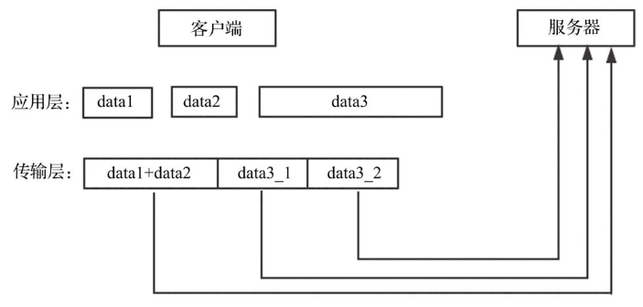
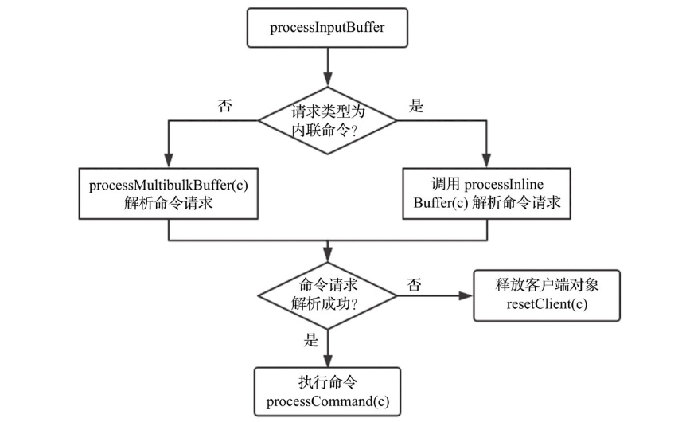

# 命令处理过程

①解析命令请求
②调用命令
③返回结果给客户端

## 步骤①：解析命令请求

TCP是一种基于字节流的传输层通信协议，因此接收到的TCP数据不一定是一个完整的数据包，其有可能是多个数据包的组合，也有可能是某一个数据包的部分，这种现象被称为半包与粘包，如下图：



客户端应用层分别发送3个数据包，data3、data2和data1，但是TCP传输层在真正发送数据时，将data3数据包分割为data3_1与data3_2，并且将data1与data2数据合并，此时服务器接收到的数据包就不是一个完整的数据包。

为了区分一个完整的数据包，通常有如下3种方法：① 数据包长度固定；② 通过特定的分隔符区分，比如HTTP协议就是通过换行符区分的；③ 通过在数据包头部设置长度字段区分数据包长度，比如FastCGI协议。

Redis采用自定义协议格式实现不同命令请求的区分，例如当用户在redis-cli客户端键入下面的命令：

```
SET redis-key value1
```

客户端会将该命令请求转换为以下协议格式，然后发送给服务器：

```
*3\r\n$3\r\nSET\r\n$9\r\nredis-key\r\n$6\r\nvalue1\r\n
```

换行符\r\n用于区分命令请求的若干参数，“*3”表示该命令请求有3个参数，“$3”“$9”和“$6”等表示该参数字符串长度。

Redis还支持在telnet会话输入命令的方式，此时没有了请求协议中的“*”来声明参数的数量，必须使用空格来分隔各个参数，服务器在接收到数据之后，会将空格作为参数分隔符解析命令请求。这种方式的命令请求称为内联命令。

Redis服务器接收到的命令请求首先存储在客户端对象的querybuf输入缓冲区，然后解析命令请求各个参数，并存储在客户端对象的argv（参数对象数组）和argc（参数数目）字段。解析客户端命令请求的入口函数为readQueryFromClient，会读取socket数据存储到客户端对象的输入缓冲区，并调用函数processInputBuffer解析命令请求。processInputBuffer函数主要逻辑如下图所示：



解析命令请求可以分为2个步骤：
a、解析命令请求参数数目；
b、循环解析每个请求参数。

### 步骤a、解析命令请求参数数目

querybuf指向命令请求首地址，命令请求参数数目的协议格式为`*3\r\n`，即首字符必须是“*”，并且可以使用字符“\r”定位到行尾位置。解析后的参数数目暂存在客户端对象的multibulklen字段，表示等待解析的参数数目，变量pos记录已解析命令请求的长度。

### 步骤b、循环解析每个请求参数

命令请求各参数的协议格式为`$3\r\nSET\r\n`，即首字符必须是“$”。解析当前参数之前需要解析出参数的字符串长度，可以使用字符“\r”定位到行尾位置；注意，解析参数长度时，字符串开始位置为querybuf+pos+1；字符串参数长度暂存在客户端对象的bulklen字段，同时更新已解析字符串长度pos。

按redis协议格式的处理函数

```c
// networking.c/readQueryFromClient()/processInputBufferAndReplicate()/processInputBuffer()中调用
int processMultibulkBuffer(client *c) {
    char *newline = NULL;// 指向分隔符"\r"
    int ok;
    long long ll;// 参数数目或参数的长度

    if (c->multibulklen == 0) {
        /* The client should have been reset */
        serverAssertWithInfo(c,NULL,c->argc == 0);

        /* Multi bulk length cannot be read without a \r\n */
        newline = strchr(c->querybuf+c->qb_pos,'\r');
        ...

        /* Buffer should also contain \n */
        if (newline-(c->querybuf+c->qb_pos) > (ssize_t)(sdslen(c->querybuf)-c->qb_pos-2))
            return C_ERR;

        /* We know for sure there is a whole line since newline != NULL,
         * so go ahead and find out the multi bulk length. */
        serverAssertWithInfo(c,NULL,c->querybuf[c->qb_pos] == '*');
        ok = string2ll(c->querybuf+1+c->qb_pos,newline-(c->querybuf+1+c->qb_pos),&ll);
        ...

        c->qb_pos = (newline-c->querybuf)+2;// 到每个结束符（首地址querybuf到\r\n的偏移）的偏移量

        if (ll <= 0) return C_OK;

        c->multibulklen = ll;// 第一次取的就是参数的总个数

        /* Setup argv array on client structure */
        if (c->argv) zfree(c->argv);
        c->argv = zmalloc(sizeof(robj*)*c->multibulklen);
    }

    serverAssertWithInfo(c,NULL,c->multibulklen > 0);
    while(c->multibulklen) {// 循环取完所有参数
        /* Read bulk length if unknown */
        if (c->bulklen == -1) {
            newline = strchr(c->querybuf+c->qb_pos,'\r');
            ...

            /* Buffer should also contain \n */
            if (newline-(c->querybuf+c->qb_pos) > (ssize_t)(sdslen(c->querybuf)-c->qb_pos-2))
                break;

            if (c->querybuf[c->qb_pos] != '$') {// 每个参数区段的开头是符号$
                ...
            }

            ok = string2ll(c->querybuf+c->qb_pos+1,newline-(c->querybuf+c->qb_pos+1),&ll);// 此时 ll 记录了当前参数字符串的长度
            ...

            c->qb_pos = newline-c->querybuf+2;// 记录到下一个结束符"\r\n"的偏移
            ...
            c->bulklen = ll;
        }

        /* Read bulk argument */
        // 读取参数字符串内容
        if (sdslen(c->querybuf)-c->qb_pos < (size_t)(c->bulklen+2)) {
            /* Not enough data (+2 == trailing \r\n) */
            break;
        } else {
            /* Optimization: if the buffer contains JUST our bulk element
             * instead of creating a new object by *copying* the sds we
             * just use the current sds string. */
            if (c->qb_pos == 0 &&
                c->bulklen >= PROTO_MBULK_BIG_ARG &&
                sdslen(c->querybuf) == (size_t)(c->bulklen+2))
            {
                ...
            } else {// 解析的参数记录在argv数组(相对于一个二维数组)中，argc记录参数个数
                c->argv[c->argc++] =
                    createStringObject(c->querybuf+c->qb_pos,c->bulklen);
                c->qb_pos += c->bulklen+2;
            }
            c->bulklen = -1;
            c->multibulklen--;
        }
    }

    /* We're done when c->multibulk == 0 */
    if (c->multibulklen == 0) return C_OK;

    /* Still not ready to process the command */
    return C_ERR;
}
```

当`multibulklen`值更新为0时，说明参数解析完成，结束循环。读者可以思考一下，待解析参数数目、当前参数长度为什么都需要暂存在客户端结构体？使用函数局部变量行不行？答案是肯定不行，原因就在于上面提到的TCP半包与粘包现象，服务器可能只接收到部分命令请求，例如`*3\r\n$3\r\nSET\r\n$9\r\nredis`。当函数`processMultibulkBuffer`执行完毕时，同样只会解析部分命令请求`*3\r\n$3\r\nSET\r\n$9\r\n`，此时就需要**记录该命令请求待解析的参数数目，以及待解析参数的长度；而剩余待解析的参数“redis”会继续缓存在客户端的输入缓冲区**。

## 步骤②：命令调用

解析完命令请求之后，会调用函数processCommand处理该命令请求，而处理命令请求之前还有很多校验逻辑，比如客户端是否已经完成认证，命令请求参数是否合法等。

```c
// networking.c/readQueryFromClient()/processInputBufferAndReplicate()/processInputBuffer()/中调用 processCommand()函数
	/* Only reset the client when the command was executed. */
            if (processCommand(c) == C_OK) {
                if (c->flags & CLIENT_MASTER && !(c->flags & CLIENT_MULTI)) {
                    /* Update the applied replication offset of our master. */
                    c->reploff = c->read_reploff - sdslen(c->querybuf) + c->qb_pos;
                }

                /* Don't reset the client structure for clients blocked in a
                 * module blocking command, so that the reply callback will
                 * still be able to access the client argv and argc field.
                 * The client will be reset in unblockClientFromModule(). */
                if (!(c->flags & CLIENT_BLOCKED) || c->btype != BLOCKED_MODULE)
                    resetClient(c);
            }
```

processCommand()函数定义：

```c
// server.c
int processCommand(client *client){
    // 按规则校验参数
    
    // 执行命令
}
```

下面简要列出若干校验规则：

校验1：如果是quit命令直接返回并关闭客户端。

```c
// server.c/processCommand()
if (!strcasecmp(c->argv[0]->ptr,"quit")) {
        addReply(c,shared.ok);
        c->flags |= CLIENT_CLOSE_AFTER_REPLY;
        return C_ERR;
    }
```

校验2：执行函数lookupCommand查找命令后，如果命令不存在返回错误。

```c
// server.c/processCommand()
	/* Now lookup the command and check ASAP about trivial error conditions
     * such as wrong arity, bad command name and so forth. */
    c->cmd = c->lastcmd = lookupCommand(c->argv[0]->ptr);
    if (!c->cmd) {
        flagTransaction(c);
        sds args = sdsempty();
        int i;
        for (i=1; i < c->argc && sdslen(args) < 128; i++)
            args = sdscatprintf(args, "`%.*s`, ", 128-(int)sdslen(args), (char*)c->argv[i]->ptr);
        addReplyErrorFormat(c,"unknown command `%s`, with args beginning with: %s",
            (char*)c->argv[0]->ptr, args);
        sdsfree(args);
        return C_OK;
    }
```

校验3：如果命令参数数目不合法，返回错误

```c
// server.c/processCommand()
	if ((c->cmd->arity > 0 && c->cmd->arity != c->argc) ||
               (c->argc < -c->cmd->arity)) {
        flagTransaction(c);
        addReplyErrorFormat(c,"wrong number of arguments for '%s' command",
            c->cmd->name);
        return C_OK;
    }
```

命令结构体的arity用于校验参数数目是否合法，当arity小于0时，表示命令参数数目大于等于arity的绝对值；当arity大于0时，表示命令参数数目必须为arity。注意命令请求中命令的名称本身也是一个参数。

校验4：如果配置文件中使用指令“requirepass password”设置了密码，且客户端没未认证通过，只能执行auth命令，auth命令格式为“AUTH password”。

```c
// server.c/processCommand()
	/* Check if the user is authenticated */
    if (server.requirepass && !c->authenticated && c->cmd->proc != authCommand)
    {
        flagTransaction(c);
        addReply(c,shared.noautherr);
        return C_OK;
    }
```

校验5：如果配置文件中使用指令“maxmemory <bytes>”设置了最大内存限制，且当前内存使用量超过了该配置门限，服务器会拒绝执行带有“m”（CMD_DENYOOM）标识的命令，如SET命令、APPEND命令和LPUSH命令等。

```c
// server.c/processCommand()
	/* Handle the maxmemory directive.
     *
     * Note that we do not want to reclaim memory if we are here re-entering
     * the event loop since there is a busy Lua script running in timeout
     * condition, to avoid mixing the propagation of scripts with the
     * propagation of DELs due to eviction. */
    if (server.maxmemory && !server.lua_timedout) {
        int out_of_memory = freeMemoryIfNeededAndSafe() == C_ERR;
        /* freeMemoryIfNeeded may flush slave output buffers. This may result
         * into a slave, that may be the active client, to be freed. */
        if (server.current_client == NULL) return C_ERR;

        /* It was impossible to free enough memory, and the command the client
         * is trying to execute is denied during OOM conditions or the client
         * is in MULTI/EXEC context? Error. */
        if (out_of_memory &&
            (c->cmd->flags & CMD_DENYOOM ||
             (c->flags & CLIENT_MULTI && c->cmd->proc != execCommand))) {
            flagTransaction(c);
            addReply(c, shared.oomerr);
            return C_OK;
        }
    }
```

校验6：除了上面的5种校验，还有很多校验规则，比如集群相关校验、持久化相关校验、主从复制相关校验、发布订阅相关校验及事务操作等。

当所有校验规则都通过后，才会调用命令处理函数执行命令，代码如下：

```c
// server.c/processCommand()
/* Exec the command */
    if (c->flags & CLIENT_MULTI &&
        c->cmd->proc != execCommand && c->cmd->proc != discardCommand &&
        c->cmd->proc != multiCommand && c->cmd->proc != watchCommand)
    {
        ...
    } else {
        call(c,CMD_CALL_FULL);
        c->woff = server.master_repl_offset;
        if (listLength(server.ready_keys))
            handleClientsBlockedOnKeys();
    }
    ...;

// 在call函数中执行命令
// server.c/call()
void call(client *c, int flags){
    ...
    start = server.ustime;
    c->cmd->proc(c);
    duration = ustime()-start;
    ...;
    
    /* Log the command into the Slow log if needed, and populate the
     * per-command statistics that we show in INFO commandstats. */
    if (flags & CMD_CALL_SLOWLOG && c->cmd->proc != execCommand) {
        char *latency_event = (c->cmd->flags & CMD_FAST) ?
                              "fast-command" : "command";
        latencyAddSampleIfNeeded(latency_event,duration/1000);
        // 记录慢查询日志
        slowlogPushEntryIfNeeded(c,c->argv,c->argc,duration);
    }
    // 更新统计信息：当前命令执行时间和调用次数
    if (flags & CMD_CALL_STATS) {
        /* use the real command that was executed (cmd and lastamc) may be
         * different, in case of MULTI-EXEC or re-written commands such as
         * EXPIRE, GEOADD, etc. */
        real_cmd->microseconds += duration;
        real_cmd->calls++;
    }
}
```

执行命令完成后，如果有必要，还需要更新统计信息，记录慢查询日志，AOF持久化该命令请求，传播命令请求给所有的从服务器等。持久化与主从复制会在相关章节会作详细介绍，这里主要介绍慢查询日志的实现方式。代码如下：

```c
// slowlog.c
/* Push a new entry into the slow log.
 * This function will make sure to trim the slow log accordingly to the
 * configured max length. */
void slowlogPushEntryIfNeeded(client *c, robj **argv, int argc, long long duration) {
    // 执行时间超过门限，记录该命令
    if (server.slowlog_log_slower_than < 0) return; /* Slowlog disabled */
    if (duration >= server.slowlog_log_slower_than)
        listAddNodeHead(server.slowlog,
                        slowlogCreateEntry(c,argv,argc,duration));

    /* Remove old entries if needed. */
    // 慢查询日志最多记录条数为slowlog_max_len,超过时删除
    while (listLength(server.slowlog) > server.slowlog_max_len)
        listDelNode(server.slowlog,listLast(server.slowlog));
}
```

可以在配置文件中使用指令“slowlog-log-slower-than 10000”配置“执行时间超过多少毫秒”才会记录慢查询日志，指令“slowlog-max-len 128”配置慢查询日志最大数目，超过会删除最早的日志记录。可以看到慢查询日志记录在服务端结构体的slowlog字段，即使存取速度非常快，也不会影响命令执行效率。用户可通过“SLOWLOG subcommand [argument]”命令查看服务器记录的慢查询日志。

## 步骤③：返回结果

Redis服务器返回结果类型不同，协议格式不同，而客户端根据返回结果的第一个字符判断返回类型。

Redis的返回结果可以分为5类：

1）状态回复，第一个字符是“+”；例如，SET命令执行完毕会向客户端返回“+OK\r\n”。

```c
addReply(c, ok_reply ? ok_reply : shared.ok);
```

变量ok_reply通常为NULL，则返回的是共享变量shared.ok，在服务器启动时就完成了共享变量的初始化：

```c
// server.c/createSharedObjects()
shared.ok = createObject(OBJ_STRING, sdsnew("+OK\r\n"));
```

2）错误回复，第一个字符是“-”。例如，当客户端请求命令不存在时，会向客户端返回“-ERR unknowncommand 'testcmd'”。

```c
addReplyErrorFormate(c, "unkown command '%s'", (char*)c-argv[0]->ptr);
```

函数addReplyErrorFormat内部调用addReplyErrorLength实现会拼装错误回复字符串：

```c
    if (!len || s[0] != '-') addReplyString(c,"-ERR ",5);
    addReplyString(c,s,len);
    addReplyString(c,"\r\n",2);
```

3）整数回复，第一个字符是“:”。例如，INCR命令执行完毕向客户端返回“:100\r\n”。

```c
addReply(c, shared.colon);
addReply(c, new);
addReply(c, shared.crlf);
```

共享变量shared.colon与shared.crlf同样都是在服务器启动时就完成了初始化：

```c
// server.c/createSharedObjects()
shared.crlf = createObject(OBJ_STRING,sdsnew("\r\n"));
shared.colon = createObject(OBJ_STRING,sdsnew(":"));
```

4）批量回复，第一个字符是“`$`”。例如，GET命令查找键向客户端返回结果`$5\r\nhello\r\n`，其中`$5`表示返回字符串长度。

```c
// 计算返回对象obj长度，并拼接为字符串"$5\r\n"
addReplyBulkLen(c, obj);
addReply(c, obj);
addReply(c, shared.crlf);
```

5）多条批量回复，第一个字符是`*`。例如，LRANGE命令可能会返回多个值，格式为`*3\r\n$6\r\nvalue1\r\n$6\r\nvalue2\r\n$6\r\nvalue3\r\n`，与命令请求协议格式相同，`*3`表示返回值数目，`$6`表示当前返回值字符串长度：

```c
// 拼接返回值数目 "*3\r\n"
addReplyMultiBulkLen(c, rangelen);
// 循环输出所有返回值
while(rangelen--){
    // 拼接当前返回值长度 "$6\r\n"
    addReplyLongWithPrefix(c, len, '$');
    addReplyString(c, p, len);
    addReply(c, shared.crlf);
}
```

以上5种类型的返回结果都调用类似addReply函数返回，但是并不是这些方法将结果返回给客户端的。函数addReply会直接或间接调用以下函数将返回结果暂时缓存在客户端client的reply或buf字段，两个关键字段reply和buf，分别表示输出链表与输出缓冲区。

```c
// networking.c
// 如
void addReplyString(client *c, const char *s, size_t len) {
    if (prepareClientToWrite(c) != C_OK) return;
    if (_addReplyToBuffer(c,s,len) != C_OK)
        _addReplyStringToList(c,s,len);
}
// 同样也有
int __addReplyToBuffer(client *c, const char *s, size_t len);
void __addReplyObjectToList(client *c, robj *o);
void __addReplySdsToList(client *c, sds s);
void __addReplyStringToList(client *c, const char *s, size_t len);
```

调用函数_addReplyToBuffer缓存数据到输出缓冲区时，如果检测到reply字段有待返回给客户端的数据，则函数返回错误。而通常缓存数据时都会先尝试缓存到buf输出缓冲区，如果失败会再次尝试缓存到reply输出链表：

```c
// networking.c
int _addReplyToBuffer(client *c, const char *s, size_t len) {
    size_t available = sizeof(c->buf)-c->bufpos;

    if (c->flags & CLIENT_CLOSE_AFTER_REPLY) return C_OK;

    /* If there already are entries in the reply list, we cannot
     * add anything more to the static buffer. */
    if (listLength(c->reply) > 0) return C_ERR;

    /* Check that the buffer has enough space available for this string. */
    if (len > available) return C_ERR;

    memcpy(c->buf+c->bufpos,s,len);
    c->bufpos+=len;
    return C_OK;
}
```

函数addReply在将待返回给客户端的数据暂时缓存在输出缓冲区或者输出链表的同时，会将当前客户端添加到服务端结构体的clients_pending_write链表，以便后续能快速查找出哪些客户端有数据需要发送。

```c
listAddNodeHead(server.clients_pending_write, c);
```

函数addReply只是将待返回给客户端的数据暂时缓存在输出缓冲区或者输出链表，**那么什么时候将这些数据发送给客户端呢？**

在服务器启动过程的“步骤⑦开启事件循环”时，提到函数beforesleep在每次事件循环阻塞等待文件事件之前执行，主要执行一些不是很费时的操作，比如过期键删除操作，向客户端返回命令回复等。函数beforesleep会遍历clients_pending_write链表中每一个客户端节点，并发送输出缓冲区或者输出链表中的数据。

```c
/* This function is called just before entering the event loop, in the hope
 * we can just write the replies to the client output buffer without any
 * need to use a syscall in order to install the writable event handler,
 * get it called, and so forth. */
int handleClientsWithPendingWrites(void) {
    listIter li;
    listNode *ln;
    int processed = listLength(server.clients_pending_write);

    listRewind(server.clients_pending_write,&li);
    while((ln = listNext(&li))) {
        client *c = listNodeValue(ln);
        c->flags &= ~CLIENT_PENDING_WRITE;
        listDelNode(server.clients_pending_write,ln);

        /* If a client is protected, don't do anything,
         * that may trigger write error or recreate handler. */
        if (c->flags & CLIENT_PROTECTED) continue;

        /* Try to write buffers to the client socket. */
        if (writeToClient(c->fd,c,0) == C_ERR) continue;

        /* If after the synchronous writes above we still have data to
         * output to the client, we need to install the writable handler. */
        if (clientHasPendingReplies(c)) {
            int ae_flags = AE_WRITABLE;
            /* For the fsync=always policy, we want that a given FD is never
             * served for reading and writing in the same event loop iteration,
             * so that in the middle of receiving the query, and serving it
             * to the client, we'll call beforeSleep() that will do the
             * actual fsync of AOF to disk. AE_BARRIER ensures that. */
            if (server.aof_state == AOF_ON &&
                server.aof_fsync == AOF_FSYNC_ALWAYS)
            {
                ae_flags |= AE_BARRIER;
            }
            if (aeCreateFileEvent(server.el, c->fd, ae_flags,
                sendReplyToClient, c) == AE_ERR)
            {
                    freeClientAsync(c);
            }
        }
    }
    return processed;
}
```

此时也不一定能认为返回结果已经发送给客户端，命令请求也已经处理完成。当返回结果数据量非常大时，是无法一次性将所有数据都发送给客户端的，即函数writeToClient执行之后，客户端输出缓冲区或者输出链表中可能还有部分数据未发送给客户端。

那么redis中如何处理的？

redis通过添加文件事件，监听当前客户端socket文件描述符的可写事件

```c
// 仍然在handleClientsWithPendingWrites()中
            if (aeCreateFileEvent(server.el, c->fd, ae_flags,
                sendReplyToClient, c) == AE_ERR)
            {
                    freeClientAsync(c);
            }
```

看到该文件事件的事件处理函数为sendReplyToClient，即当客户端可写时，函数sendReplyToClient会发送剩余部分的数据给客户端。至此，命令请求才算是真正处理完成了。