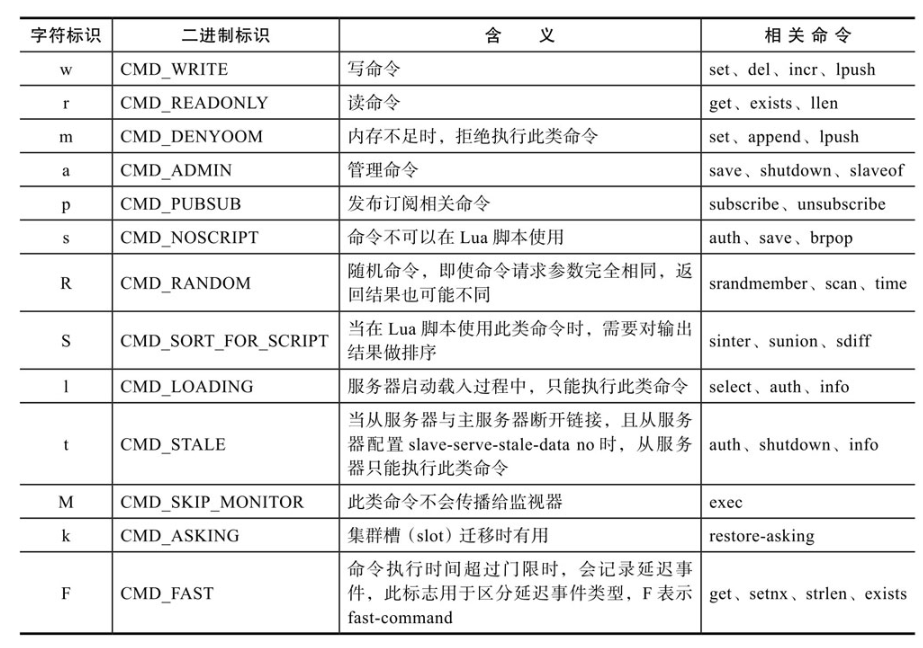

# redisObject结构体

Redis是一个key-value型数据库，key只能是字符串，value可以是字符串、列表、集合、有序集合和散列表，这5种数据类型用结构体robj表示，称为Redis对象。

```c
// server.h

typedef struct redisObject {
    unsigned type:4;
    unsigned encoding:4;
    unsigned lru:LRU_BITS; /* LRU time (relative to global lru_clock) or
                            * LFU data (least significant 8 bits frequency
                            * and most significant 16 bits access time). */
    int refcount; // 引用计数
    void *ptr;
} robj;
```

字段解释：

-   type字段表示对象类型，5种对象类型在server.h文件中定义：

    ```c
    // server.h
    
    /* The actual Redis Object */
    #define OBJ_STRING 0    /* String object. */
    #define OBJ_LIST 1      /* List object. */
    #define OBJ_SET 2       /* Set object. */
    #define OBJ_ZSET 3      /* Sorted set object. */
    #define OBJ_HASH 4      /* Hash object. */
    ```

    

-   对某一种类型的对象，Redis在不同情况下可能采用不同的数据结构存储，结构体robj的encoding字段表示当前对象底层存储采用的数据结构，即对象的编码，总共定义了11种encoding常量

    ```c
    // server.h
    
    #define OBJ_ENCODING_RAW 0     /* Raw representation */
    #define OBJ_ENCODING_INT 1     /* Encoded as integer */
    #define OBJ_ENCODING_HT 2      /* Encoded as hash table */
    #define OBJ_ENCODING_ZIPMAP 3  /* Encoded as zipmap */
    #define OBJ_ENCODING_LINKEDLIST 4 /* No longer used: old list encoding. */
    #define OBJ_ENCODING_ZIPLIST 5 /* Encoded as ziplist */
    #define OBJ_ENCODING_INTSET 6  /* Encoded as intset */
    #define OBJ_ENCODING_SKIPLIST 7  /* Encoded as skiplist */
    #define OBJ_ENCODING_EMBSTR 8  /* Embedded sds string encoding */
    #define OBJ_ENCODING_QUICKLIST 9 /* Encoded as linked list of ziplists */
    #define OBJ_ENCODING_STREAM 10 /* Encoded as a radix tree of listpacks */
    ```

    编码OBJ_ENCODING_RAW和OBJ_ENCODING_EMBSTR都表示的是简单动态字符串，那么这两种编码有什么区别吗？

    为了创建一个字符串对象，必须分配两次内存，robj与sds存储空间；两次内存分配效率低下，且数据分离存储降低了计算机高速缓存的效率。因此提出OBJ_ENCODING_EMBSTR编码的字符串，当字符串内容比较短时，只分配一次内存，robj与sds连续存储，以此提升内存分配效率与数据访问效率。OBJ_ENCODING_EMBSTR编码的字符串内存结构如下：

    

-   lru字段占24比特，用于实现**缓存淘汰策略**，可以在配置文件中使用maxmemory-policy配置已用内存达到最大内存限制时的缓存淘汰策略。lru根据用户配置的缓存淘汰策略存储不同数据，常用的策略就是LRU与LFU。

    **LRU的核心思想是，如果数据最近被访问过，那么将来被访问的几率也更高，此时lru字段存储的是对象访问时间；LFU的核心思想是，如果数据过去被访问多次，那么将来被访问的频率也更高，此时lru字段存储的是上次访问时间与访问次数。**

    例如使用GET命令访问数据时，会执行下面代码更新对象的lru字段：

    ```c
    // 
    if(server.maxmemmory_policy & MAXMEMORY_FLAG_LFU){
    	updateLFU(val);
    } else{
    	val->lru = LRU_CLOCK();
    }
    ```

    LRU_CLOCK函数用于获取当前时间，注意此时间不是实时获取的，Redis以1秒为周期执行系统调用获取精确时间，缓存在全局变量server.lruclock, LRU_CLOCK函数获取的只是该缓存时间。

    updateLFU函数用于更新对象的上次访问时间与访问次数，函数实现如下：

    ```c
    //
    updateLFU(robj *val){
        unsigned long counter = LFUDecrAndReturn(val);// 
        counter = LFULogIncr(counter);// 对象访问次数
        val->lru = (LFUGetTimeInMinuters()<<8) | counter;// lru高16位存储了对象访问时间（分钟），低8位存储了对象访问次数
    }
    ```

    函数LFUDecrAndReturn，其返回计数值counter，对象的访问次数在此值上累加。为什么不直接累加呢？因为假设每次只是简单的对访问次数累加，那么越老的数据一般情况下访问次数越大，即使该对象可能很长时间已经没有访问，相反新对象的访问次数通常会比较小，显然这是不公平的。因此访问次数应该有一个随时间衰减的过程，函数LFUDecrAndReturn实现了此衰减功能。

-   ptr是void*类型的指针，指向实际存储的某一种数据结构，但是当robj存储的数据可以用long类型表示时，数据直接存储在ptr字段

-   refcount存储当前对象的引用次数，用于实现对象的共享。共享对象时，refcount加1；删除对象时，refcount减1，当refcount值为0时释放对象空间。删除对象的代码：

    ```c
    // object.c
    void decrRefCount(robj *o) {
        if (o->refcount == 1) {
            switch(o->type) {// 根据对象类型，释放其指向数据结构空间
            case OBJ_STRING: freeStringObject(o); break;
            case OBJ_LIST: freeListObject(o); break;
            ...
            default: serverPanic("Unknown object type"); break;
            }
            zfree(o);// 释放对象空间
        } else {
            if (o->refcount <= 0) serverPanic("decrRefCount against refcount <= 0");
            // 引用计数减1
            if (o->refcount != OBJ_SHARED_REFCOUNT) o->refcount--;
        }
    }
    ```

    

# 客户端 client结构体

redis通信上的结构，client端<---socket--->server端

客户端通过socket与服务端建立网络连接并发送命令请求，服务端处理命令请求并回复。Redis使用结构体client存储客户端连接的所有信息，包括但不限于客户端的名称、客户端连接的套接字描述符、客户端当前选择的数据库ID、客户端的输入缓冲区与输出缓冲区等。结构体client字段较多，此处只介绍命令处理主流程所需的关键字段。

```c
// server.h
tyoedef struct client{
    uint64_t id;
    int fd;
    redisDb *db;
    robj *name;
    
    time_t lastinteraction;
    sds querybuf;
    int argc;
    robj **argv;
    struct redisCommand *cmd;
    
    list *replay;
    unsigned long long reply_bytes;
    size_t sentlen;
    char buf[PROTO_REPLY_CHUNK_BYTES];
    int bufops;
    
}client;
```

字段解释：

-   id为客户端唯一ID，通过全局变量server.next_client_id（server.h中）实现

-   fd为客户端socket的文件描述符

-   db为客户端使用select命令选择的数据库对象。redisDb结构体定义如下:

    ```c
    /* Redis database representation. There are multiple databases identified
     * by integers from 0 (the default database) up to the max configured
     * database. The database number is the 'id' field in the structure. */
    typedef struct redisDb {
        dict *dict;                 /* The keyspace for this DB */
        dict *expires;              /* Timeout of keys with a timeout set */
        dict *blocking_keys;        /* Keys with clients waiting for data (BLPOP)*/
        dict *ready_keys;           /* Blocked keys that received a PUSH */
        dict *watched_keys;         /* WATCHED keys for MULTI/EXEC CAS */
        int id;                     /* Database ID */
        long long avg_ttl;          /* Average TTL, just for stats */
        list *defrag_later;         /* List of key names to attempt to defrag one by one, gradually. */
    } redisDb;
    ```

    -   dict存储数据库所有键值对
    -   expires存储键的过期时间
    -   id为数据库序号，默认情况下Redis有16个数据库，id序号为0～15
    -   avg_ttl存储数据库对象的平均TTL，用于统计

    使用命令BLPOP阻塞获取列表元素时，如果链表为空，会阻塞客户端，同时将此列表键记录在blocking_keys；当使用命令PUSH向列表添加元素时，会从字典blocking_keys中查找该列表键，如果找到说明有客户端正阻塞等待获取此列表键，于是将此列表键记录到字典ready_keys，以便后续响应正在阻塞的客户端;

    Redis支持事务，命令multi用于开启事务，命令exec用于执行事务；**但是开启事务到执行事务期间，如何保证关心的数据不会被修改呢？**Redis采用**乐观锁**实现。开启事务的同时可以使用watch key命令监控关心的数据键，而watched_keys字典存储的就是被watch命令监控的所有数据键，其中key-value分别为数据键与客户端对象。当Redis服务器接收到写命令时，会从字典watched_keys中查找该数据键，如果找到说明有客户端正在监控此数据键，于是标记客户端对象为dirty；待Redis服务器收到客户端exec命令时，如果客户端带有dirty标记，则会拒绝执行事务。

-   name：客户端名称，可以使用命令CLIENTSETNAME设置

-    lastinteraction：客户端上次与服务器交互的时间，以此实现客户端的超时处理

-   querybuf：输入缓冲区，recv函数接收的客户端命令请求会暂时缓存在此缓冲区

-   argc：输入缓冲区的命令请求是按照Redis协议格式编码字符串，需要解析出命令请求的所有参数，参数个数存储在argc字段，参数内容被解析为robj对象，存储在argv数组

-   cmd：待执行的客户端命令；解析命令请求后，会根据命令名称查找该命令对应的命令对象，存储在客户端cmd字段，可以看到其类型为struct redisCommand结构体

-   reply：输出链表，存储待返回给客户端的命令回复数据
    链表节点存储的值类型为clientReplyBlock，定义如下：

    ```c
    /* This structure is used in order to represent the output buffer of a client,
     * which is actually a linked list of blocks like that, that is: client->reply. */
    // server.h
    typedef struct clientReplyBlock {
        size_t size, used;
        char buf[];
    } clientReplyBlock;
    ```

    链表节点本质上就是一个缓冲区buffer，size为buffer的总大小，used标识buffer已使用的空间大小

-   reply_bytes：表示输出链表中所有节点的存储空间总和

-   sentlen：表示已返回给客户端的字节数

-   buf：输出缓冲区，存储待返回给客户端的命令回复数据，bufpos表示输出缓冲区中数据的最大字节位置，显然sentlen～bufpos区间的数据都是需要返回给客户端的。可以看到reply和buf都用于缓存待返回给客户端的命令回复数据，为什么同时需要reply和buf的存在呢？其实二者只是用于返回不同的数据类型而已，将在9.3.3节详细介绍。

# 服务端 redisServer结构体

redisServer结构体存储Redis服务器的所有信息，包括但不限于数据库、配置参数、命令表、监听端口与地址、客户端列表、若干统计信息、RDB与AOF持久化相关信息、主从复制相关信息、集群相关信息等。以下对部分字段做简要说明，首先定义（部分字段）：

```c
struct redisServer{
    char *configfile;
    
    int dbnum;
    redisDb *db;
    dict *commnands;
    
    aeEventLoop *el;
    
    int port;
    char *bindaddr[CONFIGADDR_BINDADDR_MAX];
    int bindaddr_count;
    int ipfd[CONFIG_BINDADD_MAX];
    int ipfd_count;
    
    list *clients;
    int maxidletime;
    
}
```

字段解释：

-   configfile：配置文件绝对路径
-   dbnum：数据库的数目，可通过参数databases配置，默认16
-   db：数据库数组，数组的每个元素都是redisDb类型
-   commands：命令字典，Redis支持的所有命令都存储在这个字典中，key为命令名称，vaue为structredisCommand对象
-   el:Redis是典型的事件驱动程序，el代表Redis的事件循环，类型为aeEventLoop
-   port：服务器监听端口号，可通过参数port配置，默认端口号6379
-   bindaddr：绑定的所有IP地址，可以通过参数bind配置多个，例如bind 192.168.1.10010.0.0.1,bindaddr_count为用户配置的IP地址数目；CONFIG_BINDADDR_MAX常量为16，即最多绑定16个IP地址；Redis默认会绑定到当前机器所有可用的Ip地址
-   ipfd：针对bindaddr字段的所有IP地址创建的socket文件描述符，ipfd_count为创建的socket文件描述符数目
-   clients：当前连接到Redis服务器的所有客户端
-   maxidletime：最大空闲时间，可通过参数timeout配置，结合client对象的lastinteraction字段，当客户端没有与服务器交互的时间超过maxidletime时，会认为客户端超时并释放该客户端连接

# 命令结构体 redisCommand

Redis支持的所有命令初始都存储在全局变量redisCommandTable，类型为redisCommand，定义及初始化如下：

```c
// redisCommandTable的初始化及定义，在server.c中
struct redisCommand redisCommandTable[] = {
    {"module",moduleCommand,-2,"as",0,NULL,0,0,0,0,0},
    {"get",getCommand,2,"rF",0,NULL,1,1,1,0,0},
    ...;
};

// redisCoomand结构体定义在server.h
struct redisCommand {
    char *name;// 命令名称
    redisCommandProc *proc;//命令处理函数
    int arity;
    char *sflags; /* Flags as string representation, one char per flag. */
    int flags;    /* The actual flags, obtained from the 'sflags' field. */
    /* Use a function to determine keys arguments in a command line.
     * Used for Redis Cluster redirect. */
    redisGetKeysProc *getkeys_proc;
    /* What keys should be loaded in background when calling this command? */
    int firstkey; /* The first argument that's a key (0 = no keys) */
    int lastkey;  /* The last argument that's a key */
    int keystep;  /* The step between first and last key */
    long long microseconds, calls;
};
```

`redisCommand`字段解释：

-   arity：命令参数数目，用于校验命令请求格式是否正确；当arity小于0时，表示命令参数数目大于等于arity；当arity大于0时，表示命令参数数目必须为arity；注意命令请求中，命令的名称本身也是一个参数，如get命令的参数数目为2，命令请求格式为`get key`
-   sflags：命令标志，例如标识命令时读命令还是写命令，其类型有
    
-   `flags`：命令的二进制标志，服务器启动时解析sflags字段生成
-   `calls`：从服务器启动至今命令执行的次数，用于统计
-   `microseconds`：从服务器启动至今命令总的执行时间，`microseconds/calls`即可计算出该命令的平均处理时间，用于统计

当服务器接收到一条命令请求时，需要从命令表中查找命令，而`redisCommandTable`命令表是一个数组，意味着查询命令的时间复杂度为O(N)，效率低下。因此`Redis`在服务器初始化时，会将`redisCommandTable`转换为一个字典存储在`redisServer`对象的`commands`字段，`key`为命令名称，`value`为命令`redisCommand`对象。`populateCommandTable`函数实现了命令表从数组到字典的转化，同时解析`sflags`生成`flags`：

```c
/* Populates the Redis Command Table starting from the hard coded list
 * we have on top of redis.c file. */
void populateCommandTable(void) {
    int j;
    int numcommands = sizeof(redisCommandTable)/sizeof(struct redisCommand);

    for (j = 0; j < numcommands; j++) {
        struct redisCommand *c = redisCommandTable+j;
        char *f = c->sflags;
        int retval1, retval2;

        while(*f != '\0') {
            switch(*f) {
            case 'w': c->flags |= CMD_WRITE; break;
            ...
            case 'F': c->flags |= CMD_FAST; break;
            default: serverPanic("Unsupported command flag"); break;
            }
            f++;
        }

        retval1 = dictAdd(server.commands, sdsnew(c->name), c);
        /* Populate an additional dictionary that will be unaffected
         * by rename-command statements in redis.conf. */
        retval2 = dictAdd(server.orig_commands, sdsnew(c->name), c);
        serverAssert(retval1 == DICT_OK && retval2 == DICT_OK);
    }
}
```

对于经常使用的命令，Redis甚至会在服务器初始化的时候将命令缓存在redisServer对象，这样使用的时候就不需要每次都从commands字典中查找了：

```c
// server.h/redisServer
    /* Fast pointers to often looked up command */
	struct redisCommand *delCommand, *multiCommand, *lpushCommand,
                        *lpopCommand, *rpopCommand, *zpopminCommand,
                        *zpopmaxCommand, *sremCommand, *execCommand,
                        *expireCommand, *pexpireCommand, *xclaimCommand,
                        *xgroupCommand;
```

