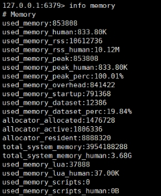
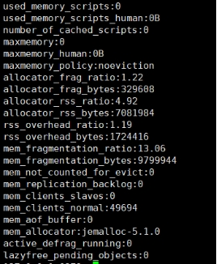

# 对RDEDIS内存的分析和理解

## 一、Redis内存统计

### 1.1、查看内存信息

在通过redis-cli连接服务器后，使用info memory查看redis内存的使用情况

info命令可以显示redis服务器的许多信息，包括服务器基本信息、CPU、内存、持久化、客户端连接信息等等；memory是参数，表示只显示内存相关的信息。

 （1）used_memory：Redis分配器分配的内存总量（单位是字节），包括使用的虚拟内存（即swap）；Redis分配器后面会介绍。used_memory_human只是显示更人性化。

（2）used_memory_rss：Redis进程占据操作系统的内存（单位是字节），与top及ps命令看到的值是一致的；除了分配器分配的内存之外，used_memory_rss还包括进程运行本身需要的内存、内存碎片等，但是不包括虚拟内存。

对比used_memory和used_memory_rss，前者是从Redis角度得到的量，后者是从操作系统角度得到的量。二者之所以有所不同，一方面是因为内存碎片和Redis进程运行需要占用内存，使得前者可能比后者小，另一方面虚拟内存的存在，使得前者可能比后者大。

由于在实际应用中，Redis的数据量会比较大，此时进程运行占用的内存与Redis数据量和内存碎片相比，都会小得多；因此used_memory_rss和used_memory的比例，便成了衡量Redis内存碎片率的参数；这个参数就是mem_fragmentation_ratio。

（3）mem_fragmentation_ratio：内存碎片比率，该值是used_memory_rss / used_memory的比值。mem_fragmentation_ratio一般大于1，且该值越大，内存碎片比例越大。mem_fragmentation_ratio<1，说明Redis使用了虚拟内存，由于虚拟内存的媒介是磁盘，比内存速度要慢很多，当这种情况出现时，应该及时排查，如果内存不足应该及时处理，如增加Redis节点、增加Redis服务器的内存、优化应用等。

 

一般来说，mem_fragmentation_ratio在1.03左右是比较健康的状态（对于jemalloc来说）；上面截图中的mem_fragmentation_ratio值很大，是因为还没有向Redis中存入数据，Redis进程本身运行的内存使得used_memory_rss 比used_memory大得多。

 （4）mem_allocator：Redis使用的内存分配器，在编译时指定；可以是 libc 、jemalloc或者tcmalloc，默认是jemalloc；

 

### 1.2、Redis内存划分

Redis作为内存数据库，在内存中存储的内容主要是数据（键值对）；但除了数据以外，Redis的其他部分也会占用内存。

 Redis的内存占用主要可以划分为以下几个部分：

#### 1.2.1、数据

作为数据库，数据是最主要的部分；这部分占用的内存会统计在used_memory中。

Redis使用键值对存储数据，其中的值（对象）包括5种类型，即字符串、哈希、列表、集合、有序集合。这5种类型是Redis对外提供的，实际上，在Redis内部，每种类型可能有2种或更多的内部编码实现；此外，Redis在存储对象时，并不是直接将数据扔进内存，而是会对对象进行各种包装：如redisObject、SDS等；这篇文章后面将重点介绍Redis中数据存储的细节。

####  1.2.2、进程本身运行需要的内存

Redis主进程本身运行肯定需要占用内存，如代码、常量池等等；这部分内存大约几兆，在大多数生产环境中与Redis数据占用的内存相比可以忽略。这部分内存不是由jemalloc分配，因此不会统计在used_memory中。

 补充说明：除了主进程外，Redis创建的子进程运行也会占用内存，如Redis执行RDB重建、AOF重写时创建的子进程。Redis执行fork操作产生子进程内存占用对外表现为与父进程相同，理论上需要一倍的相同物理内存来完成重写操作。但是Linux的copy-on-write机制使得父子进程共享相同的物理内存页，当父进程处理写请求时会对需要修改的页复制出一份副本完成写操作，而子进程依旧读取fork时整个父进程内存快照。

Redis子进程并不需要消耗1倍 的父进程内存，但是依然要预留一些内存防止内存溢出

需要设置sysctl vm.overcommit_memory=1允许内核可以分配所有的物理内存，防止Redis进程执行fork时因系统剩余内存不足而失败。

排查当前系统是否支持并开启THP，如果开启，建议关闭。

因此，这部分内存不属于Redis进程，也不会统计在used_memory和used_memory_rss中。

####  1.2.3、缓冲内存

缓冲内存包括客户端缓冲区、复制积压缓冲区、AOF缓冲区等：

- 客户端缓冲指的是所有连接到Redis的服务器tcp连接输入输出缓冲，输入缓冲无法控制，最大空间1G；输出缓冲可通过client-output-buffer-limit控制。

  - 普通客户端：client-output-buffer-limit normal 0 0 0

    普通客户端默认并没有对输出缓冲区做限制。但是如果当有大量的慢连接客户端接入时，这部分消耗就不能忽略了，因为消费的很慢，在成输出缓冲区数据积压。所以可以设置maxclients做限制。

  - 从客户端：client-output-buffer-limit slave 256mb 64mb 60

    主节点会为每一个从节点单独建立一条连接用于命令复制。当主节点网络延迟较高或主节点挂载大量的从节点时，这部分内存消耗将占用很大一部分，建议主节点挂载从节点最好不要超过2个。

  - 订阅客户端：client-output-buffer-limit pubsub 32mb 8mb 60 当生产消息的速度快于消费的速度时，输出缓冲区容易积压消息

- 复制积压缓冲用于部分复制功能

  一个可重用的固定大小缓冲区用于实现部分复制功能，根据repl-backlog-size参数控制，默认1MB. 对于复制积压缓区，主节点有一个，所有从节点啊共享这个缓冲区，因此可以设置较大的值，比如100MB,这部分投入是有价值的，可以有效避免全量复制。

- AOF缓冲区用于在进行AOF重写时，保存最近的写入命令。

####  1.2.4、内存碎片

内存碎片是Redis在分配、回收物理内存过程中产生的。例如，如果对数据的更改频繁，而且数据之间的大小相差很大，可能导致redis释放的空间在物理内存中并没有释放，但redis又无法有效利用，这就形成了内存碎片。内存碎片不会统计在used_memory中。

 内存碎片的产生与对数据进行的操作、数据的特点等都有关；此外，与使用的内存分配器也有关系：如果内存分配器设计合理，可以尽可能的减少内存碎片的产生。

 如果Redis服务器中的内存碎片已经很大，可以通过安全重启的方式减小内存碎片：因为重启之后，Redis重新从备份文件中读取数据，在内存中进行重排，为每个数据重新选择合适的内存单元，减小内存碎片。

##  二、内存管理

### 2.1 设置内存上限

Redis通过maxmemory参数限制最大可用内存。限制内存目的主要有：

- 用于缓存场景，当超出内存上限maxmemory时候使用LRU等删除策略释放空间

- 防止所用内存超过服务器物理内存

需要注意的是，maxmeory限制的是Redis实际使用的内存量，也就是used_memory统计项对应的内存。通过设置上限，可以方便实现一台服务器部署多个Redis进程的内存控制。比如一台32G的内存的服务器，预留4GB内存给系统，预留4GB给Redis fork进程，留给Redis24GB内存，这样就可以部署3个maxmemory=8GB的redis进程。

### 2.2 动态调整内存上限

可以通过命令config set maxmemory8GB

### 2.3 内存回收策略

内存回收机制主要体现在以下两个方面：

#### 2.3.1删除过期的key

Redis采用惰性删除和定时任务删除机制实现过期key的内存回收

- 惰性删除

  用于当客户端读取带有超时属性的key的时候，如果已经超过设置的过期时间，会执行删除操作并返回空。但是有一个问题，当过期键一直没有访问将无法得到及时删除，从而导致内存 不能及时释放

- 定时任务删除

  Redis内部维护一个定时任务，默认每秒运行10次，通过配置hz属性控制。

#### 2.3.2 内存使用达到maxmeory上限时触发内存溢出的控制策略

当Redis所用内存达到maxmeory上限时，会触发相应的溢出控制策略。具体策略受maxmeory-policy参数控制，Redis支持6种策略：

- `volatile-lru`  根据LRU算法删除设置了超时属性的键，直到腾出足够空间为止

- `allkeys-lru`  根据LRU算法删除键，不管有没有设置超时属性，直到腾出足够空间为止

- `volatile-random`  随机删除过期键，直到腾出足够空间为止

- `allkeys-random`  随机删除所有键，直到腾出足够空间为止

- `volatile-ttl` 根据ttl属性，删除最近将要过期的数据，如果没有回退到noeviction策略

- `noeviction`  不会删除任何数据，拒绝所有写入操作，并返回错误信息，此时只是响应读

