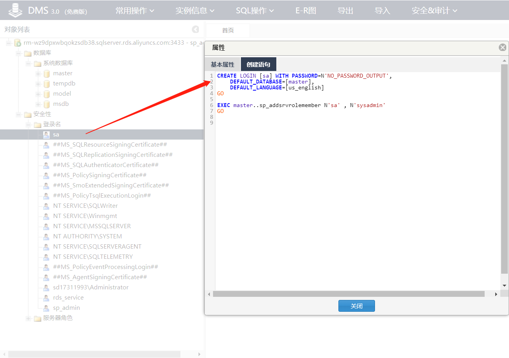
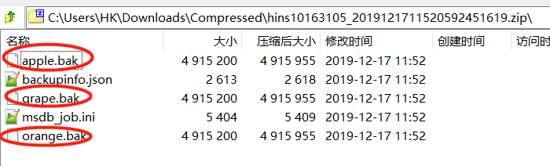
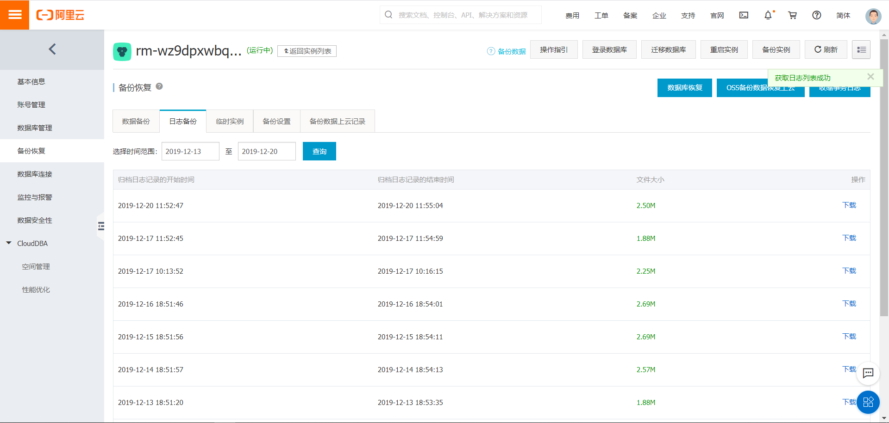
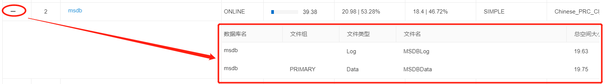
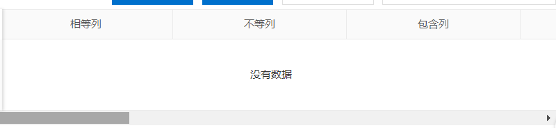

# 订单

## 云数据库 RDS 订单界面


# 实例

## 列表


### 细节


以下每个管理界面都配有

**返回实例列表跳转按钮**


## 详情


### 操作指引

#### 白名单


**白名单设置** **:** 设置可访问实例的 IP 地址。 [什么是白名单？](https://help.aliyun.com/document_detail/26198.html?env=prod)

位置： 数据安全性－设置白名单 立即前往设置（页面内部跳转），跳转至以下界面


#### 可维护时段


**可维护时间** **:** 平台会定期维护数据库，维护期间可能会造成RDS闪断，请将维护时间设置为业务低峰期。 [什么是可维护时间？](https://help.aliyun.com/document_detail/26180.html)
位置： 基本信息－配置信息 立即前往设置（内部跳转页面），将跳转至


#### 切换网络类型


**切换网络类型** **:** 网络类型分为经典网络类型和专有网络类型（VPC）。 [什么是网络类型？](https://help.aliyun.com/document_detail/26194.html)
位置： 数据库连接－切换网络类型 立即前往设置（内部跳转页面），将跳转至


#### 切换访问模式


**切换访问模式** **:** 访问模式分为标准模式和高安全模式。 [什么是访问模式？](https://help.aliyun.com/document_detail/26193.html)
位置： 数据库连接－切换访问模式 立即前往设置（内部跳转页面），将跳转至


#### 迁移数据库


**迁移数据库** **:** 支持本地数据库与RDS实例数据库、RDS实例间数据库相互迁移。 [如何迁移数据库？](https://help.aliyun.com/document_detail/26210.html)
位置： 迁移数据库 立即前往设置（内部跳转页面），将跳转至


#### 备份设置


**备份设置** **:** 可设置自动备份策略，进行数据恢复。 [如何进行数据恢复？](https://help.aliyun.com/document_detail/26207.html)
位置： 备份恢复－备份设置 立即前往设置（内部跳转页面），将跳转至


### 登录数据库


跳转至DMS平台

### 细节


#### 提示


#### 临时实例


## 账号管理

### 首次创建时，只能创建高权限账号

#### 页面细节


- 第一次只能创建高级权限账号，只能通过控制台创建

实际在阿里中的创建语句（通过控制台创建成功后，去阿里的DMS平台查看）

```
CREATE LOGIN [sp_admin] WITH PASSWORD=N'Hukai1235',
	DEFAULT_DATABASE=[master],
	DEFAULT_LANGUAGE=[us_english]
GO

EXEC master..sp_addsrvrolemember N'sp_admin' , N'processadmin'
GO
```

服务器角色为 `processadmin` 和 `public`，权限如下


阿里DMS中具备的登录名如下


登录名`sa`



SQL语句

```
CREATE LOGIN [sa] WITH PASSWORD=N'NO_PASSWORD_OUTPUT',
	DEFAULT_DATABASE=[master],
	DEFAULT_LANGUAGE=[us_english]
GO

EXEC master..sp_addsrvrolemember N'sa' , N'sysadmin'
GO
```

登录名`rds_service`


SQL语句

```
CREATE LOGIN [rds_service] WITH PASSWORD=N'NO_PASSWORD_OUTPUT',
	DEFAULT_DATABASE=[master],
	DEFAULT_LANGUAGE=[us_english]
GO

EXEC master..sp_addsrvrolemember N'rds_service' , N'sysadmin'
GO
```

登录名`sd17311993\Administrator`，猜测是服务器上的Windows用户


SQL语句

```
CREATE LOGIN [sd17311993\Administrator] WITH PASSWORD=N'NO_PASSWORD_OUTPUT',
	DEFAULT_DATABASE=[master],
	DEFAULT_LANGUAGE=[us_english]
GO

EXEC master..sp_addsrvrolemember N'sd17311993\Administrator' , N'sysadmin'
GO
```

### 再次创建时，只能创建普通账号

#### 页面细节


- 普通账户，在高级账户创建成功后方可创建，可控制台、API、SQL创建管理


SQL语句（在控制台创建后去DMS查看）

```
CREATE LOGIN [nor_test] WITH PASSWORD=N'NO_PASSWORD_OUTPUT',
	DEFAULT_DATABASE=[master],
	DEFAULT_LANGUAGE=[us_english]
GO

EXEC master..sp_addsrvrolemember N'nor_test' , N'processadmin'
GO
```


以上，操作场景：

只通过控制台创建，均为首次，此时没有用户数据库存在，只是创建有账户

结果对比

- 高级与普通在创建语句上没有区别，服务器角色均为：`processadmin`、`public`

- 均有连接数据库的权限

### 账户列表/刷新


#### **细节**

##### 使用说明链接


##### 点击展开全部内容


##### 提示信息


### 重置密码

输入新密码即可


### 修改权限


- 权限类别：只读(db_datareader)、读写(db_datawriter)、所有者(db_owner)

为方便作移除操作，用“delete”权限标记要移除的数据库

假设现在要移除数据库apple授权、修改数据库orange为只读权限，请求参数示例：

```json
{
	"tenantId":"1",
	"instId":"1001",
	"dbUserName":"sp_admin",
	"dbNameWithAuthority":{
		"apple":"移除",
		"orange":"只读"
	}
}
```

- 未授权数据库列表和授权数据库列表

前端放不方便提取？不好做的话，考虑点击进入该页面时，从后端获取信息，假设还有存在数据库“student”、“teacher”，那么返回参数(仅数据库及权限的信息)示例

```json
{
	"dbNameWithoutAuthorizing":{
		"student",
		"teacher"
	},
	"dbNameWithAuthority":{
		"apple":"所有者",
		"orange":"所有者",
		"grape":"所有者"
	}
}
```

### 删除

#### 普通账号可删除


#### 高权限账号仅一个，不可删除


## 数据库管理

### 提示


### 数据库列表/刷新


### 创建数据库

页面细节


### 删除数据库


再次手机验证确认删除


### 复制到其他实例


## 备份

### 总览


#### **字段提示**


#### **云文档提示**


#### **手动备份实例**


点击后弹窗如下


- 自动备份

- 全量备份

  - 备份策略：实例备份

  

  - 单库备份

  

  


以上方式均以后台任务的形式进行

#### **分页展示**

固定每页数量（30条）

#### **可按时间检索**

默认查询当前时间一周内的记录

>  **开发Note：**
>
> 自动备份规则
>
> 1、由SQL SERVER的计划管理（创建维护计划或者作业）
>
> 2、具体查看 https://help.aliyun.com/document_detail/95717.html?spm=5176.13642974.108.3.156b1450zsDdbq

阿里的备份注意事项：


### 数据备份


#### 字段提示

##### 备份恢复时间点


##### 备份所在实例编号

便于同类产品在不同实例上恢复


#### 可下载数据备份

##### 下载的文件名


##### 下载的内容



`backupinfo.json`文件内容：

```json
{
    "backupinfo": [
        {
            "dbname": "master",
            "logicalname": "master",
            "filename": "E:\\SQLDATA\\MSSQL\\DATA\\master.mdf",
            "fileid": 1
        },
        {
            "dbname": "master",
            "logicalname": "mastlog",
            "filename": "E:\\SQLDATA\\MSSQL\\DATA\\mastlog.ldf",
            "fileid": 2
        },
        {
            "dbname": "tempdb",
            "logicalname": "tempdev",
            "filename": "E:\\SQLDATA\\MSSQL\\DATA\\tempdb.mdf",
            "fileid": 1
        },
        {
            "dbname": "tempdb",
            "logicalname": "templog",
            "filename": "E:\\SQLDATA\\MSSQL\\DATA\\templog.ldf",
            "fileid": 2
        },
        {
            "dbname": "tempdb",
            "logicalname": "tempdev1",
            "filename": "E:\\SQLDATA\\MSSQL\\DATA\\tempdb1.ndf",
            "fileid": 3
        },
        {
            "dbname": "tempdb",
            "logicalname": "tempdev2",
            "filename": "E:\\SQLDATA\\MSSQL\\DATA\\tempdb2.ndf",
            "fileid": 4
        },
        {
            "dbname": "tempdb",
            "logicalname": "tempdev3",
            "filename": "E:\\SQLDATA\\MSSQL\\DATA\\tempdb3.ndf",
            "fileid": 5
        },
        {
            "dbname": "tempdb",
            "logicalname": "tempdev4",
            "filename": "E:\\SQLDATA\\MSSQL\\DATA\\tempdb4.ndf",
            "fileid": 6
        },
        {
            "dbname": "tempdb",
            "logicalname": "tempdev5",
            "filename": "E:\\SQLDATA\\MSSQL\\DATA\\tempdb5.ndf",
            "fileid": 7
        },
        {
            "dbname": "tempdb",
            "logicalname": "tempdev6",
            "filename": "E:\\SQLDATA\\MSSQL\\DATA\\tempdb6.ndf",
            "fileid": 8
        },
        {
            "dbname": "tempdb",
            "logicalname": "tempdev7",
            "filename": "E:\\SQLDATA\\MSSQL\\DATA\\tempdb7.ndf",
            "fileid": 9
        },
        {
            "dbname": "model",
            "logicalname": "modeldev",
            "filename": "E:\\SQLDATA\\MSSQL\\DATA\\model.mdf",
            "fileid": 1
        },
        {
            "dbname": "model",
            "logicalname": "modellog",
            "filename": "E:\\SQLDATA\\MSSQL\\DATA\\modellog.ldf",
            "fileid": 2
        },
        {
            "dbname": "msdb",
            "logicalname": "MSDBData",
            "filename": "E:\\SQLDATA\\MSSQL\\DATA\\MSDBData.mdf",
            "fileid": 1
        },
        {
            "dbname": "msdb",
            "logicalname": "MSDBLog",
            "filename": "E:\\SQLDATA\\MSSQL\\DATA\\MSDBLog.ldf",
            "fileid": 2
        },
        {
            "dbname": "apple",
            "logicalname": "apple",
            "filename": "E:\\SQLDATA\\DATA\\apple.mdf",
            "fileid": 1
        },
        {
            "dbname": "apple",
            "logicalname": "apple_log",
            "filename": "E:\\SQLDATA\\DATA\\apple_log.ldf",
            "fileid": 2
        },
        {
            "dbname": "grape",
            "logicalname": "grape",
            "filename": "E:\\SQLDATA\\DATA\\grape.mdf",
            "fileid": 1
        },
        {
            "dbname": "grape",
            "logicalname": "grape_log",
            "filename": "E:\\SQLDATA\\DATA\\grape_log.ldf",
            "fileid": 2
        },
        {
            "dbname": "orange",
            "logicalname": "orange",
            "filename": "E:\\SQLDATA\\DATA\\orange.mdf",
            "fileid": 1
        },
        {
            "dbname": "orange",
            "logicalname": "orange_log",
            "filename": "E:\\SQLDATA\\DATA\\orange_log.ldf",
            "fileid": 2
        },
        {
            "dbname": null,
            "logicalname": "data",
            "filename": "C:\\Program Files\\Microsoft SQL Server\\MSSQL13.MSSQLSERVER\\MSSQL\\Binn\\mssqlsystemresource.mdf",
            "fileid": 1
        },
        {
            "dbname": null,
            "logicalname": "log",
            "filename": "C:\\Program Files\\Microsoft SQL Server\\MSSQL13.MSSQLSERVER\\MSSQL\\Binn\\mssqlsystemresource.ldf",
            "fileid": 2
        }
    ],
    "Time_Zone": 28800,
    "Encrypted_Database_List": [],
    "BackupType": 2,
    "DatabaseVersion": "2016_web"
}
```

`msdb_job.ini`文件内容：

```mssql
[job]
rds_instance_copy_database =  BEGIN TRANSACTION
DECLARE @ReturnCode INT
IF NOT EXISTS (SELECT name FROM msdb.dbo.syscategories WHERE name=N'[Uncategorized (Local)]'AND category_class=1)
BEGIN
EXEC @ReturnCode = msdb.dbo.sp_add_category @class=N'JOB', @type=N'LOCAL', @name=N'[Uncategorized (Local)]'
IF (@@ERROR <> 0 OR @ReturnCode <> 0) GOTO QuitWithRollback
end
DECLARE @jobId BINARY(16)
EXEC @ReturnCode = msdb.dbo.sp_add_job @job_name=N'rds_instance_copy_database',
 @enabled=1, 
 @notify_level_eventlog=0, 
 @notify_level_email=0, 
 @notify_level_netsend=0, 
 @notify_level_page=0, 
 @notify_email_operator_name =N'', 
 @notify_netsend_operator_name=N'', 
 @notify_page_operator_name=N'', 
 @delete_level=0, 
 @description=N'funcion:copy database on instance
author: rds: ay15
create date:2017/07
affect: ignore', 
 @category_name=N'[Uncategorized (Local)]', 
 @owner_login_name=N'sa', 
 @job_id = @jobId OUTPUT
IF (@@ERROR <> 0 OR @ReturnCode <> 0) GOTO QuitWithRollback
 EXEC @ReturnCode = msdb.dbo.sp_add_jobstep @job_id=@jobId, 
 @step_name=N'copy database', 
 @step_id=1, 
 @cmdexec_success_code=0, 
 @on_success_action=1, 
 @on_success_step_id=0, 
 @on_fail_action=2, 
 @on_fail_step_id=0, 
 @retry_attempts=0, 
 @retry_interval=0, 
 @os_run_priority=0, @subsystem=N'TSQL', 
 @database_name=N'master',
 @flags=0 ,
 @command=N'EXEC sp_rds_copy_database_sys'
 IF (@@ERROR <> 0 OR @ReturnCode <> 0) GOTO QuitWithRollback
 EXEC @ReturnCode = msdb.dbo.sp_update_job @job_id = @jobId, @start_step_id = 1
 IF (@@ERROR <> 0 OR @ReturnCode <> 0) GOTO QuitWithRollback 
 EXEC @ReturnCode = msdb.dbo.sp_add_jobschedule @job_id=@jobId, @name=N'Occurs every day every 10 second(s) between 0:00:00 and 23:59:59. Schedule will be used starting on 2017/7/27.', 
 @enabled=1, 
 @freq_type=4, 
 @freq_interval=1, 
 @freq_subday_type=2, 
 @freq_subday_interval=10, 
 @freq_relative_interval=0, 
 @freq_recurrence_factor=0, 
 @active_start_date=20170727, 
 @active_end_date=99991231, 
 @active_start_time=0, 
 @active_end_time=235959, 
 @schedule_uid=N'F737F9AB-367C-4130-AFB7-241210F32E70'
 IF (@@ERROR <> 0 OR @ReturnCode <> 0) GOTO QuitWithRollback
 EXEC @ReturnCode = msdb.dbo.sp_add_jobserver @job_id = @jobId, @server_name = N'(local)'
 IF (@@ERROR <> 0 OR @ReturnCode <> 0) GOTO QuitWithRollback
COMMIT TRANSACTION
GOTO EndSave
QuitWithRollback:
 IF(@@TRANCOUNT>0)ROLLBACK TRANSACTION
EndSave:
 

rds_instance_level_configure_info =  BEGIN TRANSACTION
DECLARE @ReturnCode INT
IF NOT EXISTS (SELECT name FROM msdb.dbo.syscategories WHERE name=N'[Uncategorized (Local)]'AND category_class=1)
BEGIN
EXEC @ReturnCode = msdb.dbo.sp_add_category @class=N'JOB', @type=N'LOCAL', @name=N'[Uncategorized (Local)]'
IF (@@ERROR <> 0 OR @ReturnCode <> 0) GOTO QuitWithRollback
end
DECLARE @jobId BINARY(16)
EXEC @ReturnCode = msdb.dbo.sp_add_job @job_name=N'rds_instance_level_configure_info',
 @enabled=1, 
 @notify_level_eventlog=0, 
 @notify_level_email=0, 
 @notify_level_netsend=0, 
 @notify_level_page=0, 
 @notify_email_operator_name =N'', 
 @notify_netsend_operator_name=N'', 
 @notify_page_operator_name=N'', 
 @delete_level=0, 
 @description=N'funcion:process permission problem
author: rds: ay15
create date:2017/07
affect: ignore', 
 @category_name=N'[Uncategorized (Local)]', 
 @owner_login_name=N'sa', 
 @job_id = @jobId OUTPUT
IF (@@ERROR <> 0 OR @ReturnCode <> 0) GOTO QuitWithRollback
 EXEC @ReturnCode = msdb.dbo.sp_add_jobstep @job_id=@jobId, 
 @step_name=N'set instance parameter', 
 @step_id=1, 
 @cmdexec_success_code=0, 
 @on_success_action=3, 
 @on_success_step_id=0, 
 @on_fail_action=3, 
 @on_fail_step_id=0, 
 @retry_attempts=0, 
 @retry_interval=0, 
 @os_run_priority=0, @subsystem=N'TSQL', 
 @database_name=N'master',
 @flags=0 ,
 @command=N'EXEC sp_rds_configure_sys'
 IF (@@ERROR <> 0 OR @ReturnCode <> 0) GOTO QuitWithRollback
 EXEC @ReturnCode = msdb.dbo.sp_add_jobstep @job_id=@jobId, 
 @step_name=N'dbcc trace', 
 @step_id=2, 
 @cmdexec_success_code=0, 
 @on_success_action=1, 
 @on_success_step_id=0, 
 @on_fail_action=2, 
 @on_fail_step_id=0, 
 @retry_attempts=0, 
 @retry_interval=0, 
 @os_run_priority=0, @subsystem=N'TSQL', 
 @database_name=N'master',
 @flags=0 ,
 @command=N'EXEC sp_rds_dbcc_trace_sys'
 IF (@@ERROR <> 0 OR @ReturnCode <> 0) GOTO QuitWithRollback
 EXEC @ReturnCode = msdb.dbo.sp_update_job @job_id = @jobId, @start_step_id = 1
 IF (@@ERROR <> 0 OR @ReturnCode <> 0) GOTO QuitWithRollback 
 EXEC @ReturnCode = msdb.dbo.sp_add_jobschedule @job_id=@jobId, @name=N'Occurs every day every 10 second(s) between 0:00:00 and 23:59:59. Schedule will be used starting on 2017/7/18.', 
 @enabled=1, 
 @freq_type=4, 
 @freq_interval=1, 
 @freq_subday_type=2, 
 @freq_subday_interval=10, 
 @freq_relative_interval=0, 
 @freq_recurrence_factor=0, 
 @active_start_date=20170718, 
 @active_end_date=99991231, 
 @active_start_time=0, 
 @active_end_time=235959, 
 @schedule_uid=N'15DAD7FD-2201-425B-8172-B94584205B3A'
 IF (@@ERROR <> 0 OR @ReturnCode <> 0) GOTO QuitWithRollback
 EXEC @ReturnCode = msdb.dbo.sp_add_jobserver @job_id = @jobId, @server_name = N'(local)'
 IF (@@ERROR <> 0 OR @ReturnCode <> 0) GOTO QuitWithRollback
COMMIT TRANSACTION
GOTO EndSave
QuitWithRollback:
 IF(@@TRANCOUNT>0)ROLLBACK TRANSACTION
EndSave:
```

#### 手动备份记录

当在实例详情页进行过实例备份->单库备份后，单库备份的记录会更新到当前备份列表


##### 下载的文件名


##### 下载的内容


`backupinfo.json`文件内容：

```json
{
    "backupinfo": [
        {
            "dbname": "master",
            "logicalname": "master",
            "filename": "E:\\SQLDATA\\MSSQL\\DATA\\master.mdf",
            "fileid": 1
        },
        {
            "dbname": "master",
            "logicalname": "mastlog",
            "filename": "E:\\SQLDATA\\MSSQL\\DATA\\mastlog.ldf",
            "fileid": 2
        },
        {
            "dbname": "tempdb",
            "logicalname": "tempdev",
            "filename": "E:\\SQLDATA\\MSSQL\\DATA\\tempdb.mdf",
            "fileid": 1
        },
        {
            "dbname": "tempdb",
            "logicalname": "templog",
            "filename": "E:\\SQLDATA\\MSSQL\\DATA\\templog.ldf",
            "fileid": 2
        },
        {
            "dbname": "tempdb",
            "logicalname": "tempdev1",
            "filename": "E:\\SQLDATA\\MSSQL\\DATA\\tempdb1.ndf",
            "fileid": 3
        },
        {
            "dbname": "tempdb",
            "logicalname": "tempdev2",
            "filename": "E:\\SQLDATA\\MSSQL\\DATA\\tempdb2.ndf",
            "fileid": 4
        },
        {
            "dbname": "tempdb",
            "logicalname": "tempdev3",
            "filename": "E:\\SQLDATA\\MSSQL\\DATA\\tempdb3.ndf",
            "fileid": 5
        },
        {
            "dbname": "tempdb",
            "logicalname": "tempdev4",
            "filename": "E:\\SQLDATA\\MSSQL\\DATA\\tempdb4.ndf",
            "fileid": 6
        },
        {
            "dbname": "tempdb",
            "logicalname": "tempdev5",
            "filename": "E:\\SQLDATA\\MSSQL\\DATA\\tempdb5.ndf",
            "fileid": 7
        },
        {
            "dbname": "tempdb",
            "logicalname": "tempdev6",
            "filename": "E:\\SQLDATA\\MSSQL\\DATA\\tempdb6.ndf",
            "fileid": 8
        },
        {
            "dbname": "tempdb",
            "logicalname": "tempdev7",
            "filename": "E:\\SQLDATA\\MSSQL\\DATA\\tempdb7.ndf",
            "fileid": 9
        },
        {
            "dbname": "model",
            "logicalname": "modeldev",
            "filename": "E:\\SQLDATA\\MSSQL\\DATA\\model.mdf",
            "fileid": 1
        },
        {
            "dbname": "model",
            "logicalname": "modellog",
            "filename": "E:\\SQLDATA\\MSSQL\\DATA\\modellog.ldf",
            "fileid": 2
        },
        {
            "dbname": "msdb",
            "logicalname": "MSDBData",
            "filename": "E:\\SQLDATA\\MSSQL\\DATA\\MSDBData.mdf",
            "fileid": 1
        },
        {
            "dbname": "msdb",
            "logicalname": "MSDBLog",
            "filename": "E:\\SQLDATA\\MSSQL\\DATA\\MSDBLog.ldf",
            "fileid": 2
        },
        {
            "dbname": "apple",
            "logicalname": "apple",
            "filename": "E:\\SQLDATA\\DATA\\apple.mdf",
            "fileid": 1
        },
        {
            "dbname": "apple",
            "logicalname": "apple_log",
            "filename": "E:\\SQLDATA\\DATA\\apple_log.ldf",
            "fileid": 2
        },
        {
            "dbname": "grape",
            "logicalname": "grape",
            "filename": "E:\\SQLDATA\\DATA\\grape.mdf",
            "fileid": 1
        },
        {
            "dbname": "grape",
            "logicalname": "grape_log",
            "filename": "E:\\SQLDATA\\DATA\\grape_log.ldf",
            "fileid": 2
        },
        {
            "dbname": "orange",
            "logicalname": "orange",
            "filename": "E:\\SQLDATA\\DATA\\orange.mdf",
            "fileid": 1
        },
        {
            "dbname": "orange",
            "logicalname": "orange_log",
            "filename": "E:\\SQLDATA\\DATA\\orange_log.ldf",
            "fileid": 2
        }
    ],
    "Time_Zone": 28800,
    "Encrypted_Database_List": [],
    "BackupType": 1,
    "DatabaseVersion": "2016_web"
}
```

`msdb_job.ini`文件内容：

```mssql
[job]
rds_instance_copy_database =  BEGIN TRANSACTION
DECLARE @ReturnCode INT
IF NOT EXISTS (SELECT name FROM msdb.dbo.syscategories WHERE name=N'[Uncategorized (Local)]'AND category_class=1)
BEGIN
EXEC @ReturnCode = msdb.dbo.sp_add_category @class=N'JOB', @type=N'LOCAL', @name=N'[Uncategorized (Local)]'
IF (@@ERROR <> 0 OR @ReturnCode <> 0) GOTO QuitWithRollback
end
DECLARE @jobId BINARY(16)
EXEC @ReturnCode = msdb.dbo.sp_add_job @job_name=N'rds_instance_copy_database',
 @enabled=1, 
 @notify_level_eventlog=0, 
 @notify_level_email=0, 
 @notify_level_netsend=0, 
 @notify_level_page=0, 
 @notify_email_operator_name =N'', 
 @notify_netsend_operator_name=N'', 
 @notify_page_operator_name=N'', 
 @delete_level=0, 
 @description=N'funcion:copy database on instance
author: rds: ay15
create date:2017/07
affect: ignore', 
 @category_name=N'[Uncategorized (Local)]', 
 @owner_login_name=N'sa', 
 @job_id = @jobId OUTPUT
IF (@@ERROR <> 0 OR @ReturnCode <> 0) GOTO QuitWithRollback
 EXEC @ReturnCode = msdb.dbo.sp_add_jobstep @job_id=@jobId, 
 @step_name=N'copy database', 
 @step_id=1, 
 @cmdexec_success_code=0, 
 @on_success_action=1, 
 @on_success_step_id=0, 
 @on_fail_action=2, 
 @on_fail_step_id=0, 
 @retry_attempts=0, 
 @retry_interval=0, 
 @os_run_priority=0, @subsystem=N'TSQL', 
 @database_name=N'master',
 @flags=0 ,
 @command=N'EXEC sp_rds_copy_database_sys'
 IF (@@ERROR <> 0 OR @ReturnCode <> 0) GOTO QuitWithRollback
 EXEC @ReturnCode = msdb.dbo.sp_update_job @job_id = @jobId, @start_step_id = 1
 IF (@@ERROR <> 0 OR @ReturnCode <> 0) GOTO QuitWithRollback 
 EXEC @ReturnCode = msdb.dbo.sp_add_jobschedule @job_id=@jobId, @name=N'Occurs every day every 10 second(s) between 0:00:00 and 23:59:59. Schedule will be used starting on 2017/7/27.', 
 @enabled=1, 
 @freq_type=4, 
 @freq_interval=1, 
 @freq_subday_type=2, 
 @freq_subday_interval=10, 
 @freq_relative_interval=0, 
 @freq_recurrence_factor=0, 
 @active_start_date=20170727, 
 @active_end_date=99991231, 
 @active_start_time=0, 
 @active_end_time=235959, 
 @schedule_uid=N'F737F9AB-367C-4130-AFB7-241210F32E70'
 IF (@@ERROR <> 0 OR @ReturnCode <> 0) GOTO QuitWithRollback
 EXEC @ReturnCode = msdb.dbo.sp_add_jobserver @job_id = @jobId, @server_name = N'(local)'
 IF (@@ERROR <> 0 OR @ReturnCode <> 0) GOTO QuitWithRollback
COMMIT TRANSACTION
GOTO EndSave
QuitWithRollback:
 IF(@@TRANCOUNT>0)ROLLBACK TRANSACTION
EndSave:
 

rds_instance_level_configure_info =  BEGIN TRANSACTION
DECLARE @ReturnCode INT
IF NOT EXISTS (SELECT name FROM msdb.dbo.syscategories WHERE name=N'[Uncategorized (Local)]'AND category_class=1)
BEGIN
EXEC @ReturnCode = msdb.dbo.sp_add_category @class=N'JOB', @type=N'LOCAL', @name=N'[Uncategorized (Local)]'
IF (@@ERROR <> 0 OR @ReturnCode <> 0) GOTO QuitWithRollback
end
DECLARE @jobId BINARY(16)
EXEC @ReturnCode = msdb.dbo.sp_add_job @job_name=N'rds_instance_level_configure_info',
 @enabled=1, 
 @notify_level_eventlog=0, 
 @notify_level_email=0, 
 @notify_level_netsend=0, 
 @notify_level_page=0, 
 @notify_email_operator_name =N'', 
 @notify_netsend_operator_name=N'', 
 @notify_page_operator_name=N'', 
 @delete_level=0, 
 @description=N'funcion:process permission problem
author: rds: ay15
create date:2017/07
affect: ignore', 
 @category_name=N'[Uncategorized (Local)]', 
 @owner_login_name=N'sa', 
 @job_id = @jobId OUTPUT
IF (@@ERROR <> 0 OR @ReturnCode <> 0) GOTO QuitWithRollback
 EXEC @ReturnCode = msdb.dbo.sp_add_jobstep @job_id=@jobId, 
 @step_name=N'set instance parameter', 
 @step_id=1, 
 @cmdexec_success_code=0, 
 @on_success_action=3, 
 @on_success_step_id=0, 
 @on_fail_action=3, 
 @on_fail_step_id=0, 
 @retry_attempts=0, 
 @retry_interval=0, 
 @os_run_priority=0, @subsystem=N'TSQL', 
 @database_name=N'master',
 @flags=0 ,
 @command=N'EXEC sp_rds_configure_sys'
 IF (@@ERROR <> 0 OR @ReturnCode <> 0) GOTO QuitWithRollback
 EXEC @ReturnCode = msdb.dbo.sp_add_jobstep @job_id=@jobId, 
 @step_name=N'dbcc trace', 
 @step_id=2, 
 @cmdexec_success_code=0, 
 @on_success_action=1, 
 @on_success_step_id=0, 
 @on_fail_action=2, 
 @on_fail_step_id=0, 
 @retry_attempts=0, 
 @retry_interval=0, 
 @os_run_priority=0, @subsystem=N'TSQL', 
 @database_name=N'master',
 @flags=0 ,
 @command=N'EXEC sp_rds_dbcc_trace_sys'
 IF (@@ERROR <> 0 OR @ReturnCode <> 0) GOTO QuitWithRollback
 EXEC @ReturnCode = msdb.dbo.sp_update_job @job_id = @jobId, @start_step_id = 1
 IF (@@ERROR <> 0 OR @ReturnCode <> 0) GOTO QuitWithRollback 
 EXEC @ReturnCode = msdb.dbo.sp_add_jobschedule @job_id=@jobId, @name=N'Occurs every day every 10 second(s) between 0:00:00 and 23:59:59. Schedule will be used starting on 2017/7/18.', 
 @enabled=1, 
 @freq_type=4, 
 @freq_interval=1, 
 @freq_subday_type=2, 
 @freq_subday_interval=10, 
 @freq_relative_interval=0, 
 @freq_recurrence_factor=0, 
 @active_start_date=20170718, 
 @active_end_date=99991231, 
 @active_start_time=0, 
 @active_end_time=235959, 
 @schedule_uid=N'15DAD7FD-2201-425B-8172-B94584205B3A'
 IF (@@ERROR <> 0 OR @ReturnCode <> 0) GOTO QuitWithRollback
 EXEC @ReturnCode = msdb.dbo.sp_add_jobserver @job_id = @jobId, @server_name = N'(local)'
 IF (@@ERROR <> 0 OR @ReturnCode <> 0) GOTO QuitWithRollback
COMMIT TRANSACTION
GOTO EndSave
QuitWithRollback:
 IF(@@TRANCOUNT>0)ROLLBACK TRANSACTION
EndSave:
```


### 日志备份



#### 可下载日志备份

##### 下载的文件名


##### 下载的文件内容


`backupinfo.json`文件内容：

```json
{
    "backupinfo": [
        {
            "dbname": "master",
            "logicalname": "master",
            "filename": "E:\\SQLDATA\\MSSQL\\DATA\\master.mdf",
            "fileid": 1
        },
        {
            "dbname": "master",
            "logicalname": "mastlog",
            "filename": "E:\\SQLDATA\\MSSQL\\DATA\\mastlog.ldf",
            "fileid": 2
        },
        {
            "dbname": "tempdb",
            "logicalname": "tempdev",
            "filename": "E:\\SQLDATA\\MSSQL\\DATA\\tempdb.mdf",
            "fileid": 1
        },
        {
            "dbname": "tempdb",
            "logicalname": "templog",
            "filename": "E:\\SQLDATA\\MSSQL\\DATA\\templog.ldf",
            "fileid": 2
        },
        {
            "dbname": "tempdb",
            "logicalname": "tempdev1",
            "filename": "E:\\SQLDATA\\MSSQL\\DATA\\tempdb1.ndf",
            "fileid": 3
        },
        {
            "dbname": "tempdb",
            "logicalname": "tempdev2",
            "filename": "E:\\SQLDATA\\MSSQL\\DATA\\tempdb2.ndf",
            "fileid": 4
        },
        {
            "dbname": "tempdb",
            "logicalname": "tempdev3",
            "filename": "E:\\SQLDATA\\MSSQL\\DATA\\tempdb3.ndf",
            "fileid": 5
        },
        {
            "dbname": "tempdb",
            "logicalname": "tempdev4",
            "filename": "E:\\SQLDATA\\MSSQL\\DATA\\tempdb4.ndf",
            "fileid": 6
        },
        {
            "dbname": "tempdb",
            "logicalname": "tempdev5",
            "filename": "E:\\SQLDATA\\MSSQL\\DATA\\tempdb5.ndf",
            "fileid": 7
        },
        {
            "dbname": "tempdb",
            "logicalname": "tempdev6",
            "filename": "E:\\SQLDATA\\MSSQL\\DATA\\tempdb6.ndf",
            "fileid": 8
        },
        {
            "dbname": "tempdb",
            "logicalname": "tempdev7",
            "filename": "E:\\SQLDATA\\MSSQL\\DATA\\tempdb7.ndf",
            "fileid": 9
        },
        {
            "dbname": "model",
            "logicalname": "modeldev",
            "filename": "E:\\SQLDATA\\MSSQL\\DATA\\model.mdf",
            "fileid": 1
        },
        {
            "dbname": "model",
            "logicalname": "modellog",
            "filename": "E:\\SQLDATA\\MSSQL\\DATA\\modellog.ldf",
            "fileid": 2
        },
        {
            "dbname": "msdb",
            "logicalname": "MSDBData",
            "filename": "E:\\SQLDATA\\MSSQL\\DATA\\MSDBData.mdf",
            "fileid": 1
        },
        {
            "dbname": "msdb",
            "logicalname": "MSDBLog",
            "filename": "E:\\SQLDATA\\MSSQL\\DATA\\MSDBLog.ldf",
            "fileid": 2
        },
        {
            "dbname": "apple",
            "logicalname": "apple",
            "filename": "E:\\SQLDATA\\DATA\\apple.mdf",
            "fileid": 1
        },
        {
            "dbname": "apple",
            "logicalname": "apple_log",
            "filename": "E:\\SQLDATA\\DATA\\apple_log.ldf",
            "fileid": 2
        },
        {
            "dbname": "grape",
            "logicalname": "grape",
            "filename": "E:\\SQLDATA\\DATA\\grape.mdf",
            "fileid": 1
        },
        {
            "dbname": "grape",
            "logicalname": "grape_log",
            "filename": "E:\\SQLDATA\\DATA\\grape_log.ldf",
            "fileid": 2
        },
        {
            "dbname": "orange",
            "logicalname": "orange",
            "filename": "E:\\SQLDATA\\DATA\\orange.mdf",
            "fileid": 1
        },
        {
            "dbname": "orange",
            "logicalname": "orange_log",
            "filename": "E:\\SQLDATA\\DATA\\orange_log.ldf",
            "fileid": 2
        }
    ],
    "Time_Zone": 28800,
    "Encrypted_Database_List": [],
    "BackupType": 1,
    "DatabaseVersion": "2016_web"
}
```

### 临时实例


#### 创建临时实例

选中一个时间的备份集


选择其他时间时


### 备份设置


#### 编辑

##### 保留时间


##### 备份周期


##### 备份时间

全天的整时段范围


##### 日志备份频率


### 备份数据上云记录


### 数据恢复


#### 恢复到全新实例

会跳转至实例订购页面，订购产品后方可恢复到新实例

#### 恢复到已有实例


##### 还原方式

- 按时间点


- 按备份集


##### 目标实例名

选中实例


需要存在有当前实例以外的实例对象，如果选则当前实例会报错

不知道为什么会出现这个错误，按逻辑讲，不应该出现错误。


### oss备份数据恢复上云


##### 备份向导1-备份你的数据库

完全备份脚本文件名 `RDSBackupSpecifiedDatabasesToLocal.sql`

内容： 

```sql
USE master
GO

/**
* author: 
*	jianming.wjm@alibaba-inc.com of Alibaba Cloud Team.
*
* @purpose:
*	Backup your databases to local directory (no matter destination folder exist or not).
*	You can personal your backup type, support three backup types include(FULL, DIFF, LOG).
*	This script also support just check to see details or run directly.
*
*	if you find something happen unhappy, please kindly tell us via the author email. thanks.
* 
* @usage:
*	Copy all the script (ctrl + a) into SSMS, fill out the public variables and then F5 or Execute it.
*
* @parameters:
*	@backup_databases_list: databases list needed to backup
*	@backup_type: which backup type needed, choice one of ['FULL', 'DIFF', 'LOG']
*	@backup_folder: where backup files located
*	@is_run: I want to run or just check, 1: run; 0: just check.
* 
* @version:
*	1.0.0, 2018/03/02 15:20: Create script.
*
* @Tips:
*	We'd like to advice you to change your databases to FULL recovery model to improve migrate to RDS.
*	example: ALTER DATABASE [db_simple] SET RECOVERY FULL WITH NO_WAIT
*	pay attention to the SSMS output messages, and correct the error if have any.
**/

SET NOCOUNT ON

-- declare public variables
DECLARE
	@backup_databases_list NVARCHAR(max),
	@backup_type SYSNAME,
	@backup_folder SYSNAME,
	@is_run TINYINT
;

-- YOU HAVE TO INIT PUBLIC VARIABLES HERE!!!!
SELECT
	/**
	* Databases list needed to backup, delimiter is ; or ,
	* empty('') or null: means all databases excluding system database
	* example: '[testdb];TestDR,Test,readonly'
	**/
	@backup_databases_list = N'[TestMigration];[TestFG],readonly,Test',
	@backup_type = N'FULL',								-- Backup Type? FULL: FULL backup; DIFF: Differential backup; LOG: Log backup
	@backup_folder = N'C:\BACKUP',						-- Backup folder to store backup files.
	@is_run = 0											-- Check or run? 1, run directly; 0, just check
;

-- variables checking
IF @backup_type NOT IN(N'FULL', N'DIFF', N'LOG')
BEGIN
	RAISERROR('Backup type %s is not supported!', 16, 1, @backup_type)
	RETURN
END
;

IF ISNULL(@backup_folder, N'') = N''
BEGIN
	RAISERROR('backup_folder is not allow empty!', 16, 1)
	RETURN
END

IF @is_run NOT IN(0, 1)
BEGIN
	RAISERROR('is_run parameter should be 0 or 1 !', 16, 1)
	RETURN
END

-- declare private variables
DECLARE
	@database_name SYSNAME,
	@database_state TINYINT,
	@database_state_desc NVARCHAR(60),
	@database_count INT,
	@database_do INT,
	@flag_edition BIT,
	@exec_sql NVARCHAR(MAX),
	@timestamp VARCHAR(20),
	@context_info VARCHAR(20),
	@backup_databases_list_XML XML
;

-- private variables init.
SELECT
	@database_name = N'',
	@database_state = 11,
	@database_state_desc = N'',
	@database_count = 0,
	@database_do = 1,
	@flag_edition = CASE
							WHEN CONVERT(sysname, SERVERPROPERTY(N'Edition')) LIKE N'Enterprise%' THEN 1
							ELSE 0
						END,
	@exec_sql = N'',
	@timestamp = REPLACE(REPLACE(REPLACE(CONVERT(VARCHAR(19), GETDATE(),120), N'-', N''), N':', N''), CHAR(32), N''),
	@backup_folder = CASE 
						WHEN RIGHT(@backup_folder, 1) = N'\' THEN @backup_folder 
						ELSE @backup_folder + N'\' 
					END,
	@context_info = N'0x1256698449',
	@backup_databases_list_XML = 
			N'<V><![CDATA[' + 
				REPLACE(
					REPLACE(
						REPLACE(
								REPLACE(
										REPLACE(
												REPLACE(
														@backup_databases_list, '[', ''
													), ']', ''
											), ';', ','
									),CHAR(10),']]></V><V><![CDATA['
								),',',']]></V><V><![CDATA['
							),CHAR(13),']]></V><V><![CDATA['
					) 
				+ ']]></V>'
;

-- temp table declare to save databases splitted
IF OBJECT_ID('tempdb..#tmp_databases', 'U') IS NOT NULL
	DROP TABLE #tmp_databases
CREATE TABLE #tmp_databases(
	RowId INT IDENTITY(1,1) NOT NULL PRIMARY KEY,
	Database_name SYSNAME
)
;

-- get databases name
IF ISNULL(@backup_databases_list, N'') > N''
BEGIN
	INSERT INTO #tmp_databases
	SELECT DISTINCT
		[Database_name] = T.C.value('(./text())[1]','sysname')
	FROM @backup_databases_list_XML.nodes('./V') AS T(C)
	WHERE T.C.value('(./text())[1]','sysname') IS NOT NULL
	;
END
ELSE
BEGIN
	INSERT INTO #tmp_databases
	SELECT DISTINCT name
	FROM sys.databases WITH (NOLOCK)
	WHERE name NOT IN (N'master', N'tempdb', N'model', N'msdb', N'distribution')
END

-- decalre cursor to loop each database.
DECLARE CUR_DatabaseList CURSOR LOCAL STATIC FORWARD_ONLY READ_ONLY
FOR
SELECT DISTINCT name, state, state_desc
FROM sys.databases WITH (NOLOCK)
WHERE name IN(SELECT [Database_name] FROM #tmp_databases)

-- Open cursor and get the rowcount
OPEN CUR_DatabaseList
FETCH NEXT FROM CUR_DatabaseList INTO @database_name, @database_state, @database_state_desc
SET @database_count = @@CURSOR_ROWS;

-- prepare folder on local host.
IF @database_count > 0
BEGIN
	EXEC sys.xp_create_subdir @backup_folder
END

WHILE @@FETCH_STATUS = 0
BEGIN
	-- contact the backup script for each backup type.
	SET
		@exec_sql = 
					CASE 
						WHEN @backup_type = N'FULL' 
						THEN  N'BACKUP DATABASE ' + QUOTENAME(@database_name) 
							+ N' TO DISK = N' + QUOTENAME(@backup_folder + @database_name + N'_' + @backup_type + N'_' + @timestamp + N'.bak', '''') 
							+ N' WITH STATS = 1' + CASE 
														WHEN @flag_edition = 1 THEN N', COMPRESSION;'
														ELSE N';'
													END
						WHEN @backup_type = N'DIFF'
						THEN N'BACKUP DATABASE ' + QUOTENAME(@database_name) 
							+ N' TO DISK = N' + QUOTENAME(@backup_folder + @database_name + N'_' + @backup_type + N'_' + @timestamp + N'.bak', '''')
							+ N' WITH DIFFERENTIAL, STATS = 1' + CASE 
														WHEN @flag_edition = 1 THEN N', COMPRESSION;'
														ELSE N';'
													END
						WHEN @backup_type = N'LOG'
						THEN N'BACKUP LOG ' + QUOTENAME(@database_name) 
							+ N' TO DISK = N' + QUOTENAME(@backup_folder + @database_name + N'_' + @backup_type + N'_' + @timestamp + N'.bak', '''')
							+ N' WITH STATS = 1' + CASE 
														WHEN @flag_edition = 1 THEN N', COMPRESSION;'
														ELSE N';'
													END
						ELSE N''
					END
	;

	RAISERROR('--==============%d/%d: Working on database: %s', 10, 1, @database_do , @database_count, @database_name) WITH NOWAIT;

	--Only online database can be Backup.
	IF @database_state = 0
	BEGIN
		RAISERROR('-- %s', 10, 1, @exec_sql) WITH NOWAIT;

		IF @is_run = 1
		BEGIN
			SET
				@exec_sql = N'SET CONTEXT_INFO ' + @context_info + N';' + @exec_sql
			;
			EXEC sys.sp_executesql @exec_sql
		END
	END
	ELSE
	BEGIN
		RAISERROR('-- database %s state: %s can''t be backup, skipped.', 10, 1, @database_name, @database_state_desc) WITH NOWAIT;
	END
	
	SET @database_do = @database_do + 1;
	FETCH NEXT FROM CUR_DatabaseList INTO @database_name, @database_state, @database_state_desc
END

-- close and release cursor.
CLOSE CUR_DatabaseList
DEALLOCATE CUR_DatabaseList
GO
```


导入必读链接地址：https://help.aliyun.com/document_detail/68310.html?spm=5176.13642995.0.0.fd9214506usiXU

##### 备份向导2-上传备份文件到OSS


1、对于单个文件，且文件空间小于5G，建议您直接通过OSS控制台上传备份文件，具体 [请参考](https://help.aliyun.com/document_detail/31886.html)

2、对于多个文件，或者文件空间大于5G，建议您采用断点续传的方式上传备份文件到OSS，需要调用OSS OpenAPI，具体 [请参考](https://help.aliyun.com/document_detail/31850.html)

3、亦可以利用客户端形式上传备份文件到OSS，具体 [请参考](https://help.aliyun.com/document_detail/61872.html)

参考链接：[OSS上传文件方法大全](https://promotion.aliyun.com/ntms/act/ossdoclist.html)

##### 备份向导3-数据导入


点击授权地址会跳转至下图界面


### 收缩事务日志


## 监控

### 总览

#### 提示细节


### 频率

#### 参考文档

> 设置监控频率
>
> https://help.aliyun.com/document_detail/26200.html?spm=5176.13643027.0.0.468e1450CJJSoz

#### 时间跨度

- 1小时
- 1天
- 7天
- 1个月


#### 采样时间精度

- 60秒/次
- 300秒/次


### 资源监控项

#### MSSQL实例CPU使用率(占操作系统总数 %) 


#### 磁盘空间（单位MByte）

- 磁盘空间总体使用量（以下的总和）
- 数据空间使用量
- 日志空间使用量
- 临时文件空间使用量
- 系统文件空间使用量 


#### IOPS（单位:次/秒） 


#### 当前总连接数


#### SQLServer实例平均每秒钟的输入/流出流量。单位为KB 

- 平均每秒钟的输入流量（KB/s）
- 平均每秒钟的输出流量（KB/s）


### 引擎监控项

#### 平均每秒事务数


#### 平均每秒SQL语句执行次数 


#### 缓存命中率(%) 


#### 每秒检查点写入Page数 


#### 每秒登录次数 


#### 平均每秒全表扫描次数 


#### 每秒SQL编译 


#### 每秒锁超时次数 


#### 每秒死锁次数 


#### 每秒锁等待次数


## 数据库连接

### 总览


### 提示信息

##### 专有网络


超链接跳转至 https://help.aliyun.com/document_detail/26194.html

##### 连接


[如何连接RDS](http://help.aliyun.com/knowledge_detail.htm?spm=5176.13643011.252.d32.55421450a9SNDZ&knowledgeId=5973806)

[为什么连接不上](https://help.aliyun.com/document_detail/96028.html?spm=5176.13643011.252.d32.55421450a9SNDZ)


超链接跳转至 https://help.aliyun.com/document_detail/26193.html


## 数据安全性

### 总览

#### 白名单设置


注：1、RDS IP白名单支持IP段的格式（如X.X.X.X/X）。2、设置为127.0.0.1表示禁止所有地址访问。 [白名单设置说明](https://help.aliyun.com/document_detail/26198.html)

##### 添加白名单分组


点击后弹窗


##### 自定义的白名单分组修改


##### 自定义的白名单分组删除


##### 默认白名单设置

**可修改、清空但不可删除**


#### SQL审计


#### SSL


## CloudDB

### 空间管理

#### 概览


##### 标题


##### 总览


近一周变化量：数据库的总空间大小一周的变化

剩余可用空间：$$磁盘总量-已使用空间$$

已使用空间：$$所有数据库的总空间大小（指的是保留大小）之和 = \sum_i^{所有数据库}{空间大小}$$

###### 预计增长计算

​				$$平均增长量=\frac{已使用空间}{已使用天数}$$ 					$$天数 = \frac{剩余空间总量}{平均增长量}$$

##### 空间数据报表


**空间数据**分为两部分：数据和日志，均为保留大小，比如某个数据库的总空间、数据、日志空间保留大小


在后台数据表中记录所有数据库的磁盘使用情况，通过重新采集接口获取最新信息。

空间使用率计算

​				$$空间使用率=\frac{已使用}{总量}$$

数据与日志比

​				$$数据与日志比 = \frac{数据空间总大小}{日志空间总大小}$$

Top5 DB空间计算

```bsah
-- 第一步找所有的数据库的空间总量
exec sp_helpdb;
```

##### 空间变化趋势


频率：一天、一周、一月

精度：1小时、一天、一天

总空间大小：数据空间+日志空间

均为保留的总大小。

##### Top 10数据库

箭头实现升降排序


总览


数据库信息统揽，包括以下字段

- 排名序号

- 数据库名（点击可查看变化趋势），比如msdb的

  

- 状态，如 ONLINE

- 总空间（MB）

- 已使用（MB）

- 可使用（MB）

- 恢复模式，如SIMPLE

- 排序规则，如Chinese_PRC_CI_AS

- ~~日志重用等待~~（暂不考虑）

- 创建时间

展开详情：



包含字段：

- 数据库名
- 文件组
- 文件类型
- 文件名
- 总空间空间（MB）
- 已使用空间（MB）
- 可用空间（MB）
- 文件最大限制
- 文件自动增长量


##### Top 20数据表

箭头实现升降排序


总览


点击表名后展示


字段

ReserveredSize =  DataSize + IndexsSize + UnusedSize

单位：MB

##### 其他


在 `exec sp_spaceused @oneresultset=1;`中对应字段

- 未使用	<=>	unused
- 索引	<=>	index_size
- 数据	<=>	data
- 未分配	<=>	unallocated_space

其中 reserved = data + index_size + unused


在 `DBCC SQLPERF(LOGSPACE);`中对应字段


- 总空间大小	<=>	Log Size (MB)

- 已使用	<=>	Log Space Used (%) 


### 性能优化

#### 性能洞察


##### 性能指标


- 精度：Last 5m、30m、1h、2h、6h、24h、2d

- 自定时间范围
- 指标
  - CPU(%)
  - IOPS
  - Network Traffic(KB)
  - Session


##### Average Active Session(AAS)


AAS分类:

- SQL
- Waits
- Users
- Hosts
- Commands
- Databases
- Status

另附数据报表

- SQL


- Waits


- Users


- Hosts


- Commands


- Databases


- Status


#### 索引缺失


##### 索引确实详情





#### 索引使用率


##### 索引使用图表信息

###### **碎片率**


###### **使用率**


###### **Top碎片率**


###### **空间变化**


##### 索引使用信息表


#### 统计信息


##### 未更新统计信息


##### 未更新信息占比


##### 附表


#### TOP SQL


##### 精度


##### 选择属性


在实时TOP SQL列表有展示所有属性

##### 选择属性Top N项


##### 实时TOP SQL-平均开销

###### 平均CPU开销


###### 平均执行耗时


###### 平均返回行


###### 平均逻辑读


###### 实时TOP SQL-总开销

###### 总CPU开销


###### 总执行耗时


###### 总返回行


###### 总逻辑读


##### 实时TOP SQL列表


##### 历史TOP SQL


#### Top Objects


##### DB过滤


##### 精度


##### 选择属性


##### 选择属性的Top N项


##### 实时TOP Objects-平均开销


##### 实时TOP Objects-总开销


##### 实时TOP Objects-列表


