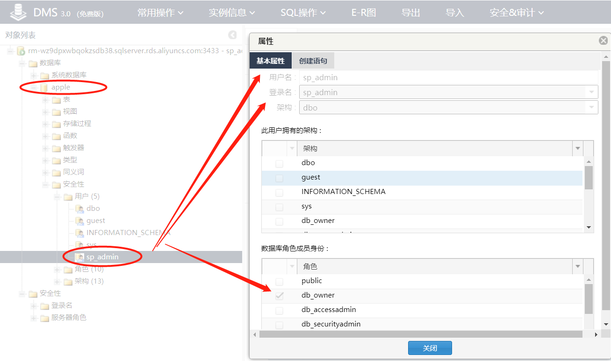

控制台上展示的管理功能实际是由登录名 sa 来控制的

只添加账户时，即为登录名，默认分配权限（服务器角色：processadmin）

只添加数据库时，默认归属于 sa

授权数据库时，在该数据库下添加同登录名的用户，并给予权限（db_datareader、db_datawriter、db_owner）

# 高级账户

可管理普通账户，断开连接

## sp_admin

```
/*登录名*/
CREATE LOGIN [sp_admin] WITH PASSWORD=N'Hukai1235',
	DEFAULT_DATABASE=[master],
	DEFAULT_LANGUAGE=[us_english]
GO

EXEC master..sp_addsrvrolemember N'sp_admin' , N'processadmin'
GO

/*msdb下的用户名*/
CREATE USER [sp_admin] FOR LOGIN [sp_admin] WITH DEFAULT_SCHEMA=[dbo]
GO

EXEC sp_addrolemember N'SQLAgentOperatorRole' , N'sp_admin'
GO

EXEC sp_addrolemember N'SQLAgentReaderRole' , N'sp_admin'
GO

EXEC sp_addrolemember N'SQLAgentUserRole' , N'sp_admin'
GO
```


# 普通账户

## nor_test

```
CREATE LOGIN [nor_test] WITH PASSWORD=N'NO_PASSWORD_OUTPUT',
	DEFAULT_DATABASE=[master],
	DEFAULT_LANGUAGE=[us_english]
GO

EXEC master..sp_addsrvrolemember N'nor_test' , N'processadmin'
GO


CREATE USER [nor_test] FOR LOGIN [nor_test] WITH DEFAULT_SCHEMA=[dbo]
GO

EXEC sp_addrolemember N'SQLAgentOperatorRole' , N'nor_test'
GO

EXEC sp_addrolemember N'SQLAgentReaderRole' , N'nor_test'
GO

EXEC sp_addrolemember N'SQLAgentUserRole' , N'nor_test'
GO
```


# 数据库

假设创建数据库 apple

未授权时

```
/*在sa，master下创建*/
CREATE DATABASE [apple]
ON PRIMARY
(
	NAME = N'apple',
	FILENAME = N'E:\SQLDATA\DATA\apple.mdf',
	SIZE = 8192 KB,
	MAXSIZE = Unlimited,
	FILEGROWTH = 65536 KB
)
LOG ON
(
	NAME = N'apple_log',
	FILENAME = N'E:\SQLDATA\DATA\apple_log.ldf',
	SIZE = 8192 KB,
	MAXSIZE = 2147483648 KB,
	FILEGROWTH = 65536 KB
)
GO

IF NOT EXISTS (SELECT name FROM sys.filegroups WHERE is_default=1 AND name = N'PRIMARY') 
	ALTER DATABASE [apple] MODIFY FILEGROUP [PRIMARY] DEFAULT
GO
```


授权给高级账户

```
/*访问数据库*/
CREATE USER [sp_admin] FOR LOGIN [sp_admin] WITH DEFAULT_SCHEMA=[dbo]
GO

/*授权读写权限*/
EXEC sp_addrolemember N'db_datareader' , N'sp_admin'
GO

EXEC sp_addrolemember N'db_datawriter' , N'sp_admin'
GO

/*只读权限*/
CREATE USER [sp_admin] FOR LOGIN [sp_admin] WITH DEFAULT_SCHEMA=[dbo]
GO

EXEC sp_addrolemember N'db_datareader' , N'sp_admin'
GO

/*所有者*/
CREATE USER [sp_admin] FOR LOGIN [sp_admin] WITH DEFAULT_SCHEMA=[dbo]
GO

EXEC sp_addrolemember N'db_owner' , N'sp_admin'
GO
```


如，所有者权限



授权给普通账户

```

```


