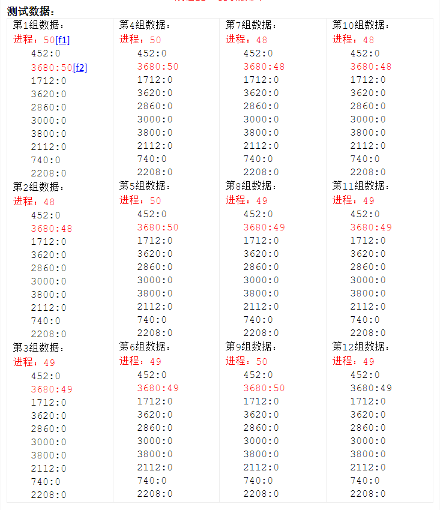

# Windows 平台下CPU使用率的计算

来源：[有关Windows平台下CPU使用率的计算](http://www.blogjava.net/fjzag/articles/317774.html)

一.  有关Windows平台下CPU使用率的计算

1．Windows下CPU使用率的定义

a)     CPU使用率：在任务管理器的刷新周期内CPU忙的时间与整个刷新周期的比值。

b)     任务管理器默认的刷新周期是1s。

 

2． CPU使用率计算公式

根据CPU使用率的定义我们可以得出在某一段时间内总的CPU使用率的计算公式：

sysTime：表示该时间段内总的CPU时间=CPU处于用户态和内核态CPU时间的总和，即sysTime =kerneTimel + userTime（注：这里并不包括idleTime，因为当CPU处于空闲状态时，实在内核模式下运行System Idle Process这个进程，所以kernelTime实际上已经包含了idleTime）；

idleTime：表示在该时间段内CPU处于空闲状态的时间；

CPU% = 1 – idleTime / sysTime  100

以上同理适用于进程

3． 有关Cpu时间信息的获取方式：

基本思想：通过JNI(http://java.sun.com/docs/books/jni/html/jniTOC.html)将底层原生API获取的有关进程、线程、总的CPU时间等信息回传给Java，然后上层再根据采集到数据以及以上的公式计算相关的CPU使用率。

| 涉及到原生API   | 说明(有关这些操作系统的原生API可以通过查询MSDN来进一步了解)http://msdn.microsoft.com/en-us/library/default.aspx |
| --------------- | ------------------------------------------------------------ |
| GetSystemInfo   | 根据该方法返回的结构体数据结构SystemInfo中的dwNumberOfProcessors可以获取系统中地CPU个数。 |
| OpenProcess     | 通过该方法可以获取指定进程ID的进程的句柄。                   |
| GetProcessTimes | 根据OpenProcess方法回带的进程句柄，可以获取该进程的userTime和kernelTime。 |
| OpenThread      | 通过该方法可以获取指定线程ID的线程的句柄。                   |
| GetThreadTimes  | 根据OpenThread方法回带的进程句柄，可以获取该线程的userTime和kernelTime（注：这里的线程与Java里面的线程示一一对应的）。 |
| GetSystemTimes  | 获取总CPU时间idleTime、kernelTime、userTime（注：在多核情况下得到的是所有CPU的总和）。 |

4． Windows平台下CPU使用率的测试

线程级别CPU使用率监控

说明：在一台双CPU的主机上监控一个包含一个空循环子线程的一个进程。

其中每一组数据的格式为：               

进程：进程CPU使用率

线程ID：CPU使用率

测试数据：

数据分析：

1． 监控时所取得采样周期为1s，因为这个值与任务管理器的刷新频率一致。

2． 根据测试用例的的特殊性，被监控进程的CPU使用率在双CPU环境下被监控进程的CPU使用率的理论值应该为50%。

3． 根据测试用例的的特殊性，被监控进程的理论上应该是包含一个CPU使用率接近50%，而其他线程的CPU使用率接近0。

4． 由以上实际的测试数据，可以知道被监控进程的实际CPU使用率与理论值基本一致；

5． 根据以上测试数据，可知进程中各线程CPU使用率以及进程的CPU用率也符合理论上的分析，都是一个线程的CPU使用率接近50%，而其他线程的CPU使用率接近0；

 补充说明：

1． 有关总的CPU使用率监控，由于采集到的数据不具备可比性，所以只能人工的在测试的时候对比程序得到的总的CPU使用率和由任务管理器中得到的CPU使用率。对比的结论是：基本上与任务管理器中得到的数据一致的。2． 同理有关进程CPU使用率的监控，也只能人工的通过对比程序得到的进程CPU使用率和任务管理器以及JConsole中的数据。对比的结论是：基本上与任务管理器和JConsole中得到的数据一致的。

3． 在运行Windows平台下有关CPU使用率的监控功能，得将Win32CpuTimeUtil.dll这个动态链接库放到java.library.path目录之下。其中Win32CpuTimeUtil.dll使用C语言实现的。

 

5．参考文献:

 http://blog.csdn.net/JPEXE/archive/2008/12/17/3541270.aspx

 http://www.codeproject.com/KB/threads/Get_CPU_Usage.aspx

---

 [[f1\]](http://www.blogjava.net/fjzag/articles/317774.html#_msoanchor_1)由于是在双CPU的环境下测试的，所以该进程的CPU使用率为50%（按100%计算的）。

 [[f2\]](http://www.blogjava.net/fjzag/articles/317774.html#_msoanchor_2)3680表示Java线程的NativeThreadID，50表示CPU使用率。

 [GetCPU.zip](GetCPU.zip) 

