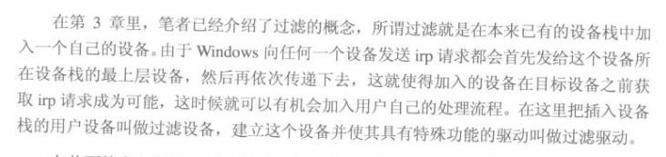
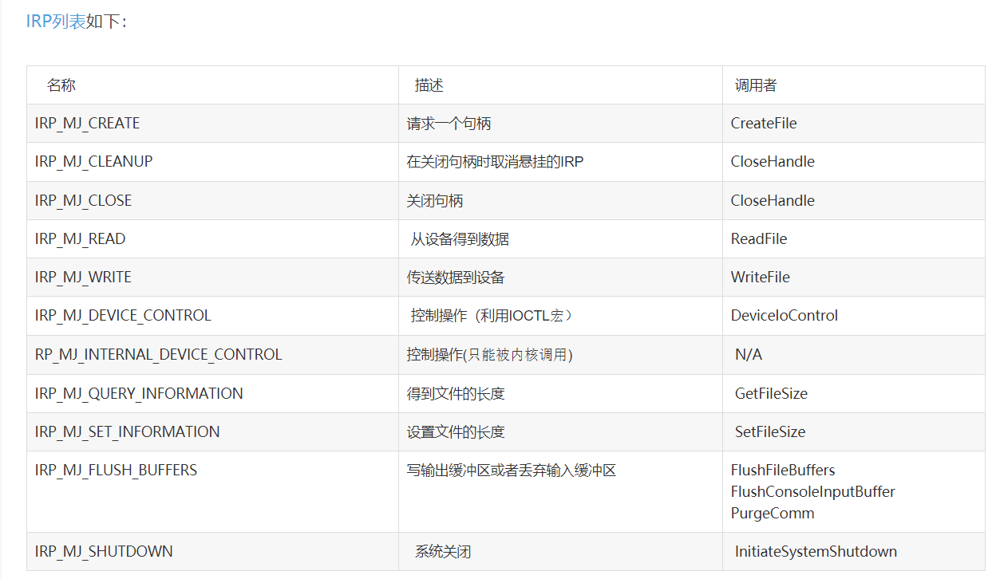

简要说明：

1、过滤的概念及结果



以上内容参考自《寒江独钓—Windows内核安全编程》第六章

添加上层设备，在底层设备之前抓取IRP包

2、IRP包的说明

IRP结构，参考：[IRP(I/O Request Package)详解](https://blog.csdn.net/baidu_37503452/article/details/73088205)

IRP类型是与上层对底层设备的访问类型相对应。

文件相关的I/O函数如：CreateFile/ReadFile/WriteFile/CloseHandle等，[操作系统](http://lib.csdn.net/base/operatingsystem)就会将其转为IRP_MJ_CREATE/IRP_MJ_READ/IRP_MJ_WRITE/IRP_MJ_CLOSE等IRP类型，这些IRP再被传送到驱动程序的派遣函数中。




3、IRP中的重要I/O函数的说明

参考：[文件读写（Windows API）--ReadFile、WriteFile](https://www.jianshu.com/p/787fde709ca0)

```cpp
BOOL ReadFile(
    HANDLE hFile,       //文件的句柄
     LPVOID lpBuffer    //用于保存读入数据的一个缓冲区
     DWORD nNumberOfBytesToRead,     //要读入的字节数
     LPDWORD lpNumberOfBytesRead,   //指向实际读取字节数的指针
     LPOVERLAPPED lpOverlapped
    //如文件打开时指定了FILE_FLAG_OVERLAPPED，那么必须，用这个参数引用一个特殊的结构。
    //该结构定义了一次异步读取操作。否则，应将这个参数设为NULL
     //（暂时不看异步读取，只看基本的话，用NULL就好了）
);
```


```cpp
BOOL WriteFile(
HANDLE  hFile,//文件句柄
LPCVOID lpBuffer,//数据缓存区指针
DWORD   nNumberOfBytesToWrite,//要写的字节数
LPDWORD lpNumberOfBytesWritten,//用于保存实际写入字节数的存储区域的指针
LPOVERLAPPED lpOverlapped//OVERLAPPED结构体指针
);
```


该方案是文件层面的抓取，没有到底层地址操作的级别

