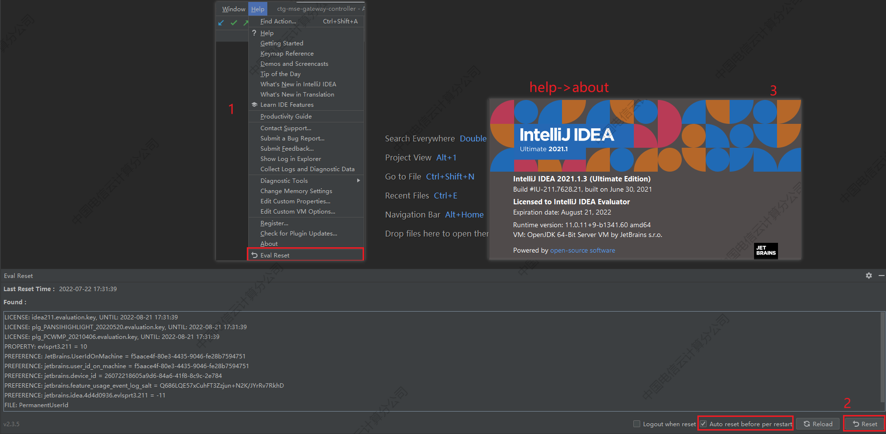

# Idea开发配置

## 参考

> [IntelliJ IDEA详细配置和使用教程(适用于Java开发人员)](https://blog.csdn.net/RobertoHuang/article/details/75042116)

## 版本

- 提倡正版
- 有账号的使用账号登入
- 如无特需要求，使用2021.1/2021.2低版本（在试用时不会跟账号绑定），通过试用插件无限续杯

2021.1/2021.2无限续杯

安装后

## 插件

- Alibaba Java Coding Guidelines，阿里的java开发规范，会实时给出代码意见
- Git commit template，提交模板
- GitToolBox，辅助git
- IDE Eval Reset，evaluate无限续杯，需要添加第三方插件库`https://plugins.zhile.io`
- Rainbow Brackets，括号美化
- Translation，翻译辅助

