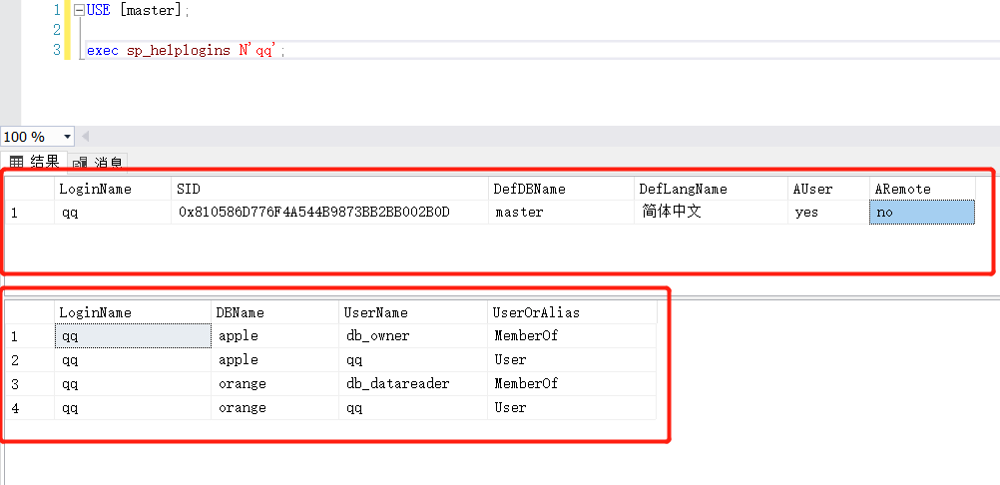

# 多个返回结果的 ResultSet 读取

场景：在 SQL SERVER 2016 中执行 `sp_helplogins` 命令时,

```mssql
USE [master];
exec sp_helplogins N'loginName';
```

会产生两个结果集：



通常情况下，只会获取第一个结果集

```java
Statement statement = connection.createStatement();
ResultSet resultSet = statement.executeQuery(sql);
```

使用其他结果集的方法

```java
if(statement.getMoreResults()) { // 若存在下一个结果集
    ResultSet resultSet = statement.getResultSet(); // 获得下一个结果集
    while (resultSet.next()) {
    	...
    }
  	...
}
```

