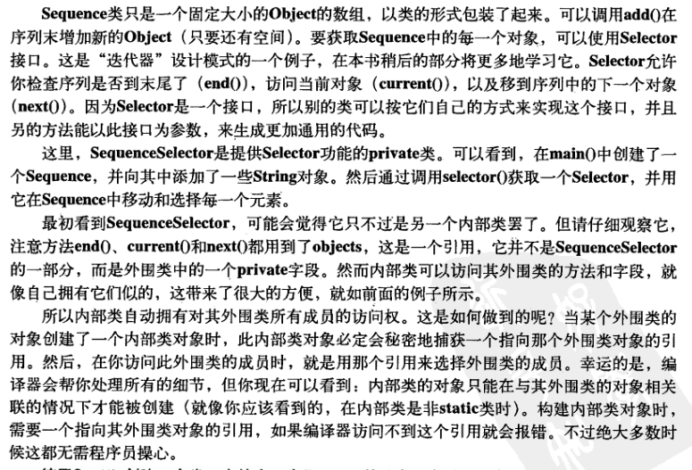

当生成内部类的对象时，此对象与制造它的外围对象之间就产生了联系，它能访问其外围类对象的所有成员，而不需要任何特殊条件。

内部类还拥有其外围类的所有元素的访问权。

示例

```java
package innerclass.demo.ch10_2;
// Holds a sequence of Objects.

interface Selector {
  boolean end();
  Object current();
  void next();
}

public class Sequence {
  private Object[] items;
  private int next = 0;
  public Sequence(int size) { items = new Object[size]; }
  public void add(Object x) {
    if(next < items.length)
      items[next++] = x;
  }
  private class SequenceSelector implements Selector {
    private int i = 0;
    public boolean end() { return i == items.length; }
    public Object current() { return items[i]; }
    public void next() { if(i < items.length) i++; }
  }
  public Selector selector() {
    return new SequenceSelector();
  }	
  public static void main(String[] args) {
    Sequence sequence = new Sequence(10);
    for(int i = 0; i < 10; i++)
      sequence.add(Integer.toString(i));
    Selector selector = sequence.selector();
    while(!selector.end()) {
      System.out.print(selector.current() + " ");
      selector.next();
    }
  }
} /* Output:
0 1 2 3 4 5 6 7 8 9
*///:~
```



