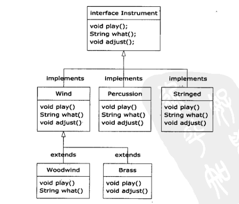

**abstract**，抽象类中可以不包含任何方法，或可以包含一个或多个抽象方法，或可以包含一个或多个一般方法。而抽象方法的作用等同于接口的意义。

**interface**，接口中允许确定方法名、参数列表、返回类型，但不提供任何具体实现。因此接口是一个完全抽象的类，也可以叫谁的抽象类，因为它提供的也只是形式。

可在interface前面添加public关键字，但仅限于该接口在与其同名的文件中被定义。如果不加public关键字，则它只有包访问权限，也即是说它只能在同一个包内可用。接口中可包含域，且这些域隐式地是static和final的。

implements，让一个类遵循某一特定接口。一旦实现了某个接口，其实现就变成了一个普通的类，再可以以常规方式扩展它。

