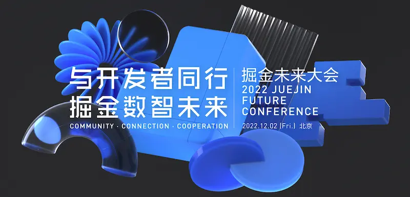

1、【开源项目】[OpenSergo 是什么](https://mp.weixin.qq.com/s/aBfEKuLFECNKunrwxAqB-w)

项目地址：https://github.com/opensergo/opensergo-specification

简介openSergo的来源背景，组成部分及社区规划，目前openSergo普及程度不高，社区仍在建设完善中

2、【系统架构】[全场景流量验证系统](https://mp.weixin.qq.com/s/EZE6wj8JCDQY_PokNH-XbA)

介绍了一种基于线上流量实现对重构系统进行功能和性能验证的实践方案。针对线上流量如何拦截、如何录制、如何存储、如何回放以及如何发压均作了详细说明，为具有类似需求的读者提供了一种可供参考的思路

3、【系统架构】[vivo 微服务 API 网关架构实践](https://mp.weixin.qq.com/s/5U1rgpcW21LDYzv8K9EX7g)

介绍技术预研打造一个功能齐全、可用性高的业务网关，包含技术选型、Zuul2网关介绍、功能介绍、系统架构设计、改造思路等

4、【技术分享】[Sentinel 是如何做限流的](https://mp.weixin.qq.com/s/s2h4dzFHse6LW0l0gudp9A)

Sentinel 是阿里巴巴提供的一种限流、熔断中间件，与RateLimiter相比，Sentinel提供了丰富的限流、熔断功能。它支持控制台配置限流、熔断规则，支持集群限流，并可以将相应服务调用情况可视化。

本文主要是对Sentinel的限流功能做一次详细的分析，至于Sentinel的其他能力，则不作深究。

5、【行业动态】[掘金未来大会](http://conf.juejin.cn/future2022/?utm_source=ryf)

时间：2022-12-2 

由掘金主办，请来上游的技术提供商和下游的技术消费厂商，为开发者分析，未来市场可能会有怎样的技术需求，以及会流行什么技术。他们的想法就是，让开发者和技术团队负责人，不仅关注技术细节，也关注社会经济发展所需要的技术方向，以及带来的机会。

6、【网页工具】[Quick Reference](https://wangchujiang.com/reference/)

该网站收集了各种编程语言和工具的速查表，带有源码仓库

仓库：https://github.com/jaywcjlove/reference

