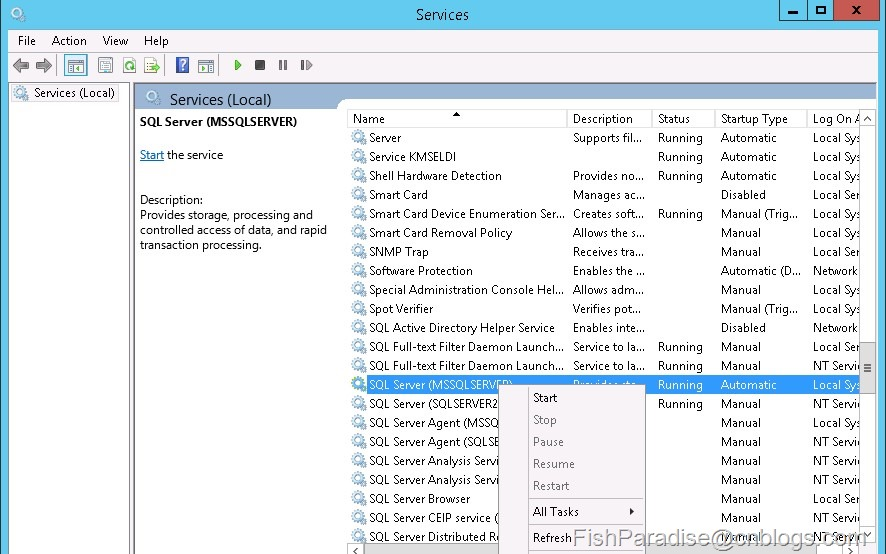
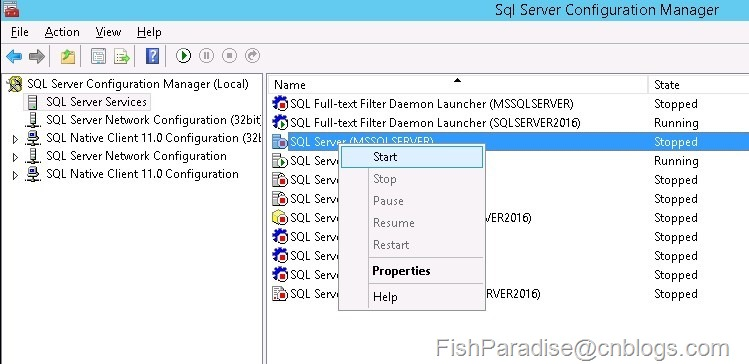
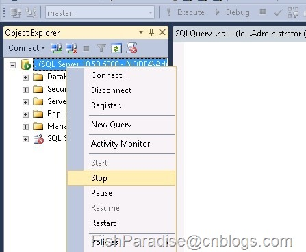
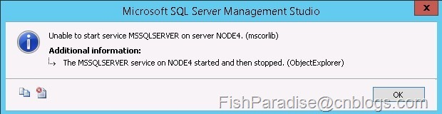
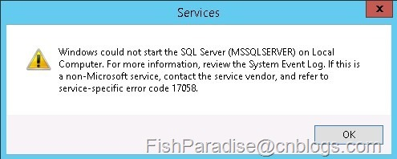
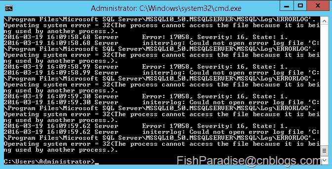

启动 SQL Server 的几种方式

参考：

[SQL Server启动的几种方法](https://www.cnblogs.com/fishparadise/p/5295377.html)

SQL Server 启动有以下几种方法：

**（1）在Control Panel——Administrative Tools——Services，找到SQL Server (XXX)进行启动。**

其中XXX为实例名，默认实例名为“MSSQLSERVER”。

  

 Figure-1: 在OS Services中启动 

**（2）在SQL Server Configuration Manager中启动。**

****

Figure-2: 在SQL Server Configuration Manager中启动

**（3）在SSMS的Object Explorer中启动。**

不过这种方法在已经打开Object Explorer并且没有断开与Database Engine的连接才能使用。适合于正在使用SSMS，需要重启SQL Server实例的快速方法。

Figure-3: SSMS中停止实例服务

**4）在CMD下启动。**

语法是：NET [option] "Service name"，通过 net /? 查看使用帮助

本处的 Service name 就是实例名，默认实例名为 MSSQLSERVER

需要足够的权限才能运行

启动 net start MSSQLSERVER

停止 net stop MSSQLSERVER

暂停 net pause MSSQLSERVER

继续 net continue MSSQLSERVER

 **5）在CMD下，直接运行“sqlservr.exe”** 

需要在 sqlservr.exe 所在目录下或以绝对路径指示运行

**前面介绍的4种方法，SQL Server是以后台服务的形式启动的，SQL  Server的日志信息会记录到日志文件里。而第5种方法是以一般应用程序在运行，在SQL  Server的日志信息直接出现在当前的CMD窗口中。如果按CTRL + C并以Y结束，或关闭CMD窗口，SQL Server进程会被关闭。** 

这种启动SQL Server后，在Services里是看不到启动的，在SSMS也显示为未启动。但是可以正常使用SQL Server。 

 如果此时在SSMS或在Services里再以服务的形式启动SQL Server，会报以下的错误： 

Figure-15: 在SSMS中启动时报错

Figure-16: 在Service中启动时报错

 同样的，如果已经以服务的形式启动了SQL Server，再以第5种方法再去启动，会报以下错误 

：

Figure-17: 再次直接执行sqlserver.exe时报

NET START命令的使用，参考以下文档：

https://technet.microsoft.com/en-us/library/bb490713.aspx