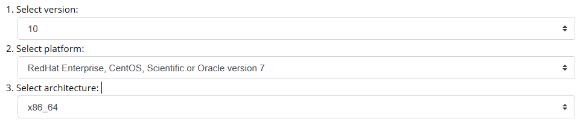
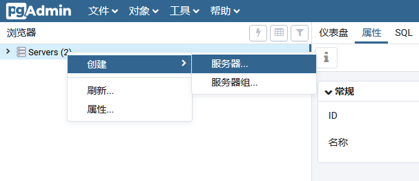
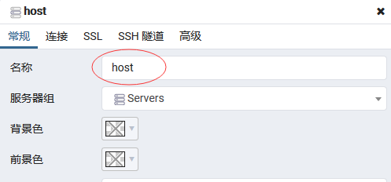
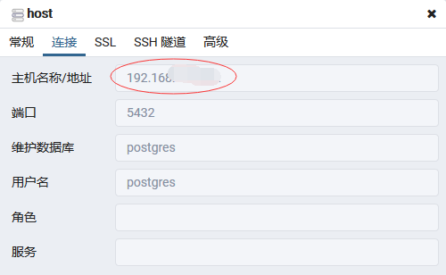
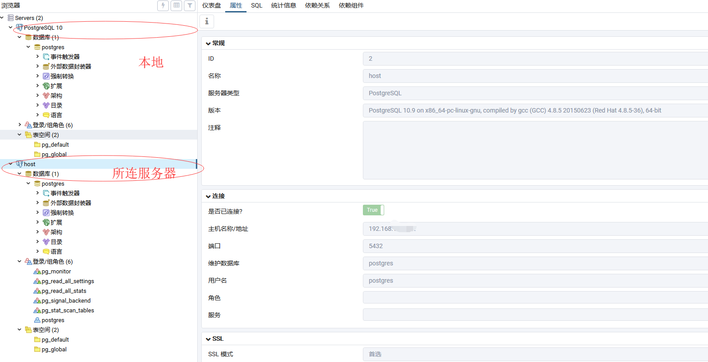
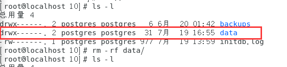
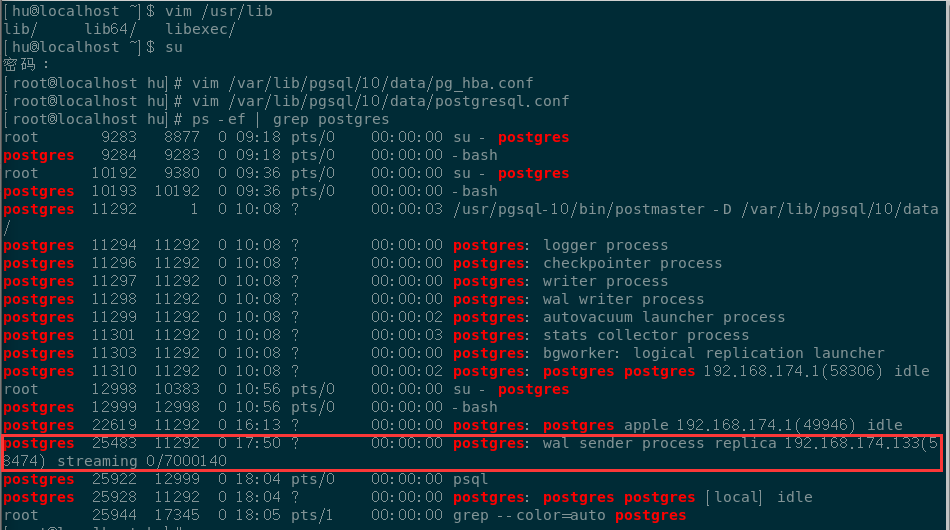
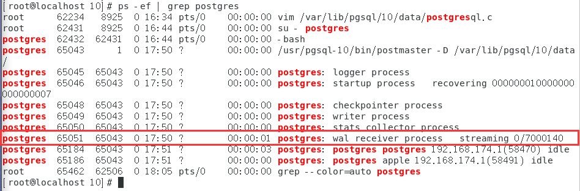

# PostgreSQL 10.9 Yum Repository

[TOC]

## **安装**

> 参考链接：
>
> 官方，添加镜像源，简易步骤
>
> https://www.postgresql.org/download/linux/redhat/
>
> 博客：具体过程
>
> https://www.cnblogs.com/jimcsharp/p/8576766.html
>
> https://blog.csdn.net/rudy5348/article/details/79299162

### Linux下支持的OS版本


其中由于Fedora上的支持周期较短，所有支持的PostgreSQL版本在此平台上都不可用。我们不建议使用Fedora进行服务器部署。

按以下步骤选择相应的PgSQL Yum Respository



### a、安装仓库

- #### 切换到root用户

```shell
[hu@localhost ~]$ yum install https://download.postgresql.org/pub/repos/yum/reporpms/EL-7-x86_64/pgdg-redhat-repo-latest.noarch.rpm
已加载插件：fastestmirror, langpacks
您需要 root 权限执行此命令。
[hu@localhost ~]$ su
密码：
```

- #### 安装镜像源

```shell
[root@localhost hu]# yum install https://download.postgresql.org/pub/repos/yum/reporpms/EL-7-x86_64/pgdg-redhat-repo-latest.noarch.rpm
已加载插件：fastestmirror, langpacks
pgdg-redhat-repo-latest.noarch.rpm                              | 5.6 kB  00:00:00     
正在检查 /var/tmp/yum-root-3rfLIz/pgdg-redhat-repo-latest.noarch.rpm: pgdg-redhat-repo-42.0-4.noarch
/var/tmp/yum-root-3rfLIz/pgdg-redhat-repo-latest.noarch.rpm 将被安装
正在解决依赖关系
--> 正在检查事务
---> 软件包 pgdg-redhat-repo.noarch.0.42.0-4 将被 安装
--> 解决依赖关系完成

依赖关系解决

=======================================================================================
 Package              架构       版本        源                                   大小
=======================================================================================
正在安装:
 pgdg-redhat-repo     noarch     42.0-4      /pgdg-redhat-repo-latest.noarch     6.8 k

事务概要
=======================================================================================
安装  1 软件包

总计：6.8 k
安装大小：6.8 k
Is this ok [y/d/N]: y
Downloading packages:
Running transaction check
Running transaction test
Transaction test succeeded
Running transaction
  正在安装    : pgdg-redhat-repo-42.0-4.noarch                                     1/1 
  验证中      : pgdg-redhat-repo-42.0-4.noarch                                     1/1 

已安装:
  pgdg-redhat-repo.noarch 0:42.0-4                                                     

完毕！
```

### b、安装客户端包

- #### 安装 postgresql10

```shell
[root@localhost hu]# yum install postgresql10
已加载插件：fastestmirror, langpacks
Loading mirror speeds from cached hostfile
 * base: centos.ustc.edu.cn
 * extras: mirrors.aliyun.com
 * updates: mirrors.cn99.com
正在解决依赖关系
--> 正在检查事务
---> 软件包 postgresql10.x86_64.0.10.9-1PGDG.rhel7 将被 安装
--> 正在处理依赖关系 postgresql10-libs(x86-64) = 10.9-1PGDG.rhel7，它被软件包 postgresql10-10.9-1PGDG.rhel7.x86_64 需要
--> 正在处理依赖关系 libpq.so.5()(64bit)，它被软件包 postgresql10-10.9-1PGDG.rhel7.x86_64 需要
--> 正在检查事务
---> 软件包 postgresql10-libs.x86_64.0.10.9-1PGDG.rhel7 将被 安装
--> 解决依赖关系完成

依赖关系解决

=======================================================================================
 Package                  架构          版本                       源             大小
=======================================================================================
正在安装:
 postgresql10             x86_64        10.9-1PGDG.rhel7           pgdg10        1.6 M
为依赖而安装:
 postgresql10-libs        x86_64        10.9-1PGDG.rhel7           pgdg10        355 k

事务概要
=======================================================================================
安装  1 软件包 (+1 依赖软件包)

总下载量：1.9 M
安装大小：9.7 M
Is this ok [y/d/N]: y
Downloading packages:
警告：/var/cache/yum/x86_64/7/pgdg10/packages/postgresql10-libs-10.9-1PGDG.rhel7.x86_64.rpm: 头V4 DSA/SHA1 Signature, 密钥 ID 442df0f8: NOKEY
postgresql10-libs-10.9-1PGDG.rhel7.x86_64.rpm 的公钥尚未安装
(1/2): postgresql10-libs-10.9-1PGDG.rhel7.x86_64.rpm            | 355 kB  00:00:19     
(2/2): postgresql10-10.9-1PGDG.rhel7.x86_64.rpm                 | 1.6 MB  00:01:31     
---------------------------------------------------------------------------------------
总计                                                       22 kB/s | 1.9 MB  01:31     
从 file:///etc/pki/rpm-gpg/RPM-GPG-KEY-PGDG 检索密钥
导入 GPG key 0x442DF0F8:
 用户ID     : "PostgreSQL RPM Building Project <pgsqlrpms-hackers@pgfoundry.org>"
 指纹       : 68c9 e2b9 1a37 d136 fe74 d176 1f16 d2e1 442d f0f8
 软件包     : pgdg-redhat-repo-42.0-4.noarch (installed)
 来自       : /etc/pki/rpm-gpg/RPM-GPG-KEY-PGDG
是否继续？[y/N]：y
Running transaction check
Running transaction test
Transaction test succeeded
Running transaction
  正在安装    : postgresql10-libs-10.9-1PGDG.rhel7.x86_64                          1/2 
  正在安装    : postgresql10-10.9-1PGDG.rhel7.x86_64                               2/2 
  验证中      : postgresql10-10.9-1PGDG.rhel7.x86_64                               1/2 
  验证中      : postgresql10-libs-10.9-1PGDG.rhel7.x86_64                          2/2 

已安装:
  postgresql10.x86_64 0:10.9-1PGDG.rhel7                                               

作为依赖被安装:
  postgresql10-libs.x86_64 0:10.9-1PGDG.rhel7                                          

完毕！

```

- #### 安装postgresql10-server

```shell
[root@localhost hu]# yum install postgresql10-server
已加载插件：fastestmirror, langpacks
Loading mirror speeds from cached hostfile
 * base: centos.ustc.edu.cn
 * extras: mirrors.aliyun.com
 * updates: mirrors.cn99.com
正在解决依赖关系
--> 正在检查事务
---> 软件包 postgresql10-server.x86_64.0.10.9-1PGDG.rhel7 将被 安装
--> 解决依赖关系完成

依赖关系解决

=======================================================================================
 Package                    架构          版本                     源             大小
=======================================================================================
正在安装:
 postgresql10-server        x86_64        10.9-1PGDG.rhel7         pgdg10        4.5 M

事务概要
=======================================================================================
安装  1 软件包

总下载量：4.5 M
安装大小：18 M
Is this ok [y/d/N]: y
Downloading packages:
postgresql10-server-10.9-1PGDG.rhel7.x86_64.rpm                 | 4.5 MB  00:00:20     
Running transaction check
Running transaction test
Transaction test succeeded
Running transaction
  正在安装    : postgresql10-server-10.9-1PGDG.rhel7.x86_64                        1/1 
  验证中      : postgresql10-server-10.9-1PGDG.rhel7.x86_64                        1/1 

已安装:
  postgresql10-server.x86_64 0:10.9-1PGDG.rhel7                                        

完毕！
```

- #### 安装postgresql10-contrib、postgresql10-devel

```shell
[root@localhost hu]# yum install postgresql10-contrib
已加载插件：fastestmirror, langpacks
Loading mirror speeds from cached hostfile
 * base: centos.ustc.edu.cn
 * extras: mirrors.aliyun.com
 * updates: mirrors.cn99.com
正在解决依赖关系
--> 正在检查事务
---> 软件包 postgresql10-contrib.x86_64.0.10.9-1PGDG.rhel7 将被 安装
--> 解决依赖关系完成

依赖关系解决

=======================================================================================
 Package                     架构          版本                    源             大小
=======================================================================================
正在安装:
 postgresql10-contrib        x86_64        10.9-1PGDG.rhel7        pgdg10        592 k

事务概要
=======================================================================================
安装  1 软件包

总下载量：592 k
安装大小：2.1 M
Is this ok [y/d/N]: y
Downloading packages:
postgresql10-contrib-10.9-1PGDG.rhel7.x86_64.rpm                | 592 kB  00:00:02     
Running transaction check
Running transaction test
Transaction test succeeded
Running transaction
  正在安装    : postgresql10-contrib-10.9-1PGDG.rhel7.x86_64                       1/1 
  验证中      : postgresql10-contrib-10.9-1PGDG.rhel7.x86_64                       1/1 

已安装:
  postgresql10-contrib.x86_64 0:10.9-1PGDG.rhel7                                       

完毕！
```

```shell
[root@localhost hu]# yum install postgresql10-devel
已加载插件：fastestmirror, langpacks
Loading mirror speeds from cached hostfile
 * base: centos.ustc.edu.cn
 * extras: mirrors.aliyun.com
 * updates: mirrors.cn99.com
正在解决依赖关系
--> 正在检查事务
---> 软件包 postgresql10-devel.x86_64.0.10.9-1PGDG.rhel7 将被 安装
--> 正在处理依赖关系 libicu-devel，它被软件包 postgresql10-devel-10.9-1PGDG.rhel7.x86_64 需要
--> 正在检查事务
---> 软件包 libicu-devel.x86_64.0.50.1.2-17.el7 将被 安装
--> 解决依赖关系完成

依赖关系解决

=======================================================================================
 Package                   架构          版本                      源             大小
=======================================================================================
正在安装:
 postgresql10-devel        x86_64        10.9-1PGDG.rhel7          pgdg10        2.0 M
为依赖而安装:
 libicu-devel              x86_64        50.1.2-17.el7             base          702 k

事务概要
=======================================================================================
安装  1 软件包 (+1 依赖软件包)

总下载量：2.7 M
安装大小：13 M
Is this ok [y/d/N]: y
Downloading packages:
警告：/var/cache/yum/x86_64/7/base/packages/libicu-devel-50.1.2-17.el7.x86_64.rpm: 头V3 RSA/SHA256 Signature, 密钥 ID f4a80eb5: NOKEY
libicu-devel-50.1.2-17.el7.x86_64.rpm 的公钥尚未安装
(1/2): libicu-devel-50.1.2-17.el7.x86_64.rpm                    | 702 kB  00:00:00     
(2/2): postgresql10-devel-10.9-1PGDG.rhel7.x86_64.rpm           | 2.0 MB  00:00:05     
---------------------------------------------------------------------------------------
总计                                                      523 kB/s | 2.7 MB  00:05     
从 file:///etc/pki/rpm-gpg/RPM-GPG-KEY-CentOS-7 检索密钥
导入 GPG key 0xF4A80EB5:
 用户ID     : "CentOS-7 Key (CentOS 7 Official Signing Key) <security@centos.org>"
 指纹       : 6341 ab27 53d7 8a78 a7c2 7bb1 24c6 a8a7 f4a8 0eb5
 软件包     : centos-release-7-6.1810.2.el7.centos.x86_64 (@anaconda)
 来自       : /etc/pki/rpm-gpg/RPM-GPG-KEY-CentOS-7
是否继续？[y/N]：y
Running transaction check
Running transaction test
Transaction test succeeded
Running transaction
  正在安装    : libicu-devel-50.1.2-17.el7.x86_64                                  1/2 
  正在安装    : postgresql10-devel-10.9-1PGDG.rhel7.x86_64                         2/2 
  验证中      : postgresql10-devel-10.9-1PGDG.rhel7.x86_64                         1/2 
  验证中      : libicu-devel-50.1.2-17.el7.x86_64                                  2/2 

已安装:
  postgresql10-devel.x86_64 0:10.9-1PGDG.rhel7                                         

作为依赖被安装:
  libicu-devel.x86_64 0:50.1.2-17.el7                                                  

完毕！
```

###  c、初始化数据库

```shell
[root@localhost hu]# /usr/pgsql-10/bin/postgresql-10-setup initdb
Initializing database ... OK
```

### d、可选项，启用开机自启，并启动服务

```shell
[root@localhost hu]# systemctl enable postgresql-10
Created symlink from /etc/systemd/system/multi-user.target.wants/postgresql-10.service to /usr/lib/systemd/system/postgresql-10.service.
[root@localhost hu]# systemctl start postgresql-10	# 启动(start)、停止(stop)、重启(restart)
```

### e、安装完毕后，系统会自动创建一个postgres用户，密码为空

我们修改它的密码

```shell
[root@localhost hu]# passwd postgres
更改用户 postgres 的密码 。
新的 密码：
无效的密码： 密码少于 8 个字符
重新输入新的 密码：
抱歉，密码不匹配。
新的 密码：
重新输入新的 密码：
passwd：所有的身份验证令牌已经成功更新。
```

### f、切换到postgres用户，输入psql进入postgres数据库

```shell
[root@localhost hu]# su - postgres 
-bash-4.2$ psql -U postgres
psql (10.9)
输入 "help" 来获取帮助信息.

postgres=#
```

### g、修改postgres数据库管理员密码

```shell
postgres=# ALTER USER postgres WITH PASSWORD '1235host';
ALTER ROLE
```

出现`ALTER ROLE`修改成功

### h、补充，命令解释

```shell
postgres=# \q	# 退出数据库
postgres=# \l	# 列出所有库
postgres=# \du  # 列出所有用户
postgres=# \d	# 列出库下所有表
```

### i、退出数据库，切换到root用户下，配置远程连接

```shell
postgres=# \q
-bash-4.2$ su
密码：
[root@localhost pgsql]# vim /var/lib/pgsql/10/data/postgresql.conf 
```

文件内容修改如下

```shell
修改#listen_addresses = ‘localhost’ 为 listen_addresses=’*’
当然，此处‘*’也可以改为任何你想开放的服务器IP

修改端口号为 port=5432
```

### j、信任远程连接

```shell
[root@localhost pgsql]# vim /var/lib/pgsql/10/data/pg_hba.conf 
```

- #### 关于pg_hba.conf的一些说明

参考自https://yq.aliyun.com/articles/708935?spm=a2c4e.11163080.searchblog.9.19562ec1zTP6gs

```shell
# "local" is for Unix domain socket connections only
local   all             all                                     trust
# IPv4 local connections:
host    all             all             127.0.0.1/32            trust
# IPv6 local connections:
host    all             all             ::1/128                 trust
# Allow replication connections from localhost, by a user with the
# replication privilege.
local   replication     all                                     trust
host    replication     all             127.0.0.1/32            trust
host    replication     all             ::1/128                 trust
```

**第一列为主机的类型：**

- local(unix-domain的socket连接访问，即通过运行在同一台主机的进程间进行通信)
- host(TCP/IP socket连接)
- hostssl(SSL加密的TCP/IP socket连接)

**第二列为DATABASE表示数据库名称**

-  `all`匹配所有数据库
-  `sameuse`匹配请求的用户和数据库一致的情况
-  `samerole`匹配请求的用户所在角色与数据库一致的情况
-  `replication`匹配物理复制的连接请求
-  `数据库名称` ,或者多个数据库名称用 `逗号` 

**注意ALL不匹配 replication**

**第三列表示用户名称**

- `all`
- `一个用户名`
-  `一组用户名` ，多个用户时，可以用 `,`逗号隔开

**第四列表示客户端的IP**

- 可以是一个地址，10.110.9.155/32
- 地址范围,10.110.9.155/28
- 通配的地址,0.0.0.0/0

**第五列(最后一列)表示认证方式**

经常使用的有三种

- peer    操作系统用户名称和数据库的用户名称一致
- md5     使用md5的方式验证密码登录
- trust   无需验证，允许所有客户端连接

修改内容如下：

```shell
修改如下内容，信任指定服务器连接 
\# IPv4 local connections: 
host    all            all      127.0.0.1/32      		md5 
host    all            all      (需要连接的服务器IP)/32    md5
# 或者用通配符
# host  all            all      0.0.0.0/0      		    md5
```

### k、打开防火墙 

CentOS 防火墙中内置了PostgreSQL服务，配置文件位置在/usr/lib/firewalld/services/postgresql.xml，我们只需以服务方式将PostgreSQL服务开放即可

```shell
[root@localhost pgsql]# firewall-cmd --add-service=postgresql --permanent
success
[root@localhost pgsql]# firewall-cmd --reload
success
```

### l、重启服务

```shell
[root@localhost pgsql]# systemctl restart postgresql-10
```

若遇到错误

```shell
Job for postgresql-10.service failed because the control process exited with error code. See "systemctl status postgresql-10.service" and "journalctl -xe" for details
```

原因通过`systemctl status postgresql-10.service -l`查看详情：


## **通过pgAdmin4连接查看、管理数据库**

本次演示在windows上操作

首先在windows完成postgreSQL的安装，版本一致。安装方式比较简单，自查。

安装完后，打开pgAdmin4，输入安装时设置的密码，默认链接本地数据库。

### 1、首先在左侧栏Servers处右键选择创建->服务器



### 2、在常规->名称栏 填写名称，任取



### 3、在连接->主机名称/地址栏 填写服务器ip；在密码处填写postgres数据库管理员密码

注意是postgres数据库管理员密码，不是postgres用户密码。



### 4、点击保存便连接成功



pgAdmin4的使用自查。


## **主从配置**

参考博客：

主从配置和验证：

https://blog.csdn.net/ywd1992/article/details/81698556

https://blog.csdn.net/kiral07/article/details/88221002

主库:192.168.174.132
从库:192.168.174.133

以下操作步骤请在两个节点进行，主库需要安装数据库软件以及初始化数据库，从库仅需要安装数据库软件即可无需初始化。

### 主库上的配置

#### postgresql.conf中的修改项

```shell
[root@localhost pgsql]# vim /var/lib/pgsql/10/data/postgresql.conf
```

```shell
listen_addresses = '*'		# what IP address(es) to listen on;
					# comma-separated list of addresses;
					# defaults to 'localhost'; use '*' for all
					# (change requires restart)
port = 5432				# (change requires restart)
max_connections = 100			# (change requires restart)

wal_level = replica

archive_mode = on
archive_command = 'cp %p /opt/pgsql/pg_archive/%f'

max_wal_senders = 10

wal_keep_segments = 256

wal_sender_timeout = 60s
```

#### pg_hba.conf的配置

```shell
vim /var/lib/pgsql/10/data/pg_hba.conf 
```

```shell
# TYPE  DATABASE        USER            ADDRESS                 METHOD

# "local" is for Unix domain socket connections only
local   all             all                                     md5
# IPv4 local connections:
host    all             all             127.0.0.1/32            md5
host	all		all		0.0.0.0/0		trust
# IPv6 local connections:
host    all             all             ::1/128                 md5
# Allow replication connections from localhost, by a user with the
# replication privilege.
local   replication     all                                     md5
host    replication     all             127.0.0.1/32            md5
host    replication     all             ::1/128                 ident
host	replication	replica		192.168.174.133/32	md5
```

#### 重启服务

```shell
systemctl restart postgresql-10
```

若出现错误：

```shell
postgresql-10.service - PostgreSQL 10 database server
   Loaded: loaded (/usr/lib/systemd/system/postgresql-10.service; enabled; vendor preset: disabled)
   Active: failed (Result: exit-code) since 四 2019-07-18 21:04:02 CST; 51s ago
     Docs: https://www.postgresql.org/docs/10/static/
  Process: 74043 ExecStart=/usr/pgsql-10/bin/postmaster -D ${PGDATA} (code=exited, status=1/FAILURE)
  Process: 74035 ExecStartPre=/usr/pgsql-10/bin/postgresql-10-check-db-dir ${PGDATA} (code=exited, status=0/SUCCESS)
 Main PID: 74043 (code=exited, status=1/FAILURE)

7月 18 21:04:02 localhost.localdomain systemd[1]: Starting PostgreSQL 10 database server...
7月 18 21:04:02 localhost.localdomain systemd[1]: postgresql-10.service: main process e...RE
7月 18 21:04:02 localhost.localdomain systemd[1]: Failed to start PostgreSQL 10 databas...r.
7月 18 21:04:02 localhost.localdomain systemd[1]: Unit postgresql-10.service entered fa...e.
7月 18 21:04:02 localhost.localdomain systemd[1]: postgresql-10.service failed.
Hint: Some lines were ellipsized, use -l to show in full.
```

查看详情输入`systemctl status postgresql-10.service -l`
```shell
systemctl status postgresql-10.service -l
● postgresql-10.service - PostgreSQL 10 database server
   Loaded: loaded (/usr/lib/systemd/system/postgresql-10.service; enabled; vendor preset: disabled)
   Active: failed (Result: exit-code) since 四 2019-07-18 21:28:23 CST; 12min ago
     Docs: https://www.postgresql.org/docs/10/static/
 Main PID: 75162 (code=exited, status=1/FAILURE)

7月 18 21:28:23 localhost.localdomain systemd[1]: Starting PostgreSQL 10 database server...
7月 18 21:28:23 localhost.localdomain postmaster[75162]: 2019-07-18 13:28:23.685 GMT [75162] 日志:  参数 "wal_level" 的值无效: "hot_stanby"
7月 18 21:28:23 localhost.localdomain systemd[1]: postgresql-10.service: main process exited, code=exited, status=1/FAILURE
7月 18 21:28:23 localhost.localdomain systemd[1]: Failed to start PostgreSQL 10 database server.
7月 18 21:28:23 localhost.localdomain systemd[1]: Unit postgresql-10.service entered failed state.

```

解决：

vendor preset：disable，预设参数有问题。

版本更新的原因，10.9版本中`wal_level`的可选值中`hot_standby`变为`replica`

因此在pg_hba.conf配置文件中改`wal_level = replica`后，再重启服务。


其他在运行时出现的问题一般通过csdn博客或者**stackoverflow**来查询

- 有些是版本更新问题，博客的中使用的版本较低，按照其中的而参数配置后不易发现问题
- 有一些是常识性的问题，但是不熟悉需要额外花时间查询了解
- 输入错误的问题也比较明显，要仔细


### 从库上的配置

在从库上安装好pgsql后，可以初始化但是后面会进行删除并修改权限，以下方式是进行初始化后的操作。建议在从库上不进行库初始化，直接备份主库的数据。

若进行了初始化，按以下方式操作：

#### 切换到root用户，创建归档目录

```shell
-bash-4.2$ su
Password: 
[root@localhost pgsql]# mkdir -p /opt/pgsql/pg_archive
```

切换到postgres用户

```shell
[slave@localhost ~]$ su - postgres
密码：
```

#### 进入postgres数据库，测试连接主库

```shell
-bash-4.2$ psql -h 192.168.174.132 -U postgres
psql (10.9)
Type "help" for help.

postgres=# \l
                                  List of databases
   Name    |  Owner   | Encoding |   Collate   |    Ctype    |   Access privileg
es   
-----------+----------+----------+-------------+-------------+------------------
-----
 postgres  | postgres | UTF8     | zh_CN.UTF-8 | zh_CN.UTF-8 | 
 template0 | postgres | UTF8     | zh_CN.UTF-8 | zh_CN.UTF-8 | =c/postgres      
    +
           |          |          |             |             | postgres=CTc/post
gres
 template1 | postgres | UTF8     | zh_CN.UTF-8 | zh_CN.UTF-8 | =c/postgres      
    +
           |          |          |             |             | postgres=CTc/post
gres
(3 rows)
```

#### 可以连接后，退出postgres数据库，暂停服务

以编译方式安装时，启动服务采用的命令

```shell
postgres=# \q
[root@localhost pgsql]# systemctl stop postgresql-10
```

以rpm包的方式安装时，启动服务采用的命令

```shell
postgres=# \q
-bash-4.2$ 登出
# 切换到root用户，su或此时Ctrl+D退出当前进程
-bash-4.2$ su
[root@localhost pgsql]# systemctl stop postgresql-10
```

#### 切换到postgres用户，清空节点数据库

```shell
[root@localhost pgsql]# rm -rf /var/lib/pgsql/10/data/*
```
#### 从主节点拷贝数据到从节点（基础备份）

```shell
[root@localhost pgsql]# pg_basebackup -h 192.168.174.132 -U replica -D /var/lib/pgsql/10/data/ -X stream -P
pg_basebackup: directory "/var/lib/pgsql/10/data/" exists but is not empty
```

注意，提示错误`pg_basebackup: directory "/var/lib/pgsql/10/data/" exists but is not empty`，因为`data`目录还在，应该删除`data`，操作：

```shell
[root@localhost pgsql]# cd /var/lib/pgsql/10/data/
[root@localhost data]# ls -l
总用量 0
[root@localhost data]# cd ..
[root@localhost 10]# ls -l
总用量 4
drwx------. 2 postgres postgres   6 6月  20 01:42 backups
drwx------. 2 postgres postgres  31 7月  19 16:55 data
-rw-------. 1 postgres postgres 977 7月  19 13:59 initdb.log
[root@localhost 10]# rm -rf data/
[root@localhost 10]# ls -l
总用量 4
drwx------. 2 postgres postgres   6 6月  20 01:42 backups
-rw-------. 1 postgres postgres 977 7月  19 13:59 initdb.log进行
```

重新备份

```shell
root@localhost pgsql]# pg_basebackup -h 192.168.174.132 -U replica -D /var/lib/pgsql/10/data/ -X stream -P
Password: # 此处输入主库当中在postgres数据库中用于复制的replica用户的密码
33183/33183 kB (100%), 1/1 tablespace
```

#### 配置recovery.conf

```shell
[root@localhost pgsql]# cp /usr/pgsql-10/share/recovery.conf.sample /var/lib/pgsql/10/data/recovery.conf
[root@localhost pgsql]# vim 10/data/recovery.conf 
```
修改内容

```shell
standby_mode = on    #说明该节点是从服务器
primary_conninfo = 'host=192.168.xx.xxx port=5432 user=replica password=xxxxx' #主节点的信息以及连接的用户
recovery_target_timeline = 'latest'
```
#### 配置postgresql.conf 文件

```shell
[root@localhost pgsql]# vim 10/data/postgresql.conf
```

修改内容

```shell
# 注释掉以下内容
		wal_level，
		max_wal_senders 
		wal_keep_segments等参数
wal_level = replica
hot_standby = on #在备份的同时允许查询
max_connections = 1000 #一般查多于写的应用从库的最大连接数要比较大
max_standby_streaming_delay = 30s #数据流备份的最大延迟时间
wal_receiver_status_interval = 10s #多久向主报告一次从的状态，当然从每次数据复制都会向主报告状态，这里只是设置最长的间隔时间
```
#### 配置完启动数据库

```shell
[root@localhost pgsql]# systemctl start postgresql-10
```

#### 配置pg_hba.conf(可选)

```shell
[root@localhost pgsql]# vim 10/data/pg_hba.conf
```

修改内容

```shell
添加下面内容
host	replication		在数据库里创建的同步用的用户名		主库IP地址或域名/32		trust或md5
# 在从库中维护的主库IP地址是为了以后切换使用
```

#### 启动服务

```shell
[root@localhost pgsql]# systemctl start postgresql-10
```

出现以下错误信息

```shell
Job for postgresql-10.service failed because the control process exited with error code. See "systemctl status postgresql-10.service" and "journalctl -xe" for details.
```

查看详情

```shell
[root@localhost pgsql]# systemctl status postgresql-10.service -l
● postgresql-10.service - PostgreSQL 10 database server
   Loaded: loaded (/usr/lib/systemd/system/postgresql-10.service; enabled; vendor preset: disabled)
   Active: failed (Result: exit-code) since 五 2019-07-19 17:19:02 CST; 22s ago
     Docs: https://www.postgresql.org/docs/10/static/
  Process: 62960 ExecStart=/usr/pgsql-10/bin/postmaster -D ${PGDATA} (code=exited, status=0/SUCCESS)
  Process: 63714 ExecStartPre=/usr/pgsql-10/bin/postgresql-10-check-db-dir ${PGDATA} (code=exited, status=1/FAILURE)
 Main PID: 62960 (code=exited, status=0/SUCCESS)

7月 19 17:19:02 localhost.localdomain systemd[1]: Starting PostgreSQL 10 database server...
7月 19 17:19:02 localhost.localdomain systemd[1]: postgresql-10.service: control process exited, code=exited status=1
7月 19 17:19:02 localhost.localdomain systemd[1]: Failed to start PostgreSQL 10 database server.
7月 19 17:19:02 localhost.localdomain systemd[1]: Unit postgresql-10.service entered failed state.
7月 19 17:19:02 localhost.localdomain systemd[1]: postgresql-10.service failed.
```

看到此处`Process: 63714 ExecStartPre=/usr/pgsql-10/bin/postgresql-10-check-db-dir ${PGDATA} (code=exited, status=1/FAILURE)`出错

网上查找的答案https://stackoverflow.com/questions/35492893/unable-to-start-postgresql-service-on-centos-7，说没有初始化，这个方案在这里不行。因为`data`是root用户下备份过来的，权限归属`root` 

```shell
[root@localhost pgsql]# cd 10
[root@localhost 10]# ls -l
总用量 8
drwx------.  2 postgres postgres    6 6月  20 01:42 backups
drwx------. 20 root     root     4096 7月  19 17:32 data
-rw-------.  1 postgres postgres  977 7月  19 13:59 initdb.log
```

而原本在默认包安装时，该文件夹应该归属`postgres`用户，如下图所示。



那么我们应该更改`data`文件夹的权限给`postgres`，再启动服务，运行正常

```shell
[root@localhost 10]# ls -l
总用量 8
drwx------.  2 postgres postgres    6 6月  20 01:42 backups
drwx------. 20 root     root     4096 7月  19 17:32 data
-rw-------.  1 postgres postgres  977 7月  19 13:59 initdb.log
[root@localhost 10]# chown -R postgres:postgres data
[root@localhost 10]# ls -l 
总用量 8
drwx------.  2 postgres postgres    6 6月  20 01:42 backups
drwx------. 20 postgres postgres 4096 7月  19 17:32 data
-rw-------.  1 postgres postgres  977 7月  19 13:59 initdb.log
[root@localhost 10]# systemctl start postgresql-10
```

### 主从验证

方法一：

登录主节点数据库执行

```shell
[root@localhost pgsql]# su - postgres 
上一次登录：五 7月 19 09:36:41 CST 2019pts/0 上
-bash-4.2$ psql
口令：
psql (10.9)
输入 "help" 来获取帮助信息.

postgres=# select client_addr,sync_state from pg_stat_replication;
   client_addr   | sync_state 
-----------------+------------
 192.168.174.133 | async
(1 行记录)

postgres=# 
```

说明133服务器是从节点，在接收流，而且是异步流复制

方法二：

在主节点与从节点分别执行如下命令

```shell
ps -ef | grep postgres
```

在主节点中可看到有wal sender进程



在从节点中可看到有



主服务器上插入数据或删除数据，在从服务器上能看到相应的变化。从服务器上只能查询，不能插入或删除。

流复制数据同步测试

分别启动主机、从机数据库

在主机上创建一个数据库和临时表

```shell
-bash-4.2$ psql
口令：
psql (10.9)
输入 "help" 来获取帮助信息.

postgres=# create database fruit;
CREATE DATABASE
postgres=# \c fruit
您现在已经连接到数据库 "fruit",用户 "postgres".
fruit=# create table apple(id serial not null,name text);
CREATE TABLE
fruit=# insert into apple(name) values('fushihong');
INSERT 0 1
fruit=# 
```

在从机上查询刚才创建的表和数据，判定是否有数据同步

```shell
[root@localhost 10]# su - postgres 
上一次登录：五 7月 19 19:53:19 CST 2019pts/0 上
-bash-4.2$ psql
口令：
psql (10.9)
输入 "help" 来获取帮助信息.
postgres=# \l
                                     数据库列表
   名称    |  拥有者  | 字元编码 |  校对规则   |    Ctype    |       存取权限        
-----------+----------+----------+-------------+-------------+-----------------------
 fruit     | postgres | UTF8     | zh_CN.UTF-8 | zh_CN.UTF-8 | 
 postgres  | postgres | UTF8     | zh_CN.UTF-8 | zh_CN.UTF-8 | 
 template0 | postgres | UTF8     | zh_CN.UTF-8 | zh_CN.UTF-8 | =c/postgres          +
           |          |          |             |             | postgres=CTc/postgres
 template1 | postgres | UTF8     | zh_CN.UTF-8 | zh_CN.UTF-8 | =c/postgres          +
           |          |          |             |             | postgres=CTc/postgres
(4 行记录)

postgres=# \c fruit 
您现在已经连接到数据库 "fruit",用户 "postgres".
fruit=# select * from apple;
 id |   name    
----+-----------
  1 | fushihong
(1 行记录)
```


## 另附可能用到的博客

### Postgresql 10 流复制配置过程-实测

https://blog.csdn.net/unmobile/article/details/80154330

### 【Postgresql】数据库postgresql 10的data目录迁移(不用重新安装)：

https://blog.csdn.net/wk1134314305/article/details/79054248

### Postgres数据库忘记密码,三个步骤解决

https://blog.csdn.net/w892824196/article/details/81355189


