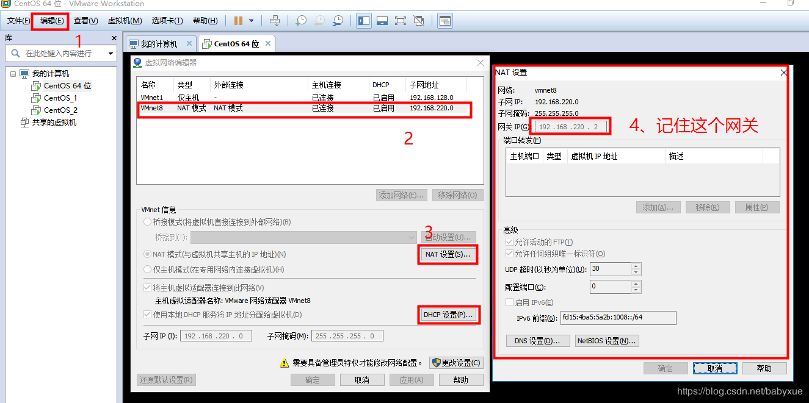
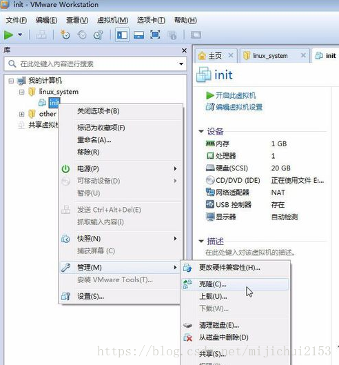
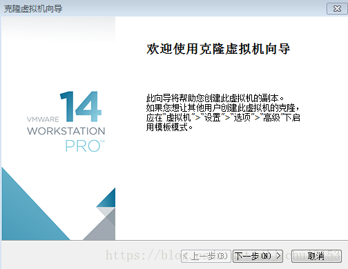
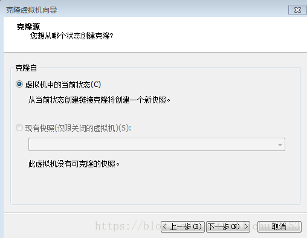
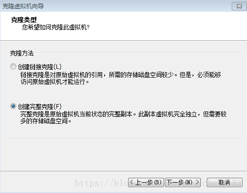
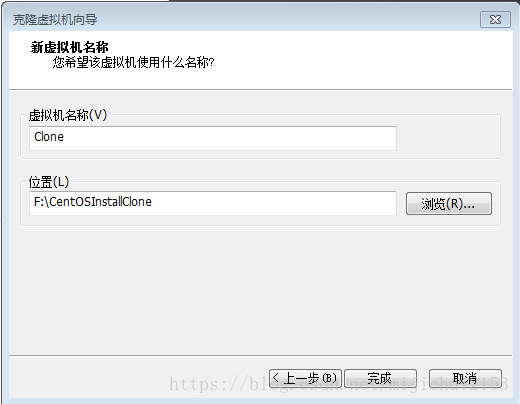

VMware安装CentOS7过程

参考博客：

- https://www.jianshu.com/p/ce08cdbc4ddb?utm_source=tuicool&utm_medium=referral
- https://blog.csdn.net/babyxue/article/details/80970526

软硬件准备

软件：VMware15 pro，版本影响不大，安装过程大同小异

镜像：http://isoredirect.centos.org/centos/7/isos/x86_64/CentOS-7-x86_64-DVD-1810.iso

**主要过程看博客内容**

- 其中网络我选择的是NAT模式，有物理机分享子网

若选择的是桥接模式，需要给虚拟机分配ip，网络配置如下：

**1、配置ip地址等信息在/etc/sysconfig/network-scripts/ifcfg-ens33文件里做如下配置：**

 命令：

```
vi   /etc/sysconfig/network-scripts/ifcfg-ens33
```

修改如下：

```
TYPE="Ethernet"   # 网络类型为以太网
BOOTPROTO="static"  # 手动分配ip
NAME="ens33"  # 网卡设备名，设备名一定要跟文件名一致
DEVICE="ens33"  # 网卡设备名，设备名一定要跟文件名一致
ONBOOT="yes"  # 该网卡是否随网络服务启动
IPADDR="192.168.220.101"  # 该网卡ip地址就是你要配置的固定IP，如果你要用xshell等工具连接，220这个网段最好和你自己的电脑网段一致，否则有可能用xshell连接失败
GATEWAY="192.168.220.2"   # 网关
NETMASK="255.255.255.0"   # 子网掩码
DNS1="8.8.8.8"    # DNS，8.8.8.8为Google提供的免费DNS服务器的IP地址
```

**2、配置网络工作**

在/etc/sysconfig/network文件里增加如下配置

```
命令：
 
vi /etc/sysconfig/network
 
 
修改：
 
NETWORKING=yes # 网络是否工作，此处一定不能为no
```

3、**配置公共DNS服务(可选)**

在/etc/resolv.conf文件里增加如下配置

```
nameserver 8.8.8.8
```

4、**关闭防火墙**

```
systemctl stop firewalld # 临时关闭防火墙
systemctl disable firewalld # 禁止开机启动
```

5、**重启网络服务**

```
service network restart
```


另外附上克隆虚拟机方法

- NAT网络模式克隆后仅需要改用户名
- 桥接网络模式克隆后需要修改用户名和网络ip

以下为修改用户名和网络IP的操作

1、先查看虚拟机的网关



2、将要克隆的虚拟机关机，右键点击要克隆的虚拟机：

右键点击虚拟机，选择“管理”、“克隆



然后下一步



再下一步



选择第二个“创建完整克隆”，后下一步



给自己的克隆机命名、选择位置后点击“完成”。



完成克隆后点击关闭即克隆成功了。

此时这个克隆出来的虚拟机和原虚拟机各个配置都是一样的，我们接下来要对网络、主机名等进行配置。

 修改配置文件**/etc/sysconfig/network-scripts/ifcfg-ens33中的IPADDR**

```
IPADDR="192.168.220.102" 
```

修改主机名：

```
hostnamectl set-hostname   xxxx(你要的主机名字)
```

 修改hosts文件，将名字和IP建立联系

输入命令“vi /etc/hosts”后，在配置文件中加入

```
127.0.0.1   localhost localhost.localdomain localhost4 localhost4.localdomain4
::1         localhost localhost.localdomain localhost6 localhost6.localdomain6
192.168.220.103（你所修改的主机IP）   xxxxxxxx(你要的主机名字)
```

重启。
